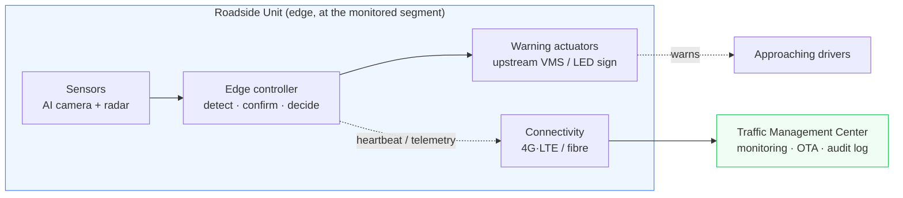

# Emergency Stop-Lane Automatic Warning System (ESW)

> **Hệ thống cảnh báo tự động cho làn dừng xe khẩn cấp**
> Architectural & foundational documentation derived from the KHCN task proposal
> *"Nghiên cứu giải pháp cảnh báo tự động cho làn dừng xe khẩn cấp để giảm thiểu tai nạn giao thông"*
> — Trường Đại học Quản lý và Công nghệ TP.HCM, Khoa Công nghệ. Chủ nhiệm: ThS. Phó Trí Tín.

> 🇻🇳 **Phiên bản tiếng Việt (bản dịch đầy đủ):** [README.vi.md](README.vi.md) — toàn bộ tài liệu 00–10 và các ADR đều có bản `.vi.md` song song.

---

## What this system does

A roadside sensor unit continuously watches a **predefined detection zone** covering the
emergency stop lane (hard shoulder). When a vehicle **stops** inside that zone, the system
**automatically activates upstream warning signs** ("STOPPED VEHICLE AHEAD" /
*PHÍA TRƯỚC CÓ XE DỪNG KHẨN CẤP*) far enough ahead to give approaching drivers time to slow and
change lane. When the vehicle leaves, the warning **automatically clears**.

The control loop is fully closed and local:

```
DETECT → CONFIRM (dwell) → WARN → TRACK → CLEAR → (back to idle)
```

This converts the shoulder from **passive observation** (fixed signs, manual CCTV, driver-placed
triangles) to **active, automatic warning** — the central thesis of the proposal.

## Document map

| # | Document | Purpose |
|---|----------|---------|
| — | [README.md](README.md) | This file — overview, index, what changed vs. the proposal |
| 00 | [docs/00-context-and-glossary.md](docs/00-context-and-glossary.md) | System context, stakeholders, scope/non-goals, bilingual glossary, assumptions & constraints |
| 01 | [docs/01-requirements.md](docs/01-requirements.md) | Functional & non-functional requirements, the **safety reframe**, warning-placement (sight-distance) math, evaluation metrics & acceptance criteria |
| 02 | [docs/02-system-architecture.md](docs/02-system-architecture.md) | The architecture: logical & physical views, components, the detection→warning state machine, data flow, deployment, interfaces, tech stack |
| 03 | [docs/03-roadmap-and-phasing.md](docs/03-roadmap-and-phasing.md) | Engineering roadmap mapped onto the proposal's 6 phases, MVP definition, **budget reality check** |
| 04 | [docs/04-risk-and-safety.md](docs/04-risk-and-safety.md) | Risk register, FMEA-lite, fail-safe design, privacy & legal compliance |
| 05 | [docs/05-field-pilot-proposal.md](docs/05-field-pilot-proposal.md) | Provincial (cấp sở) field-pilot proposal — draft (the follow-on docs 03–04 set up) |
| 06 | [docs/06-traceability-matrix.md](docs/06-traceability-matrix.md) | **Verification traceability matrix** — one auditable row per requirement → ADR → tier → scenario → pass criterion (the pre-build gate) |
| 07 | [docs/07-simulation-methodology.md](docs/07-simulation-methodology.md) | **Simulation & validation methodology** (Phase-2 frozen) — harness, synthetic-sensor model, ground-truth oracle, the ID'd scenario catalogue, pre-registered pass criteria |
| 08 | [docs/08-interface-control-document.md](docs/08-interface-control-document.md) | **Interface Control Document v1** — concrete interface inventory, message schemas, the authenticated sign-link protocol, config/OTA/override contracts |
| 09 | [docs/09-software-hardware-handoff.md](docs/09-software-hardware-handoff.md) | **Software → Hardware requirements & interface handoff** — what software requires of the hardware/firmware part choices (RQ-H1..H7), and the cross-team decisions gating the still-*Proposed* ADRs |
| 10 | [docs/10-if4-sign-controller-firmware-spec.md](docs/10-if4-sign-controller-firmware-spec.md) | **IF-4 sign-controller firmware spec (RQ-H2)** — the ESP32 dead-man's-switch firmware handoff: the authenticated 29-byte `SHOW` frame, verify + two-guard anti-replay, the LoRa airtime budget that sets `T_signhold`, and the firmware conformance checklist |
| 11 | [docs/11-dev-environment-setup.md](docs/11-dev-environment-setup.md) | **Dev-environment setup runbook** — per-module toolchains for the three build environments: the K230 AI camera (CanMV/MicroPython + the ADR-0015 D3 spike), the CoreIOT oversight server (IF-6/7 uplink smoke test), and the ESP32 YoloUno sign controller (PlatformIO + the doc 10 bench) |
| — | [docs/adr/README.md](docs/adr/README.md) | Architecture Decision Records index (15 ADRs; **software-owned set accepted 2026-06-27**, the rest Proposed pending hardware/ops) |

Figure 1 from the proposal (the concept infographic) is preserved at
[docs/assets/figure-1-concept-infographic.jpeg](docs/assets/figure-1-concept-infographic.jpeg) and is
faithfully reflected by the architecture in document 02.

## Architecture at a glance


*Tiếng Việt: [sơ đồ kiến trúc](docs/assets/architecture-diagram-vi.svg) · [máy trạng thái](docs/assets/state-machine-diagram-vi.svg) · [trình tự vận hành](docs/assets/runtime-sequence-diagram-vi.svg).*

<details><summary>Same view as an editable Mermaid diagram</summary>



</details>

The **safety-critical loop (sensor → edge → sign) runs entirely at the edge** and never depends on
the network or cloud. The center is for monitoring, audit, and software updates only. See
[ADR-0002](docs/adr/ADR-0002-edge-vs-cloud-processing.md).

---

## What I changed or added vs. the proposal (engineer's review)

The proposal is well-structured and the core idea is sound. The documents here keep its intent but
add the engineering rigor a build needs, and propose a few corrections. The most important:

1. **Reframed as a safety-related system, not a detection demo.** The dominant hazard is a *silent
   failure*: a vehicle is stopped but the warning never appears. The whole design is now organized
   around **fail-safe behavior, health monitoring, and trust calibration** (avoiding "cry wolf").
   See [ADR-0005](docs/adr/ADR-0005-fail-safe-and-system-safety.md) and [doc 04](docs/04-risk-and-safety.md).

2. **Added the warning-placement math the proposal omits.** "Place the sign at the start of the
   lane" is under-specified. At 100 km/h a driver needs **~185 m** just to stop and considerably
   more to *decide and change lane*. Document 01 derives the required upstream warning distance
   (sight-distance / decision-sight-distance) and makes it a hard requirement.

3. **Elevated multi-sensor sensing from "optional" to "core" for the conditions that matter.**
   The proposal names night / rain / fog / glare as the highest-risk conditions — which is exactly
   where a camera-only system is weakest. We recommend **camera + radar fusion** (radar sees range
   and presence in the dark and through rain/fog). See [ADR-0001](docs/adr/ADR-0001-sensing-modality.md).

4. **Made the closed loop concrete** as a state machine with **dwell confirmation, hysteresis,
   radar-corroborated occlusion hold, multi-vehicle set semantics, a watchdog, and a
   dead-man's-switch safe state** — so a passing car doesn't false-trigger, a long truck occlusion
   doesn't drop a live warning, and a crashed controller can't leave the sign stuck on. The
   **dead-man's switch lives in the sign controller** (so a dead edge box or a cut link also blanks the
   sign), and **degraded modes are honest** (a camera-dead unit is *blind to new hazards*, not "still
   running"). See [doc 02 §4](docs/02-system-architecture.md#4-the-detectionwarning-state-machine),
   [ADR-0008](docs/adr/ADR-0008-detection-persistence-and-multitrack.md),
   [ADR-0005](docs/adr/ADR-0005-fail-safe-and-system-safety.md), and
   [ADR-0009](docs/adr/ADR-0009-failsafe-placement-and-degraded-modes.md).

5. **Local-first processing.** The detect→warn loop is computed on an edge device at the roadside;
   the cloud is non-critical. A safety warning must not wait on a cellular round-trip.

6. **Defined measurable acceptance criteria** (detection rate, false-alarm rate, detection/clear
   latency, effective warning lead distance, availability) — the proposal says "evaluate" but never
   says against what. See [doc 01 §5](docs/01-requirements.md).

7. **Budget & scope reality check.** 20,000,000 VND (~US$800) funds a **bench/simulation prototype
   and one principle rig**, not a field deployment. Document 03 scopes the university-level MVP
   honestly and positions field trials as the follow-on provincial (cấp sở) project — which the
   proposal itself anticipates.

8. **Suggested reusing existing ITS infrastructure.** Where a highway already has operator-controlled
   VMS gantries, the system should *feed* them rather than add new signs. A dedicated solar LED sign
   is the fallback for un-instrumented segments. See [ADR-0004](docs/adr/ADR-0004-warning-actuator-integration.md).

9. **Added privacy, data-minimization, and standards-compliance** (QCVN 41 signage conformance,
   on-device inference, no raw-video retention). See [doc 04](docs/04-risk-and-safety.md).

A fuller list lives at the end of [doc 01](docs/01-requirements.md#appendix-a--changes-and-corrections-vs-the-proposal).

---

## Status

**Proposed.** These are design-stage artifacts to turn the approved proposal into a buildable plan.
Nothing here is built yet. ADRs are marked *Proposed* until the project team accepts them.

*Language note:* documents are written in English (engineering lingua franca, matching the project
name) with a **bilingual glossary** mapping every key term back to the Vietnamese proposal. A full
Vietnamese rendering is available — every document has a `.vi.md` sibling (start at
[README.vi.md](README.vi.md)), and every diagram has a `-vi.svg` variant.
