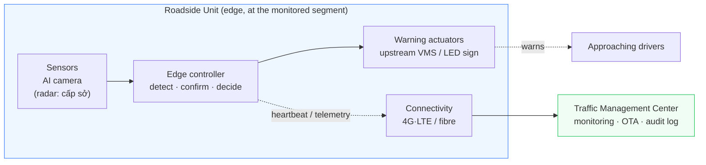

# Emergency Stop-Lane Automatic Warning System (ESW)

> 🇬🇧 Bản gốc tiếng Anh: [README.md](README.md)

> **Hệ thống cảnh báo tự động cho làn dừng xe khẩn cấp**
> Tài liệu kiến trúc và nền tảng được phát triển từ thuyết minh nhiệm vụ KHCN
> *"Nghiên cứu giải pháp cảnh báo tự động cho làn dừng xe khẩn cấp để giảm thiểu tai nạn giao thông"*
> — Trường Đại học Quản lý và Công nghệ TP.HCM, Khoa Công nghệ. Chủ nhiệm: ThS. Phó Trí Tín.

---

## Hệ thống này làm gì

Một thiết bị cảm biến đặt bên đường liên tục giám sát một **vùng phát hiện đã định trước** bao phủ
làn dừng xe khẩn cấp (hard shoulder). Khi một phương tiện **dừng** bên trong vùng đó, hệ thống
**tự động kích hoạt các bảng cảnh báo ở phía trước** (theo hướng xe tới) ("STOPPED VEHICLE AHEAD" /
*PHÍA TRƯỚC CÓ XE DỪNG KHẨN CẤP*) đủ xa về phía trước để các tài xế đang tới có thời gian giảm tốc và
chuyển làn. Khi phương tiện rời đi, cảnh báo **tự động được xóa**.

Vòng điều khiển hoàn toàn khép kín và cục bộ:

```
DETECT → CONFIRM (dwell) → WARN → TRACK → CLEAR → (back to idle)
```

Điều này chuyển làn dừng khẩn cấp từ **quan sát thụ động** (bảng cố định, CCTV thủ công, tam giác
phản quang do tài xế đặt) sang **cảnh báo chủ động, tự động** — luận điểm trung tâm của thuyết minh.

## Bản đồ tài liệu

| # | Tài liệu | Mục đích |
|---|----------|---------|
| — | [README.vi.md](README.vi.md) | Tệp này — tổng quan, mục lục, những thay đổi so với thuyết minh |
| 00 | [docs/00-context-and-glossary.vi.md](docs/00-context-and-glossary.vi.md) | Bối cảnh hệ thống, các bên liên quan, phạm vi/ngoài phạm vi, bảng thuật ngữ song ngữ, giả định & ràng buộc |
| 01 | [docs/01-requirements.vi.md](docs/01-requirements.vi.md) | Yêu cầu chức năng & phi chức năng, **tái định hình về an toàn**, phép tính bố trí cảnh báo (cự ly tầm nhìn), chỉ số đánh giá & tiêu chí nghiệm thu |
| 02 | [docs/02-system-architecture.vi.md](docs/02-system-architecture.vi.md) | Kiến trúc: góc nhìn logic & vật lý, các thành phần, máy trạng thái phát hiện→cảnh báo, luồng dữ liệu, triển khai, giao diện, ngăn xếp công nghệ |
| 03 | [docs/03-roadmap-and-phasing.vi.md](docs/03-roadmap-and-phasing.vi.md) | Lộ trình kỹ thuật ánh xạ lên 6 giai đoạn của thuyết minh, định nghĩa MVP, **rà soát thực tế ngân sách** |
| 04 | [docs/04-risk-and-safety.vi.md](docs/04-risk-and-safety.vi.md) | Bảng đăng ký rủi ro, FMEA rút gọn, thiết kế an toàn khi sự cố (fail-safe), quyền riêng tư & tuân thủ pháp lý |
| 05 | [docs/05-field-pilot-proposal.vi.md](docs/05-field-pilot-proposal.vi.md) | Đề xuất thử nghiệm hiện trường cấp sở — bản nháp (giai đoạn tiếp theo mà tài liệu 03–04 chuẩn bị) |
| 06 | [docs/06-traceability-matrix.vi.md](docs/06-traceability-matrix.vi.md) | **Ma trận truy vết kiểm chứng** — mỗi yêu cầu một dòng kiểm toán được → ADR → tầng → kịch bản → tiêu chí đạt (cổng tiền-xây-dựng) |
| 07 | [docs/07-simulation-methodology.vi.md](docs/07-simulation-methodology.vi.md) | **Phương pháp luận mô phỏng & kiểm chứng** (cố định Giai đoạn 2) — khung kiểm thử, mô hình cảm biến tổng hợp, bộ chuẩn đối chiếu (oracle), danh mục kịch bản có mã, tiêu chí đạt đăng ký trước |
| 08 | [docs/08-interface-control-document.vi.md](docs/08-interface-control-document.vi.md) | **Tài liệu Kiểm soát Giao diện (ICD) v1** — danh mục giao diện cụ thể, lược đồ thông điệp, giao thức liên kết biển báo được xác thực, hợp đồng cấu hình/OTA/ghi đè |
| 09 | [docs/09-software-hardware-handoff.vi.md](docs/09-software-hardware-handoff.vi.md) | **Bàn giao yêu cầu & giao diện Phần mềm → Phần cứng** — những gì phần mềm cần ở lựa chọn linh kiện phần cứng/firmware (RQ-H1..H7), và các quyết định liên-đội đang chặn các ADR còn ở trạng thái Đề xuất |
| 10 | [docs/10-if4-sign-controller-firmware-spec.vi.md](docs/10-if4-sign-controller-firmware-spec.vi.md) | **Đặc tả firmware bộ điều khiển biển báo IF-4 (RQ-H2)** — bàn giao firmware cơ chế tự ngắt an toàn cho ESP32: khung `SHOW` 29 byte được xác thực, kiểm tra + chống phát lại hai lớp, ngân sách thời gian phát LoRa quyết định `T_signhold`, và danh mục kiểm thử phù hợp của firmware |
| 11 | [docs/11-dev-environment-setup.vi.md](docs/11-dev-environment-setup.vi.md) | **Sổ tay thiết lập môi trường lập trình** — bộ công cụ cho ba môi trường xây dựng: camera AI K230 (CanMV/MicroPython + phép đo D3 của ADR-0015), server giám sát CoreIOT (kiểm tra nhanh đường lên IF-6/7), và bộ điều khiển biển báo ESP32 YoloUno (PlatformIO + bench theo tài liệu 10) |
| — | [docs/adr/README.vi.md](docs/adr/README.vi.md) | Mục lục các Bản ghi quyết định kiến trúc (ADR) (16 ADR; **bộ thuộc phần mềm đã chấp nhận**, phần còn lại Đề xuất chờ phần cứng/vận hành) |

Hình 1 từ thuyết minh (infographic khái niệm) được lưu tại
[docs/assets/figure-1-concept-infographic.jpeg](docs/assets/figure-1-concept-infographic.jpeg) và được
phản ánh trung thực bởi kiến trúc trong tài liệu 02.

## Kiến trúc nhìn tổng quan


<details><summary>Cùng góc nhìn dưới dạng sơ đồ Mermaid có thể chỉnh sửa</summary>



</details>

**Vòng lặp trọng yếu an toàn (cảm biến → biên → bảng) chạy hoàn toàn tại biên** và không bao giờ phụ
thuộc vào mạng hay đám mây. Trung tâm chỉ phục vụ giám sát, kiểm toán và cập nhật phần mềm. Xem
[ADR-0002](docs/adr/ADR-0002-edge-vs-cloud-processing.vi.md).

---

## Những gì tôi đã thay đổi hoặc bổ sung so với thuyết minh (rà soát của kỹ sư)

Thuyết minh có cấu trúc tốt và ý tưởng cốt lõi là vững chắc. Các tài liệu ở đây giữ nguyên chủ đích của
nó nhưng bổ sung sự chặt chẽ về mặt kỹ thuật mà một quá trình xây dựng cần đến, và đề xuất một vài hiệu
chỉnh. Những điểm quan trọng nhất:

1. **Tái định hình thành một hệ thống liên quan đến an toàn, không phải một bản trình diễn phát hiện.**
   Nguy cơ chủ đạo là một *lỗi âm thầm*: một phương tiện đang dừng nhưng cảnh báo không bao giờ xuất
   hiện. Toàn bộ thiết kế nay được tổ chức xoay quanh **hành vi an toàn khi sự cố (fail-safe), giám sát
   tình trạng, và hiệu chỉnh niềm tin** (tránh "báo động giả lặp lại" — hiệu ứng cừu giả).
   Xem [ADR-0005](docs/adr/ADR-0005-fail-safe-and-system-safety.vi.md) và [tài liệu 04](docs/04-risk-and-safety.vi.md).

2. **Bổ sung phép tính bố trí cảnh báo mà thuyết minh đã bỏ qua.** "Đặt bảng ở đầu làn" là chưa được
   đặc tả đầy đủ. Ở 100 km/h một tài xế cần **~185 m** chỉ để dừng và cần nhiều hơn đáng kể để *quyết
   định và chuyển làn*. Tài liệu 01 dẫn xuất cự ly cảnh báo phía trước cần thiết
   (cự ly tầm nhìn / cự ly tầm nhìn quyết định) và biến nó thành một yêu cầu bắt buộc.

3. **Đã xác định cảm biến đa nguồn là câu trả lời đúng cho các điều kiện quan trọng — rồi không đủ
   kinh phí cho nó.** Thuyết minh nêu đêm / mưa / sương mù / chói lóa là các điều kiện rủi ro cao
   nhất, và đây chính là nơi một hệ thống chỉ dùng camera yếu nhất. **Hợp nhất camera + radar** là câu
   trả lời về mặt thiết kế. Nó đã bị **Bác bỏ cho giai đoạn này ngày 2026-07-10**: tiêu chí cổng quyết
   định (phân giải lề đường với làn thông hành ở **cự ly giám sát**) không thể kiểm chứng trên bàn thử
   ở bất kỳ mức ngân sách nào đề tài này với tới được. **Bản dựng này chỉ dùng camera, và do đó tuyên
   bố về ban đêm/điều kiện bất lợi không được đưa ra** — rủi ro R5 được mang theo mà không có biện pháp
   giảm thiểu, thay vì dựa nó lên radar tổng hợp. Xem
   [ADR-0001](docs/adr/ADR-0001-sensing-modality.vi.md) và [doc 04](docs/04-risk-and-safety.vi.md)
   (R5, R20, R21). Radar sẽ trở lại cùng đề tài hiện trường cấp sở.

4. **Cụ thể hóa vòng kín** thành một máy trạng thái với **xác nhận theo thời gian chờ (dwell), trễ
   (hysteresis), ngữ nghĩa tập hợp đa phương tiện, một bộ giám sát (watchdog), và một trạng thái an
   toàn theo cơ chế tự ngắt an toàn (dead-man's switch)** — để một chiếc xe chỉ đơn thuần đi ngang qua
   không kích hoạt sai, và một bộ điều khiển bị sập không thể để biển báo kẹt BẬT. **Khoảng giữ-khi-che-khuất
   có radar chứng thực** đã được thiết kế và hiện thực nhưng **đang tạm ngưng trong bản dựng chỉ-dùng-camera
   này**: một xe tải che lề đường lâu hơn `T_hold` (~10 giây) *sẽ* làm rơi cảnh báo (một lần xóa lớn tiếng,
   có báo cho người trực — R20). Một lần
   che khuất kéo dài bởi xe tải dài không làm rớt một cảnh báo đang hoạt động, và một bộ điều khiển bị
   sập không thể để bảng cảnh báo kẹt ở trạng thái bật. **Cơ chế tự ngắt an toàn (dead-man's switch)
   nằm trong bộ điều khiển biển báo** (nên một hộp biên bị chết hoặc một liên kết bị cắt cũng làm trống
   bảng), và **các chế độ suy giảm là trung thực** (một thiết bị có camera bị chết thì *mù với sự cố
   mới*, chứ không phải "vẫn đang chạy"). Xem
   [tài liệu 02 §4](docs/02-system-architecture.vi.md#4-máy-trạng-thái-phát-hiệncảnh-báo),
   [ADR-0008](docs/adr/ADR-0008-detection-persistence-and-multitrack.vi.md),
   [ADR-0005](docs/adr/ADR-0005-fail-safe-and-system-safety.vi.md), và
   [ADR-0009](docs/adr/ADR-0009-failsafe-placement-and-degraded-modes.vi.md).

5. **Xử lý ưu tiên cục bộ.** Vòng lặp phát hiện→cảnh báo được tính toán trên một thiết bị biên đặt bên
   đường; đám mây là không trọng yếu. Một cảnh báo an toàn không được phép chờ một vòng truyền qua mạng
   di động.

6. **Định nghĩa các tiêu chí nghiệm thu đo lường được** (tỉ lệ phát hiện, tỉ lệ báo động giả, độ trễ
   phát hiện/xóa, cự ly cảnh báo trước hiệu dụng, độ sẵn sàng) — thuyết minh nói "đánh giá" nhưng không
   bao giờ nói đánh giá theo tiêu chí nào. Xem [tài liệu 01 §5](docs/01-requirements.vi.md).

7. **Rà soát thực tế ngân sách & phạm vi.** 20.000.000 VND (~US$800) tài trợ cho một **mô hình thử
   nghiệm trên bàn (bench)/mô phỏng và một mô hình minh họa nguyên lý**, không phải một triển khai hiện
   trường. Tài liệu 03 xác định phạm vi MVP cấp trường một cách trung thực và định vị các thử nghiệm
   hiện trường là đề tài cấp sở tiếp nối — điều mà chính thuyết minh đã dự liệu.

8. **Đề xuất tái sử dụng hạ tầng ITS hiện có.** Ở những nơi một đường cao tốc đã có sẵn các giá long
   môn (gantry) VMS do người vận hành điều khiển, hệ thống nên *cấp tín hiệu* cho chúng thay vì thêm
   bảng mới. Một bảng LED dùng pin mặt trời chuyên dụng là phương án dự phòng cho các đoạn chưa được
   trang bị thiết bị. Xem [ADR-0004](docs/adr/ADR-0004-warning-actuator-integration.vi.md).

9. **Bổ sung quyền riêng tư, tối thiểu hóa dữ liệu, và tuân thủ tiêu chuẩn** (tuân thủ biển báo theo
   QCVN 41, suy luận trên thiết bị, không lưu giữ video thô). Xem [tài liệu 04](docs/04-risk-and-safety.vi.md).

Một danh sách đầy đủ hơn nằm ở cuối [tài liệu 01](docs/01-requirements.vi.md#phụ-lục-a--các-thay-đổi-và-chỉnh-sửa-so-với-đề-xuất).

---

## Trạng thái

**Giai đoạn thiết kế + mô phỏng — đang xây dựng, chưa triển khai.** Các sản phẩm tài liệu (docs 00–11,
16 ADR) biến thuyết minh đã được phê duyệt thành một kế hoạch có thể xây dựng được, và những luồng công
việc xây dựng đầu tiên nay đã hình thành trên nền đó:

- **Phần mềm vòng lặp an toàn** ([`software/`](software/README.md)) — máy trạng thái quyết định, khối
  nhận thức (ROI-gating + bộ theo dõi), giám sát sức khỏe, telemetry, hộp thư lưu bền, và các bộ mã hóa
  kênh lệnh / liên kết biển báo có xác thực đều đã được hiện thực và đạt (xanh) trên sáu bảng mô phỏng
  (Level A–F) dưới CPython; riêng tập con `esw/` được nạp lên K230 còn được chứng minh chạy dưới
  **runtime MicroPython thật** trong CI.
- **Firmware bộ điều khiển biển báo ESP32** ([`firmware/sign-controller/`](firmware/sign-controller/README.md))
  — bộ khung cơ chế tự ngắt an toàn IF-4 (lõi xác thực, chống phát lại hai lớp, kênh mang LoRa) **biên
  dịch xanh** trên định nghĩa bo mạch YoloUno và vượt qua các vector tuân thủ lúc khởi động.
- **Lớp tri giác K230** ([`firmware/k230-detector/`](firmware/k230-detector/README.md)) — bộ nhận diện
  **đã kiểm thử trên thiết bị** của nhóm phần cứng ACLAB ELMS (YOLOv8n ~30 FPS, `kmodel` ngày/đêm, công
  cụ web cấu hình ROI, bộ lọc nhiễu) được đưa vào theo
  [ADR-0016](docs/adr/ADR-0016-repo-consolidation-and-perception-source.vi.md) làm backend thật sau điểm
  giáp ranh tri giác của ta. Chốt biển báo `LED:ON/OFF` qua MQTT của họ bị cơ chế tự ngắt an toàn IF-4 thay thế.
- **Giám sát CoreIOT** — một bài kiểm tra nhanh (smoke test) kết nối tới broker và đẩy lên được một nhịp
  heartbeat thật.

**Chưa xây dựng:** **adapter** nối bộ nhận diện K230 vừa đưa vào với ngăn xếp an toàn (lát cắt kế tiếp của
[ADR-0016](docs/adr/ADR-0016-repo-consolidation-and-perception-source.vi.md) — đầu ra bộ nhận diện của họ
→ `esw.perception`), các ràng buộc truyền tải mạng thật (telemetry và lệnh hiện vẫn chạy qua một uplink giả
và các khung do harness dựng), và **toàn bộ kiểm định trên phần cứng thật** — chưa có bo K230 hay YoloUno
nào trong tay, nên phép đo thời gian trên K230 và các bài kiểm định RF của LoRa vẫn là những ẩn số quyết
định. Xem [doc 03](docs/03-roadmap-and-phasing.md) cho lộ trình phân kỳ và thực tế ngân sách 20 triệu VND.

Về ADR: **tập ADR do phần mềm sở hữu đã được chấp nhận (2026-06-27)**; phần còn lại vẫn ở trạng thái
*Đề xuất*, chờ các quyết định phần cứng / vận hành ([mục lục ADR](docs/adr/README.md)).

*Ghi chú ngôn ngữ:* các tài liệu được viết bằng tiếng Anh (ngôn ngữ chung của giới kỹ thuật, khớp với
tên dự án) kèm một **bảng thuật ngữ song ngữ** ánh xạ mọi thuật ngữ then chốt trở lại thuyết minh tiếng
Việt. Bản dịch tiếng Việt đầy đủ đã có sẵn — mỗi tài liệu đều có một tệp `.vi.md` song song, và mỗi
sơ đồ đều có một biến thể `-vi.svg`.
