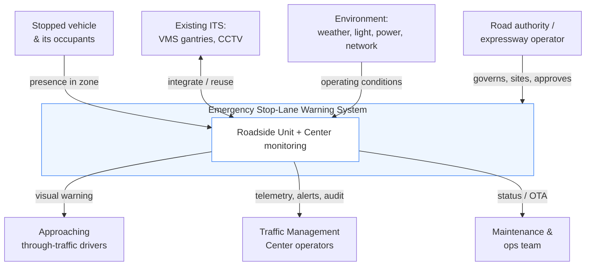

# 00 — System Context, Scope & Glossary

**Project:** Emergency Stop-Lane Automatic Warning System (ESW)
**Source:** KHCN task proposal, Trường ĐH Quản lý và Công nghệ TP.HCM — Khoa Công nghệ
**Status:** Foundational / Proposed
**Last updated:** 2026-06-26

This document fixes the vocabulary, boundaries, and operating assumptions that the rest of the
documentation builds on. Read it first.

---

## 1. Problem statement

The emergency stop lane (hard shoulder, *làn dừng xe khẩn cấp*) on a highway is meant for
unavoidable situations — breakdowns, accidents, a driver who must stop. A vehicle stopped there is a
**stationary obstacle adjacent to high-speed traffic**. The danger is acute when:

- approaching vehicles travelling at speed do not perceive the stopped vehicle early enough;
- a vehicle in the through lane swerves abruptly on suddenly seeing the obstacle;
- there is no early warning to following traffic;
- visibility is reduced — **night, rain, fog, glare, high traffic density**;
- the system relies on the stranded driver to deploy a warning triangle / hazard lights, which is
  often done late, incorrectly, or not at all.

Today's mitigations are **passive**: fixed signage, manually-monitored CCTV, and driver-initiated
warnings. The proposal's thesis is to make warning **active and automatic**: detect the stopped
vehicle and warn following traffic within seconds, without human intervention.

## 2. Goal & non-goals

**Goal.** Automatically detect a vehicle stopped in the emergency-lane detection zone and display an
upstream warning to approaching traffic early enough to act safely; clear the warning automatically
when the vehicle departs.

**In scope (this project / university level)**
- Principle model of the detection + warning system.
- Sensor / processor / sign layout design and the detection-to-warning logic (state machine).
- A bench prototype and/or simulation demonstrating auto on/off behaviour.
- Feasibility evaluation and a development path to a field pilot.

**Out of scope (explicit non-goals)**
- Detecting *causes* of stopping or diagnosing vehicle faults.
- Automated emergency-services dispatch, eCall, or incident management (future integration only).
- Enforcement / ticketing of illegal shoulder use (the system is for **safety warning**, not
  penalty — see §6 and [doc 04](04-risk-and-safety.md)).
- Controlling vehicles (no V2X actuation, no automated braking of third-party vehicles).
- Full continuous coverage of an entire highway in this phase (see coverage model in
  [doc 02](02-system-architecture.md) and the [coverage scope note](adr/README.md)).
- General incident detection (debris, wrong-way driver, congestion) — architecture is *extensible*
  toward these but they are not requirements here.

## 3. System context (who and what it touches)

## 4. Stakeholders

| Stakeholder | Interest / role |
|-------------|-----------------|
| **Approaching drivers** | Primary beneficiary — receive the early warning. Must trust it. |
| **Stranded vehicle occupants & rescue crews** | Protected by reduced rear-end collision risk. |
| **Expressway operator / road authority** (đơn vị quản lý, vận hành đường cao tốc) | Owns the road & existing ITS; approves siting; consumes alerts. |
| **Traffic Management Center (TMC)** | Monitors health, receives incident alerts, audits activations. |
| **Research team (PI, students, faculty)** | Builds the prototype; primary user of these docs. |
| **State traffic authorities** (cơ quan quản lý nhà nước về GTVT) | Regulate signage (QCVN 41), road safety, data. |
| **Industry partners** | Camera/AI, LED VMS, IoT sensor, controller vendors (future commercialization). |
| **Maintenance team** | Keeps field units powered, clean, calibrated, online. |

## 5. Assumptions

| ID | Assumption | If false → impact |
|----|-----------|-------------------|
| A1 | A monitored segment has a clearly markable emergency lane with a definable detection ROI. | ROI/geometry logic must be re-derived per site. |
| A2 | The unit can be mounted with an unobstructed view of the lane (pole/gantry, ~6–8 m). | Detection accuracy drops; may need multiple sensors. |
| A3 | Field power is available or solar+battery is feasible at the site. | See [ADR-0006](adr/ADR-0006-connectivity-and-power.md); siting constrained to powered locations. |
| A4 | A warning can be placed at the **required upstream distance** (doc 01 §4). | If the geometry can't fit the sight distance, the site is unsuitable — a real siting constraint. |
| A5 | At university scope, validation is by bench rig + simulation, not live traffic. | Field claims must be deferred to the cấp sở follow-on. |
| A6 | Vehicles of interest are cars/trucks/buses/motorcycles; pedestrians in-zone also warrant warning. | Object classes must include person. |

## 6. Guiding principles

1. **Fail safe, and fail loud to operators.** A silent detector failure is the worst outcome. The
   system self-monitors and escalates degradation to the TMC; it never *pretends* to be healthy.
2. **Warn, don't punish.** This is a driver-safety aid, not an enforcement camera. This shapes data
   retention, framing, and public acceptance.
3. **Trust is the product.** A warning that cries wolf is ignored; one that misses events is
   dangerous. Both false-alarm rate and miss rate are first-class requirements.
4. **Local-first.** The safety loop runs at the edge; connectivity is for oversight, not control.
5. **Reuse before you build.** Prefer feeding existing VMS/ITS over installing redundant hardware.
6. **Right-size to the budget.** Deliver a credible principle prototype, not an over-scoped field
   system the funding cannot support.

---

## 7. Bilingual glossary (EN ↔ VI)

| English term | Vietnamese (proposal) | Meaning in this system |
|--------------|----------------------|------------------------|
| Emergency stop lane / hard shoulder | làn dừng xe khẩn cấp | The lane being monitored for stopped vehicles. |
| Detection zone / ROI (region of interest) | vùng phát hiện / vùng giám sát | The predefined polygon in the sensor's field of view that defines "inside the emergency lane." |
| Stopped / parked vehicle | xe dừng / đậu | A vehicle stationary in the ROI beyond the confirmation dwell time. |
| Automatic warning | cảnh báo tự động | Warning activated by the system without human action. |
| Warning sign / VMS | bảng tín hiệu cảnh báo / bảng cảnh báo | Variable-message or LED sign shown to approaching traffic. |
| Variable Message Sign (VMS) | bảng tín hiệu điện tử | Electronically controllable roadway sign (gantry or roadside). |
| Central / edge processor | bộ xử lý trung tâm | The compute unit that runs detection and decides to warn. |
| Active warning | cảnh báo chủ động | System self-initiates warning (vs. passive fixed signs). |
| Closed-loop logic | chu trình khép kín | detect → confirm → warn → track → cancel. |
| AI computer vision | AI thị giác máy tính | Vehicle/person detection from camera imagery. |
| Multi-sensor fusion | kết hợp đa cảm biến | Combining camera + radar (+ optional thermal) for robustness. |
| Dwell time | (implicit) | How long a vehicle must remain to be "confirmed stopped." |
| Hysteresis | (implicit) | Different on/off thresholds to prevent the warning flapping. |
| Stopping Sight Distance (SSD) | (added) | Distance to perceive and brake to a stop; a *lower bound* for placement, not the governing one. |
| Decision Sight Distance (DSD) | (cự ly tầm nhìn quyết định) | Distance to detect, decide, and complete a **lane-change** manoeuvre; **this — not SSD — governs warning-sign placement** ([doc 01 §4](01-requirements.md#4-warning-placement--the-math-the-proposal-omits)). |
| Traffic Management Center (TMC) | trung tâm quản lý điều hành giao thông | Operations center that monitors and audits the system. |
| Pilot / field trial | thử nghiệm ngoài hiện trường | On-road test (the follow-on provincial project). |
| Provincial-level task | đề tài cấp sở | The larger follow-on grant after the university prototype. |
| University-level task | nhiệm vụ cấp trường | This funded task (the prototype/simulation scope). |
| Pilot production project | dự án sản xuất thử nghiệm | The proposal's declared project type (SXTN) — *experimental / pilot production*, which may imply a **trial-production** deliverable; **reconcile with the bench-prototype scope** ([doc 03 §1](03-roadmap-and-phasing.md#1-scope--budget-reality-check-read-first)). |
| Smart transportation / ITS | giao thông thông minh | Intelligent Transportation Systems domain. |
| Dead-man's switch | (cơ chế tự ngắt an toàn) | The **sign controller** blanks the sign automatically when the refreshed `SHOW` heartbeat stops — so a dead edge box or a cut link cannot leave a warning stuck on ([ADR-0009](adr/ADR-0009-failsafe-placement-and-degraded-modes.md)). |
| Ground-plane homography / calibration | (hiệu chuẩn mặt phẳng mặt đường) | Per-site mapping from image pixels to road coordinates, required for ROI footprint and camera↔radar fusion; **can drift** with pole sway / vibration / heat. |
| Degraded mode — *initiate* vs *hold* | (chế độ suy giảm) | What a unit can still do with one sensor down: a camera-dead unit can *hold* an existing warning but cannot *initiate* a new one (**blind to new hazards**). |
| Unwarned-exposure budget | (added) | The following vehicles that pass the sign during the ~`T_dwell + T_activate` window after a stop, before the warning lights ([doc 01 §4](01-requirements.md#4-warning-placement--the-math-the-proposal-omits)). |

> Throughout the docs, the first use of a domain term gives the Vietnamese in parentheses; thereafter
> the English term is used for brevity.
