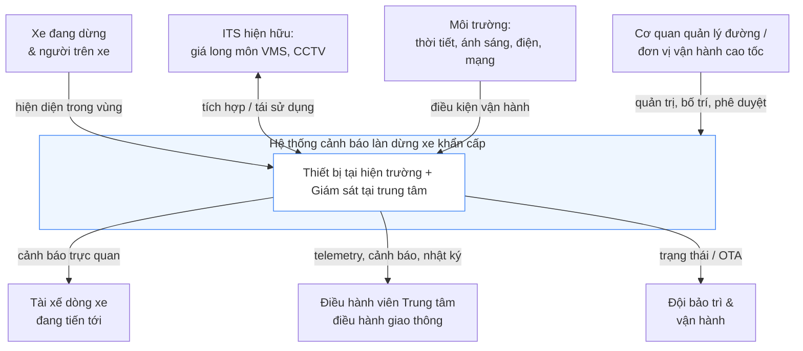

# 00 — Bối cảnh hệ thống, Phạm vi & Thuật ngữ

> 🇬🇧 Bản gốc tiếng Anh: [00-context-and-glossary.md](00-context-and-glossary.md)

**Dự án:** Hệ thống cảnh báo tự động làn dừng xe khẩn cấp (ESW)
**Nguồn:** Thuyết minh nhiệm vụ KHCN, Trường ĐH Quản lý và Công nghệ TP.HCM — Khoa Công nghệ
**Trạng thái:** Nền tảng / Đề xuất
**Cập nhật:** 2026-06-26

Tài liệu này ấn định bộ thuật ngữ, ranh giới và các giả định vận hành mà phần còn lại của bộ tài liệu sẽ xây dựng dựa trên đó. Hãy đọc tài liệu này trước.

---

## 1. Phát biểu vấn đề

Làn dừng xe khẩn cấp (hard shoulder, *làn dừng xe khẩn cấp*) trên đường cao tốc được dành cho những tình huống bất khả kháng — hỏng xe, tai nạn, hoặc tài xế buộc phải dừng lại. Một chiếc xe dừng tại đó là một **chướng ngại vật tĩnh nằm sát dòng xe tốc độ cao**. Mối nguy hiểm trở nên nghiêm trọng khi:

- các xe đang tiến tới với tốc độ cao không nhận biết được chiếc xe đang dừng đủ sớm;
- một xe trong làn lưu thông đánh lái đột ngột khi bất ngờ nhìn thấy chướng ngại vật;
- không có cảnh báo sớm cho dòng xe phía sau;
- tầm nhìn bị suy giảm — **ban đêm, mưa, sương mù, chói lóa, mật độ giao thông cao**;
- hệ thống phụ thuộc vào việc tài xế gặp sự cố tự đặt biển tam giác cảnh báo / bật đèn khẩn cấp, điều thường được thực hiện trễ, sai cách, hoặc hoàn toàn không được thực hiện.

Các biện pháp giảm thiểu hiện nay mang tính **thụ động**: biển báo cố định, CCTV giám sát thủ công, và cảnh báo do tài xế tự khởi xướng. Luận điểm của đề xuất là biến việc cảnh báo thành **chủ động và tự động**: phát hiện chiếc xe đang dừng và cảnh báo dòng xe phía sau trong vòng vài giây, không cần sự can thiệp của con người.

## 2. Mục tiêu & ngoài phạm vi

**Mục tiêu.** Tự động phát hiện một chiếc xe dừng trong vùng phát hiện của làn khẩn cấp và hiển thị cảnh báo phía trước (theo hướng xe tới) cho dòng xe đang tiến tới đủ sớm để hành động an toàn; tự động xóa cảnh báo khi chiếc xe rời đi.

**Trong phạm vi (dự án này / cấp trường)**
- Mô hình nguyên lý của hệ thống phát hiện + cảnh báo.
- Thiết kế bố trí cảm biến / bộ xử lý / bảng báo và logic từ phát hiện đến cảnh báo (máy trạng thái — state machine).
- Một mô hình thử nghiệm trên bàn (bench) và/hoặc mô phỏng minh họa hành vi bật/tắt tự động.
- Đánh giá tính khả thi và lộ trình phát triển đến thử nghiệm hiện trường.

**Ngoài phạm vi (ngoài phạm vi được nêu rõ)**
- Phát hiện *nguyên nhân* dừng xe hoặc chẩn đoán hư hỏng phương tiện.
- Tự động điều phối dịch vụ cứu hộ khẩn cấp, eCall, hoặc quản lý sự cố (chỉ là tích hợp trong tương lai).
- Cưỡng chế / xử phạt việc sử dụng làn dừng khẩn cấp trái phép (hệ thống nhằm **cảnh báo an toàn**, không phải xử phạt — xem §6 và [tài liệu 04](04-risk-and-safety.vi.md)).
- Điều khiển phương tiện (không có chấp hành V2X, không phanh tự động các phương tiện bên thứ ba).
- Phủ kín liên tục toàn bộ một tuyến đường cao tốc trong giai đoạn này (xem mô hình phạm vi giám sát trong [tài liệu 02](02-system-architecture.vi.md) và [ghi chú về phạm vi giám sát](adr/README.vi.md)).
- Phát hiện sự cố tổng quát (vật rơi, xe đi ngược chiều, ùn tắc) — kiến trúc có *khả năng mở rộng* hướng tới những điều này nhưng chúng không phải là yêu cầu ở đây.

## 3. Bối cảnh hệ thống (tương tác với ai và với cái gì)

## 4. Các bên liên quan

| Bên liên quan | Mối quan tâm / vai trò |
|-------------|-----------------|
| **Tài xế đang tiến tới** | Đối tượng hưởng lợi chính — nhận cảnh báo sớm. Phải tin tưởng vào cảnh báo đó. |
| **Người trên xe gặp sự cố & đội cứu hộ** | Được bảo vệ nhờ giảm nguy cơ va chạm từ phía sau. |
| **Đơn vị vận hành cao tốc / cơ quan quản lý đường** (đơn vị quản lý, vận hành đường cao tốc) | Sở hữu tuyến đường & hệ thống ITS hiện hữu; phê duyệt vị trí bố trí; tiếp nhận cảnh báo. |
| **Trung tâm điều hành giao thông (TMC)** | Giám sát tình trạng, nhận cảnh báo sự cố, kiểm tra các lần kích hoạt. |
| **Nhóm nghiên cứu (PI, sinh viên, giảng viên)** | Xây dựng mô hình thử nghiệm; người dùng chính của các tài liệu này. |
| **Cơ quan quản lý nhà nước về giao thông** (cơ quan quản lý nhà nước về GTVT) | Quản lý biển báo (QCVN 41), an toàn giao thông, dữ liệu. |
| **Đối tác công nghiệp** | Nhà cung cấp camera/AI, VMS LED, cảm biến IoT, bộ điều khiển (thương mại hóa trong tương lai). |
| **Đội bảo trì** | Duy trì các thiết bị hiện trường có điện, sạch sẽ, được hiệu chuẩn, trực tuyến. |

## 5. Giả định

| ID | Giả định | Nếu sai → tác động |
|----|-----------|-------------------|
| A1 | Một đoạn giám sát có làn khẩn cấp có thể đánh dấu rõ ràng với một vùng phát hiện (ROI) xác định được. | Logic ROI/hình học phải được suy ra lại cho từng vị trí. |
| A2 | Thiết bị có thể được lắp đặt với góc nhìn không bị che khuất về phía làn đường (trụ/giá long môn, ~6–8 m). | Độ chính xác phát hiện giảm; có thể cần nhiều cảm biến. |
| A3 | Có sẵn nguồn điện hiện trường hoặc pin mặt trời + ắc quy khả thi tại vị trí. | Xem [ADR-0006](adr/ADR-0006-connectivity-and-power.vi.md); vị trí bố trí bị giới hạn ở những nơi có điện. |
| A4 | Có thể đặt cảnh báo ở **cự ly phía trước (theo hướng xe tới) yêu cầu** (tài liệu 01 §4). | Nếu hình học không đáp ứng được cự ly tầm nhìn, vị trí đó không phù hợp — một ràng buộc bố trí thực tế. |
| A5 | Ở phạm vi cấp trường, việc kiểm chứng được thực hiện bằng mô hình thử nghiệm trên bàn (bench rig) + mô phỏng, không phải giao thông thực tế. | Các tuyên bố về hiện trường phải được hoãn lại cho đề tài cấp sở tiếp nối. |
| A6 | Các phương tiện cần quan tâm là ô tô con/xe tải/xe buýt/xe máy; người đi bộ trong vùng cũng cần được cảnh báo. | Các lớp đối tượng phải bao gồm cả người (person). |

## 6. Nguyên tắc định hướng

1. **An toàn khi sự cố, và báo lỗi rõ ràng cho điều hành viên.** Một lỗi phát hiện âm thầm là kết cục tệ nhất. Hệ thống tự giám sát và báo cấp tình trạng suy giảm lên TMC; nó không bao giờ *giả vờ* là đang hoạt động tốt.
2. **Cảnh báo, đừng xử phạt.** Đây là công cụ hỗ trợ an toàn cho tài xế, không phải camera cưỡng chế xử phạt. Điều này định hình cách lưu giữ dữ liệu, cách định khung, và sự chấp nhận của công chúng.
3. **Niềm tin chính là sản phẩm.** Một cảnh báo "báo động giả lặp lại" sẽ bị phớt lờ; một cảnh báo bỏ sót sự kiện thì nguy hiểm. Cả tỉ lệ báo động giả lẫn tỉ lệ bỏ sót đều là những yêu cầu hàng đầu.
4. **Ưu tiên xử lý cục bộ.** Vòng an toàn chạy tại biên; kết nối là để giám sát, không phải để điều khiển.
5. **Tái sử dụng trước khi xây mới.** Ưu tiên cấp tín hiệu cho VMS/ITS hiện hữu hơn là lắp đặt phần cứng dư thừa.
6. **Cân chỉnh đúng với ngân sách.** Cung cấp một mô hình nguyên lý đáng tin cậy, không phải một hệ thống hiện trường vượt quá phạm vi mà nguồn kinh phí không thể hỗ trợ.

---

## 7. Thuật ngữ song ngữ (EN ↔ VI)

| English term | Vietnamese (proposal) | Ý nghĩa trong hệ thống này |
|--------------|----------------------|------------------------|
| Emergency stop lane / hard shoulder | làn dừng xe khẩn cấp | Làn đường được giám sát để phát hiện xe dừng. |
| Detection zone / ROI (region of interest) | vùng phát hiện / vùng giám sát | Đa giác định trước trong trường nhìn của cảm biến, xác định phạm vi "bên trong làn khẩn cấp." |
| Stopped / parked vehicle | xe dừng / đậu | Một phương tiện đứng yên trong ROI vượt quá thời gian chờ (dwell) xác nhận. |
| Automatic warning | cảnh báo tự động | Cảnh báo được hệ thống kích hoạt mà không cần hành động của con người. |
| Warning sign / VMS | bảng tín hiệu cảnh báo / bảng cảnh báo | Bảng thông báo điện tử hoặc bảng LED hiển thị cho dòng xe đang tiến tới. |
| Variable Message Sign (VMS) | bảng tín hiệu điện tử | Bảng báo đường bộ điều khiển được bằng điện tử (trên giá long môn hoặc bên đường). |
| Central / edge processor | bộ xử lý trung tâm | Đơn vị tính toán chạy việc phát hiện và quyết định cảnh báo. |
| Active warning | cảnh báo chủ động | Hệ thống tự khởi xướng cảnh báo (so với biển báo cố định thụ động). |
| Closed-loop logic | chu trình khép kín | phát hiện → xác nhận → cảnh báo → theo dõi → hủy. |
| AI computer vision | AI thị giác máy tính | Phát hiện phương tiện/người từ hình ảnh camera. |
| Multi-sensor fusion | kết hợp đa cảm biến | Kết hợp camera + radar (+ nhiệt tùy chọn) để tăng độ bền vững. |
| Dwell time | (implicit) | Thời gian một phương tiện phải lưu lại để được "xác nhận đang dừng." |
| Hysteresis | (implicit) | Các ngưỡng bật/tắt khác nhau để ngăn cảnh báo nhấp nháy. |
| Stopping Sight Distance (SSD) | (added) | Cự ly để nhận biết và phanh dừng xe; là *cận dưới* cho việc bố trí, không phải yếu tố chi phối. |
| Decision Sight Distance (DSD) | (cự ly tầm nhìn quyết định) | Cự ly để phát hiện, ra quyết định và hoàn thành thao tác **chuyển làn**; **chính cự ly này — chứ không phải SSD — chi phối việc bố trí bảng báo cảnh báo** ([tài liệu 01 §4](01-requirements.vi.md#4-warning-placement--the-math-the-proposal-omits)). |
| Traffic Management Center (TMC) | trung tâm quản lý điều hành giao thông | Trung tâm vận hành giám sát và kiểm tra hệ thống. |
| Pilot / field trial | thử nghiệm ngoài hiện trường | Thử nghiệm trên đường (đề tài cấp sở tiếp nối). |
| Provincial-level task | đề tài cấp sở | Đề tài tiếp nối lớn hơn sau mô hình thử nghiệm cấp trường. |
| University-level task | nhiệm vụ cấp trường | Nhiệm vụ được cấp kinh phí này (phạm vi mô hình thử nghiệm/mô phỏng). |
| Pilot production project | dự án sản xuất thử nghiệm | Loại hình dự án được nêu trong đề xuất (SXTN). |
| Smart transportation / ITS | giao thông thông minh | Lĩnh vực Hệ thống giao thông thông minh (Intelligent Transportation Systems). |

> Xuyên suốt bộ tài liệu, lần sử dụng đầu tiên của một thuật ngữ chuyên ngành sẽ kèm theo tiếng Việt trong ngoặc đơn; sau đó thuật ngữ tiếng Anh được dùng cho ngắn gọn.
