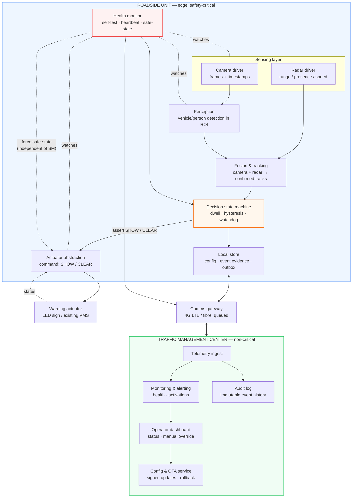
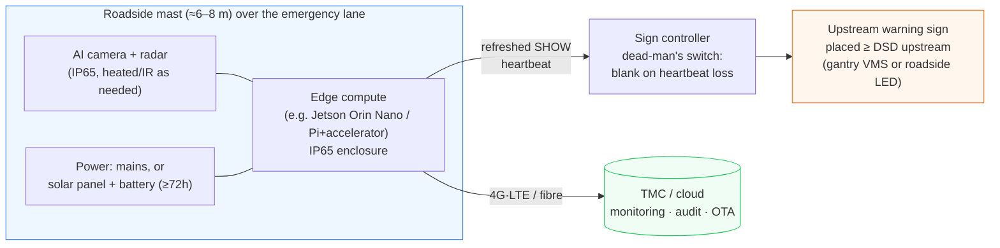
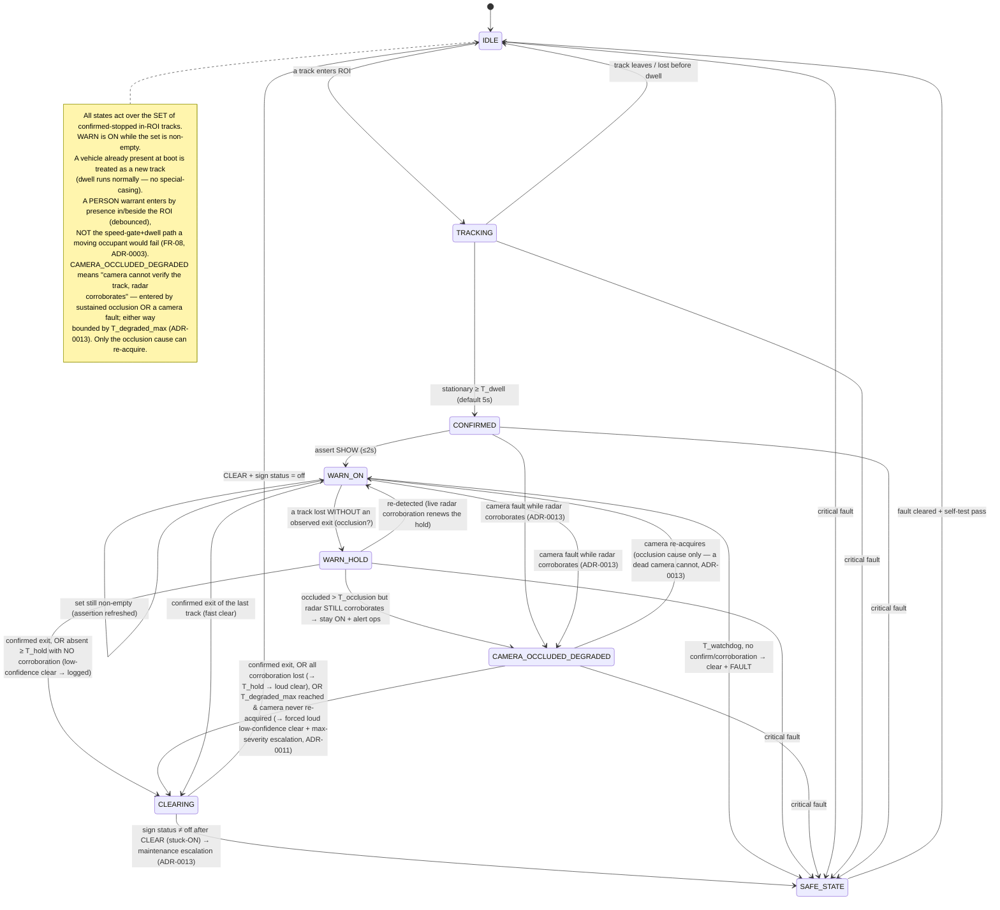
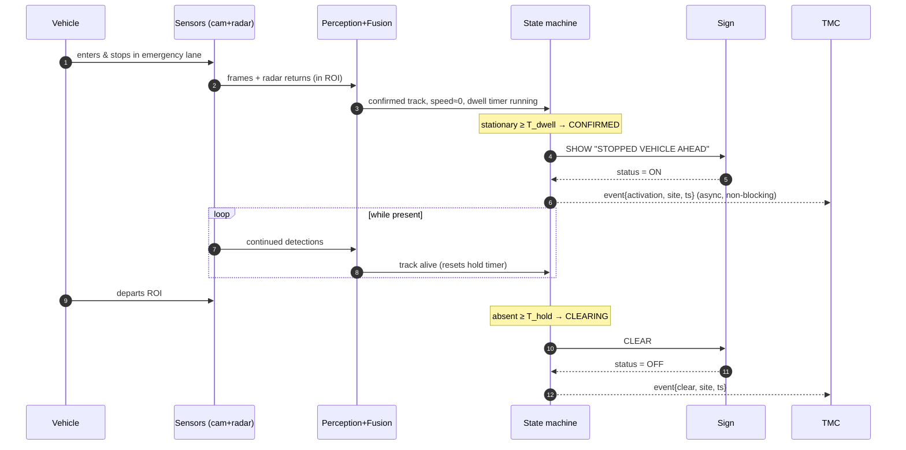

# 02 — System Architecture

**Project:** Emergency Stop-Lane Automatic Warning System (ESW)
**Status:** Proposed
**Last updated:** 2026-06-26
**Related:** [requirements](01-requirements.md) · [ADRs](adr/README.md) · [risk & safety](04-risk-and-safety.md)

This is the central design document. It describes *how* the system is built and *why* it is shaped
this way. It is faithful to Figure 1 of the proposal (the concept infographic, preserved at
[assets/figure-1-concept-infographic.jpeg](assets/figure-1-concept-infographic.jpeg)) and makes it
buildable.


*Tiếng Việt: [sơ đồ kiến trúc](assets/architecture-diagram-vi.svg).*

*Overview — the safety-critical loop (blue) runs at the edge; the center (teal) is oversight only;
amber is everything the driver sees. The detailed views follow below.*

---

## 1. Architectural drivers

The shape of this architecture follows directly from the requirements:

| Driver | Architectural response |
|--------|------------------------|
| Safety loop must not depend on the network (NFR-06) | **Edge-local closed loop**; cloud is monitoring-only ([ADR-0002](adr/ADR-0002-edge-vs-cloud-processing.md)). |
| Must work at night / rain / fog (FR-09, NFR-05) | **Multi-sensor**: camera + radar fusion ([ADR-0001](adr/ADR-0001-sensing-modality.md)). |
| No false triggers, no flapping, no stale-ON (FR-03/04/07, NFR-04) | **State machine** with dwell, hysteresis, and a **watchdog** (§4). |
| Fail-safe + fail-loud (FR-10/11) | **Health monitor + defined safe state + heartbeat** (§3, [ADR-0005](adr/ADR-0005-fail-safe-and-system-safety.md)). |
| Reuse infrastructure (FR-17) | **Pluggable actuator** abstraction: own LED sign *or* existing VMS ([ADR-0004](adr/ADR-0004-warning-actuator-integration.md)). |
| Right-size to budget (NFR-12) | Same logical design runs on a **simulation harness** and a **bench rig** (doc 03). |

## 2. Logical architecture (components & responsibilities)



**Component responsibilities**

| Component | Responsibility | Key notes |
|-----------|----------------|-----------|
| **Camera / radar drivers** | Acquire timestamped frames and radar returns. | Time sync between sensors matters for fusion. |
| **Perception** | Detect vehicles/persons; keep only detections whose footprint falls inside the ROI polygon. | Lightweight detector + ROI gating ([ADR-0003](adr/ADR-0003-detection-algorithm.md)). |
| **Fusion & tracking** | Associate camera detections with radar returns; produce stable tracks with position + speed + dwell. | Radar resolves "present & stationary" in the dark / rain. |
| **Decision state machine** | The brain. Applies dwell, hysteresis, occlusion/multi-track policy, watchdog; decides SHOW/CLEAR. | The only component that may **assert** a warning; **absence** of a live assertion is fail-safe by construction (see actuator). §4, [ADR-0008](adr/ADR-0008-detection-persistence-and-multitrack.md). |
| **Actuator abstraction** | Translate SHOW/CLEAR into the concrete sign protocol; **refresh the SHOW assertion** to the sign controller; read back sign status. | Swappable: own LED sign or existing VMS. The **dead-man's switch lives in the _sign controller_, downstream of the local link** (not in this edge-box component): it blanks the sign on loss of the refreshed SHOW heartbeat, so a crashed SM, a **dead edge box**, or a **cut/jammed link** all fall blank. This abstraction keeps an *inner* dead-man's switch on the SM heartbeat. A latching third-party VMS cannot honour the refresh contract and falls back to watchdog + active CLEAR + status read-back. See [ADR-0009](adr/ADR-0009-failsafe-placement-and-degraded-modes.md), [ADR-0005](adr/ADR-0005-fail-safe-and-system-safety.md). |
| **Health monitor** | Self-test every subsystem; emit heartbeat; drive safe state on fault. | Independent of the perception/decision path; can **force the actuator to safe state directly**, without routing through the (possibly wedged) state machine. See [ADR-0005](adr/ADR-0005-fail-safe-and-system-safety.md). |
| **Local store** | Hold config, the event-evidence buffer, and a durable outbox for telemetry. | Survives reboots; bounded retention (privacy). |
| **Comms gateway** | Store-and-forward telemetry; receive config/OTA. | Loss-tolerant; never in the safety path. |
| **TMC services** | Monitor, alert, audit, configure, update, override. | Off the critical path — can be offline without unsafe behaviour. |

## 3. Physical / deployment architecture


*Tiếng Việt: [sơ đồ triển khai](assets/deployment-diagram-vi.svg).*

*The roadside unit is one physical site: sensors + edge compute + power on the mast/cabinet, the
sign placed upstream (cable or radio link), and a non-critical uplink to the center. The editable
Mermaid source follows.*

> **Fail-safe is a property of the sign controller, not the edge box.** The sign is asserted by a
> *continuously refreshed* SHOW heartbeat; the **sign controller blanks the sign whenever that
> heartbeat stops** — so a dead edge box, a wedged OS, or a cut/jammed link all take the sign safe,
> not just an SM crash. Placing the dead-man's switch upstream of the link (in the edge box) would
> leave a latched sign stuck ON exactly when the box or link fails. See
> [ADR-0009 §A](adr/ADR-0009-failsafe-placement-and-degraded-modes.md).



**Placement geometry (critical — see [doc 01 §4](01-requirements.md#4-warning-placement--the-math-the-proposal-omits)):**

```
     traffic ──────────────────────────────────────────────►
   ┌──────────────────────────────────────────────────────┐
   │  through lanes (làn xe 1, làn xe 2)                    │
   ├──────────────────────────────────────────────────────┤
   │  emergency lane (làn dừng khẩn cấp)                    │
   │                          [████ stopped vehicle ████]   │
   └──────────────────────────────────────────────────────┘
        ▲                                  ▲           ▲
     WARNING SIGN                      sensor mast   detection
   (≥ DSD upstream:                   (overlooks      zone / ROI
    ~315 m @100 km/h)                  the ROI)     (vùng phát hiện)
```

The sign is **upstream** of the detection zone by at least the Decision Sight Distance — measured from
the **upstream (near) edge of the ROI**, so a vehicle stopping anywhere in the zone (the ROI spans tens
to low-hundreds of metres, §6) still receives at least the full DSD — so that following drivers receive
the warning before they reach the hazard. Figure 1 shows two signs (a
gantry VMS and a roadside board); both are valid instances of the same "warning actuator" — choose
per site (ADR-0004).

## 4. The detection→warning state machine

This is where the proposal's "chu trình khép kín" (closed loop) becomes precise. It is the single
authority over the sign and the place where false-trigger, flapping, stale-ON, **occlusion**, and
**multi-vehicle** risks are controlled. The persistence policy it implements is decided in
[ADR-0008](adr/ADR-0008-detection-persistence-and-multitrack.md).

**The machine operates over the _set_ of confirmed-stopped in-ROI tracks, not a single object.** The
warning is ON while that set is non-empty; it clears only when the set empties under the rules below.
This is what lets several vehicles stop, depart, and arrive independently without the warning
flapping or clearing early.


*Tiếng Việt: [sơ đồ máy trạng thái](assets/state-machine-diagram-vi.svg).*

*Blue = normal monitoring, amber = warning shown, red = fault safe state. Dwell (default 5 s) gates
false triggers; **a lost track is held while radar still corroborates presence (occlusion), but a
confirmed exit clears fast**; the watchdog clears **and raises a fault** if no channel can confirm, so
no warning can stick on silently; the safe state is reachable from any state and can be forced by the
independent health monitor. The editable Mermaid source follows.*



**Timers & guards.** Defaults are **starting points to be tuned empirically in Phase 3**
([doc 03 §5](03-roadmap-and-phasing.md#5-per-phase-risk-gates)), not derived constants; the
safety-relevant ones are the dwell, the two holds, and the watchdog.

| Symbol | Default | Purpose | Trade-off |
|--------|---------|---------|-----------|
| `T_dwell` | 5 s (3–10) | Stationary time before a track is declared "stopped". | Too low → false alarms from slow/transient vehicles; too high → late warning. Size it against the **unwarned-exposure budget** ([doc 01 §4](01-requirements.md#4-warning-placement--the-math-the-proposal-omits)). |
| `T_hold` | 10 s (5–15) | **Brief hysteresis**: hold through a short detection dropout **when no other channel corroborates**. | Absorbs flicker; too high → stale warning after a real departure not seen as an exit. |
| `T_occlusion` | up to 60 s (**renewable**) | Hold a lost track as **presumed-present** *while radar (or another channel) still corroborates a return* — sustained truck occlusion. Bounds only **un-renewed** corroboration; a live return renews it. | Past `T_occlusion` with radar **still** corroborating → **CAMERA_OCCLUDED_DEGRADED** (stay ON + alert ops), never a silent clear ([ADR-0009 §C](adr/ADR-0009-failsafe-placement-and-degraded-modes.md)). |
| `T_degraded_max` | e.g. 5 min (tunable; optional shorter ceiling for the camera-**fault** cause) | **Hard bound on `CAMERA_OCCLUDED_DEGRADED`** — the max time the warning may stay ON with the **camera unable to verify the track (occluded _or_ faulted) and only radar corroborating** before the machine forces an explicit, loud disposition ([ADR-0013](adr/ADR-0013-degraded-hold-unification.md) generalises this to the camera-fault cause). | The watchdog **cannot** bound this state — radar corroboration deliberately suppresses it — so without `T_degraded_max` a radar return mistaken for the shoulder car (the occluding through-lane truck, under a weak [ADR-0001](adr/ADR-0001-sensing-modality.md) criterion (b)) holds the sign ON **indefinitely**. On expiry with no camera re-verify: **forced loud low-confidence clear + max-severity escalation** to the operator, who owns the disposition from there ([ADR-0009 §C](adr/ADR-0009-failsafe-placement-and-degraded-modes.md), [ADR-0011](adr/ADR-0011-operator-concept-and-alarm-management.md)). |
| `T_activate` | ≤ 2 s | Confirmed → sign actually asserted ON. | Bounded by NFR-01 (qualified for the VMS backend). |
| `T_watchdog` | ≤ 30 s | Max time a warning may stay ON with **no** fresh confirmation or corroboration from any channel. | On expiry: **clear + raise a fault** (logic may be wedged). Prevents indefinite stale-ON (NFR-04). |
| `T_assert_refresh` | 0.5 s | Period at which the edge refreshes the SHOW assertion to the **sign controller**. | Must sit well below `T_signhold` so normal jitter never blanks a live warning. |
| `T_signhold` | 2 s | **Sign-controller dead-man's switch**: blank the sign if no fresh SHOW arrives within this window (covers SM crash, dead edge box, cut link). | Simultaneously the **max stale-ON after a hard failure** *and* the **min heartbeat gap that blanks a live, correct warning** ([ADR-0009 §A](adr/ADR-0009-failsafe-placement-and-degraded-modes.md)). |
| speed gate | < 3 km/h | Threshold below which a track counts as "stationary". | Separates "stopped" from "creeping along the shoulder". |
| `T_person_debounce` | ~1–2 s in/beside ROI | **Onset trigger for a pedestrian warrant** (FR-08): a *person* class detected in or immediately beside the ROI, debounced — **not** the speed-gate+dwell path, which a stranded occupant *walking* around their vehicle (3–6 km/h) would fail. | Too low → a person crossing/passing transiently false-triggers; too high → late warning for someone at risk. Persistence is still narrower than a vehicle's (no radar occlusion hold — [ADR-0008](adr/ADR-0008-detection-persistence-and-multitrack.md)). |

**ROI semantics.** A detection counts as in-ROI by **fractional footprint overlap** with the ROI
polygon (default ≥ 50 % of the track's ground footprint inside), not a single point — so a vehicle
**straddling** the shoulder/through-lane boundary (a common breakdown pose) is handled
deterministically instead of flickering at the edge. The ROI carries a defined **downstream exit
boundary** used to recognise a *confirmed exit*
([ADR-0008](adr/ADR-0008-detection-persistence-and-multitrack.md)).

**Calibration is load-bearing — and can drift.** Computing a *ground footprint* (not just an image box)
requires a per-site **ground-plane homography**, and attributing a radar return to a camera track
requires **camera↔radar extrinsic calibration** — both underpin ROI gating *and* fusion. **Calibration
drift** (pole sway in wind, vibration, thermal cycling — the very conditions NFR-13 rates for) silently
shifts the ROI and degrades fusion, manufacturing either misses or false alarms with no obvious symptom.
A per-site calibration procedure, a periodic re-check, and a **drift monitor** in the health monitor are
therefore required (a named **FR-10** self-monitoring function, [doc 01 §2](01-requirements.md#2-functional-requirements)),
and the failure is tracked as a risk ([doc 04 R15](04-risk-and-safety.md#1-risk-register)).

> **Drift-monitor spec (concrete enough to build and bound).** The monitor tracks a small set of
> **fixed reference points** in the scene (lane markings, a sign post, mounting fiducials — surveyed at
> calibration) and continuously compares their **observed image positions** against the positions the
> stored homography predicts; a residual exceeding a per-site **tolerance** (e.g. a few pixels / a
> fraction of a lane width, set at commissioning) for longer than a debounce raises a **calibration-drift**
> alarm and marks the unit **degraded** until re-calibrated. **Tier:** the *detection logic* is
> bench-demonstrable by injecting a synthetic homography shift (B); **real** drift from pole sway /
> thermal cycling is **field-deferred** (it needs the field enclosure and mast), so at bench scope R15's
> control is *logic-verified, not field-proven* — stated like the other designed-not-proven items
> ([doc 01 §3a](01-requirements.md#3a-verification-scope--what-the-funded-benchsim-phase-can-actually-show)).

**Why each guard exists (mapped to a real failure):**

- *Dwell* → a vehicle that drifts through or briefly touches the shoulder does **not** trigger.
- *Person presence-onset* → a **pedestrian** warrant (FR-08) is raised on *presence* in/beside the ROI
  (debounced, `T_person_debounce`), **not** the stationarity gate — because a stranded occupant typically
  *moves* (walks around the vehicle) and would never satisfy the `< 3 km/h` speed gate. Using the vehicle
  path for persons would systematically miss exactly the at-risk pedestrian hazard H-C names
  ([doc 04 §1](04-risk-and-safety.md#1-risk-register), [ADR-0003](adr/ADR-0003-detection-algorithm.md)).
- *Brief hysteresis (`T_hold`)* → momentary detector flicker does not blink the warning off/on.
- *Occlusion hold (`T_occlusion`) + radar corroboration* → a through-lane truck that hides the stopped
  car for many seconds does **not** drop a live warning, because radar still sees the return; the hold
  **renews** while *some* channel corroborates presence. If occlusion outlasts `T_occlusion` while radar
  still corroborates, the machine enters **CAMERA_OCCLUDED_DEGRADED** — the warning stays ON **and**
  operators are alerted (likely a compound incident or a camera fault), never a silent clear. This
  closes the occlusion-induced silent-miss gap that a single absence-timeout would open
  ([ADR-0008](adr/ADR-0008-detection-persistence-and-multitrack.md), [ADR-0009](adr/ADR-0009-failsafe-placement-and-degraded-modes.md)).
- *Confirmed exit vs. lost track* → a vehicle **seen leaving** (speed up + crossing the exit boundary)
  clears fast; a track **lost in place** is held, not cleared. Departure carries evidence; occlusion
  does not.
- *Set semantics* → the warning reflects whether **any** confirmed-stopped vehicle remains, so several
  vehicles arriving/leaving independently are handled without an early clear.
- *Watchdog* → if the logic wedges, or every channel genuinely loses the target with no exit seen, the
  watchdog **clears and raises a fault** — a *loud*, logged, low-confidence clear, never a silent
  stuck-ON. **No warning can be stuck on forever.**
- *Bounded degraded hold (`T_degraded_max`)* → the watchdog above is **deliberately suppressed** while
  radar corroborates ([ADR-0008](adr/ADR-0008-detection-persistence-and-multitrack.md)), so
  `CAMERA_OCCLUDED_DEGRADED` — camera occluded, only radar holding the warning ON — is the one state the
  watchdog cannot bound. If criterion (b) is weak, the "corroborating" return may be the **occluding
  through-lane truck**, not the shoulder car, and the warning would stay ON **indefinitely** on an
  unverifiable return. `T_degraded_max` forces a **loud** disposition (low-confidence clear +
  max-severity operator escalation, [ADR-0011](adr/ADR-0011-operator-concept-and-alarm-management.md)) so
  **no state — software *or* sensor-discrimination — holds the sign ON forever without lane-attributed
  confirmation** (NFR-04). This closes the last indefinite-hold path.
- *Safe state* → on any critical fault the machine leaves normal operation and escalates; the sign can
  be forced safe by the **independent health monitor** even if the state machine is wedged (dead-man's
  switch, [ADR-0005](adr/ADR-0005-fail-safe-and-system-safety.md)).

**Sensing-degraded modes — *initiate* and *hold* are not symmetric.** Losing a sensor is not one flat
"degraded" state; what the unit can still do depends on *which* sensor:

| Mode | Confirm a **new** stop? | **Hold** an existing warning? | Posture |
|------|-------------------------|-------------------------------|---------|
| Camera + radar (FULL) | yes | yes (incl. occlusion hold) | normal |
| Radar dead (CAMERA-ONLY) | yes | yes, but no occlusion hold | degraded + alert |
| Camera dead (RADAR-ONLY) | **no** — no class / no image-ROI geometry | yes, but only as the **bounded camera-unverified hold** (= `CAMERA_OCCLUDED_DEGRADED` semantics): while radar corroborates, **bounded by `T_degraded_max`** → forced loud clear; **no** camera re-acquire ([ADR-0013](adr/ADR-0013-degraded-hold-unification.md)) | **BLIND-TO-NEW: critical alert** |
| Both dead | no | no | SAFE STATE + alert |

A camera-dead unit is **blind to new hazards** and must say so loudly — *not* a benign "radar keeps
running" mode, because radar alone cannot place a new object in the shoulder ROI or class it. Rationale
and the fault-injection set: [ADR-0009 §B](adr/ADR-0009-failsafe-placement-and-degraded-modes.md); the
[doc 04 §2](04-risk-and-safety.md#2-fmea-lite-failure-mode--effect--detection--response) FMEA rows
follow this table.

**Warning × sensor-mode interaction matrix (the two regions are orthogonal).** The warning lifecycle
above and the sensing-health mode are **concurrent regions** — a unit can be in `WARN_ON` *and* lose its
camera — so the behaviour lives in their *product*, enumerated here rather than left to inference
([ADR-0013](adr/ADR-0013-degraded-hold-unification.md) §B). The key correction over the prior single-region
view: **camera-fault-while-warning is the same bounded camera-unverified hold as occlusion** (`T_degraded_max`),
not an unbounded "brief" hold.

| Warning state ↓ / Sensing → | **FULL** | **CAMERA-ONLY** (radar dead) | **RADAR-ONLY** (camera dead) | **NEITHER** |
|---|---|---|---|---|
| **IDLE / TRACKING** | normal | initiate OK; no radar cross-check; degraded+alert | **BLIND-TO-NEW** — cannot initiate; critical alert | **SAFE STATE** + critical alert |
| **CONFIRMED / WARN_ON** | normal | initiate OK; no occlusion hold | camera now dead → **bounded camera-unverified hold** (`T_degraded_max`); critical alert | **SAFE STATE** + critical alert |
| **WARN_HOLD** | hold while corroborated → `CAMERA_OCCLUDED_DEGRADED` past `T_occlusion` | brief `T_hold` only → loud low-confidence clear | **bounded camera-unverified hold** (`T_degraded_max`); critical alert | **SAFE STATE** + critical alert |
| **CAMERA_OCCLUDED_DEGRADED** | bounded by `T_degraded_max`; re-acquire→`WARN_ON` (occlusion cause) | same; no radar cross-check | bounded by `T_degraded_max`; **no** re-acquire (fault cause) | **SAFE STATE** + critical alert |
| **CLEARING** | clear; confirm sign off (else→SAFE STATE, stuck-ON) | clear; confirm sign off | clear; confirm sign off | **SAFE STATE** + critical alert |

No cell is unbounded or silent: **RADAR-ONLY** is BLIND-TO-NEW when idle and a `T_degraded_max`-bounded
hold when a warning is already up; **NEITHER** is always SAFE STATE.

**Congestion is a distinct false-trigger mode (not a transient pass-through).** In stop-and-go or a jam
— a *named* high-risk condition — the through lane nearest the shoulder is itself stationary against the
ROI boundary, so dwell (everything is stationary) and radar (everything is present) cannot discriminate;
only ROI geometry separates a shoulder breakdown from queued through-traffic, and that is most fragile
exactly here. The decision logic must therefore detect **general congestion** (multiple stationary
tracks spanning the through lanes) and **suppress or re-message** the shoulder warning rather than
assert "stopped vehicle ahead, change lane" into a jam where it is both wrong and counter-productive. It
is an explicit acceptance scenario ([doc 01 §5](01-requirements.md#5-evaluation-metrics--acceptance-criteria))
and a tracked risk ([doc 04 R14](04-risk-and-safety.md#1-risk-register)). Two consequences must be stated,
not buried: (1) suppressing the warning in a jam is a **deliberate coverage gap in a _named_ top-danger
condition** ("high traffic density", [doc 00 §1](00-context-and-glossary.md#1-problem-statement)), so it
is recorded as a **limit of protection** ([doc 04 §0](04-risk-and-safety.md#0-limits-of-protection-residual-hazards)),
not merely a false-trigger control; (2) *re-messaging* presupposes a **second QCVN-41-conformant
message** exists — if it does not, only suppression is available
([ADR-0004](adr/ADR-0004-warning-actuator-integration.md)).

**Warm reboot during an active warning — a re-exposure the cold boot-present rule does not cover.** The
boot-present rule (treat a vehicle present at startup as a new track, run full dwell) is written for a
*cold* start. An **unplanned reboot** (power blip, crash-restart) *while a warning is ON* is different:
the dead-man's switch correctly blanks the sign during the downtime, but on restart the still-stopped
vehicle must re-serve the full `T_dwell` before the warning returns — a **fresh unwarned-exposure window
for a vehicle that was already protected**
([doc 01 §4](01-requirements.md#4-warning-placement--the-math-the-proposal-omits)). Planned OTA/restarts
are deferred while a warning is active (FR-21); unplanned ones are not, so this re-exposure is a stated
residual. A persisted *warning-active-at-shutdown* flag may shorten re-confirmation for a vehicle still
at the same ROI position on reboot — **an open safety question** to settle in detailed design
([doc 04 §5 Q7](04-risk-and-safety.md#5-open-safety-questions-for-the-team)): shortening re-confirmation
trades the re-exposure window against a possible **stale-ON on a vehicle that actually departed during
the outage**, so it must not be done blindly.

## 5. Runtime data flow (happy path)


*Tiếng Việt: [sơ đồ trình tự](assets/runtime-sequence-diagram-vi.svg).*

*The sign displays "stopped vehicle ahead" (PHÍA TRƯỚC CÓ XE DỪNG KHẨN CẤP). Dashed arrows are
asynchronous/return messages — the TMC notifications are fire-and-forget, so a down link never
stalls the safety loop. The editable Mermaid source follows.*



The TMC interactions (steps to `T`) are **fire-and-forget**: if the link is down, events queue in the
local outbox and the safety loop is unaffected.

## 6. Coverage model

A single roadside unit covers a **bounded segment** (the length its sensors reliably see —
realistically tens to low-hundreds of metres). An emergency lane is continuous, so full coverage is
neither affordable nor in scope. The model is therefore **discrete monitored zones at high-value
locations**:

- approaches to **tunnels, bridges, elevated sections** (Figure-1 use cases);
- **curves / crests** with limited sight distance;
- known **incident hotspots** and lay-by/stop points;
- expressway segments where the operator reports recurring shoulder stops.

For this project, **one pilot zone** (or its simulation) is the scope. Scaling to many zones is a
deployment/CapEx question for the field follow-on, not an architecture change — units are independent
and report to the same TMC.

## 7. Interfaces & contracts (initial)

| Interface | Between | Shape (indicative) |
|-----------|---------|--------------------|
| Detection event | Perception → State machine | `{track_id, class, bbox/range, speed, in_roi, ts}` |
| Sign command | State machine → Actuator | `SHOW(message_id) | CLEAR | STATUS?` returns `{state, lamp_ok, ts}` |
| Sign assertion (link) | Edge box → Sign controller | refreshed `SHOW(message_id)` every `T_assert_refresh` (authenticated); controller blanks on loss within `T_signhold`; **own reliability/latency/energy/auth budget** over the ≥ DSD link ([ADR-0009 §A](adr/ADR-0009-failsafe-placement-and-degraded-modes.md)) |
| Heartbeat | Health monitor → TMC | `{site_id, fw_ver, cfg_ver, model_ver, calib_ver, subsystem_health[], state, ts}` at fixed cadence |
| Activation/clear event | State machine → TMC/audit | `{site_id, type, evidence_ref?, cfg_ver, model_ver, calib_ver, ts}` (store-and-forward) |
| Config | TMC → Roadside | `{roi_polygon, T_dwell, T_hold, T_occlusion, T_person_debounce, speed_gate, message_set, T_override_max}` (signed) — site-tunable subset; the **full safety-parameter surface and its FR-20 bounds are §7a** |
| OTA | TMC → Roadside | signed image + version + rollback token |

> **Every safety-relevant event carries the active-config fingerprint.** A liability-grade audit
> ([doc 04 R10](04-risk-and-safety.md#1-risk-register)) must reconstruct *what the unit was running* at
> event time — so each heartbeat and activation/clear/fault event carries the version hashes of the
> **ROI/config (`cfg_ver`), model (`model_ver`), and calibration (`calib_ver`)** in force, bound
> together. Without it, "the sign was ON at 02:14" cannot be tied to the ROI, timers, model, and
> homography that produced it. Cheap to add now, expensive to retrofit.
>
> **The edge↔sign link is a first-class interface, not an internal cable.** Because the sign sits ≥ DSD
> upstream ([§3](#3-physical--deployment-architecture)), the refreshed-`SHOW` heartbeat crosses a 300 m+
> field link whose loss/latency/energy/auth budget governs both fail-safe timing and flap risk
> ([ADR-0009 §A](adr/ADR-0009-failsafe-placement-and-degraded-modes.md)); validating it over distance is
> **field-deferred**, since the bench runs it over a metre of cable.

### 7a. Configuration & safety-parameter surface (the authoritative FR-20 bounds list)

The §4 timer table calls its defaults *"starting points to be tuned empirically in Phase 3"* — so the
safety-relevant parameters are **not** all compile-time constants, and the set that can be **pushed or
tuned** is **larger than the Config schema above and larger than the list [FR-20](01-requirements.md#2-functional-requirements)
first enumerated** (which named only ROI / dwell / hold / speed-gate / message-set). That gap is a safety
hole: FR-20's whole thesis is that *"signing prevents tampering, not operator error"* — a bad
`T_signhold` or `T_degraded_max` silently breaks the safety function and trips no canary. This table is
the **single authoritative surface**: every safety-relevant parameter, whether **runtime-config** or a
**bounded constant**, with the **hard range the unit clamps to under FR-20**. Nothing safety-relevant is
tunable *outside* this table.

| Parameter | Scope | Default | FR-20 hard bound (clamp/reject) | Notes |
|-----------|-------|---------|----------------------------------|-------|
| `roi_polygon` | runtime-config | per-site | within sensor FOV; ≥ min area; on-road | bad ROI = systematic miss/false-alarm |
| `T_dwell` | runtime-config | 5 s | **3–10 s** | sized vs. unwarned-exposure budget ([doc 01 §4](01-requirements.md#4-warning-placement--the-math-the-proposal-omits)) |
| `T_hold` | runtime-config | 10 s | **5–15 s** | brief hysteresis |
| `T_occlusion` | runtime-config | 60 s | **≤ 120 s** | renewable while corroborated |
| `T_person_debounce` | runtime-config | 1–2 s | **0.5–3 s** | pedestrian presence-onset |
| `speed_gate` | runtime-config | 3 km/h | **1–5 km/h** | "stationary" threshold |
| `T_override_max` | runtime-config (policy) | 30 min / 8 h ceiling | **≤ 8 h** | override expiry ceiling ([ADR-0010](adr/ADR-0010-operator-override-and-manual-control.md)) |
| `message_set` | runtime-config | per QCVN-41 | members ∈ approved set only | conformance ([ADR-0004](adr/ADR-0004-warning-actuator-integration.md)) |
| `T_degraded_max` | bounded constant (config under tight ceiling) | 5 min (shorter optional for fault cause) | **≤ 10 min** | the backstop on the camera-unverified hold ([ADR-0013](adr/ADR-0013-degraded-hold-unification.md)); must never be tunable to "effectively never" |
| `T_watchdog` | bounded constant | ≤ 30 s | **≤ 30 s** | stale-ON backstop (NFR-04); ceiling is hard |
| `T_signhold` | bounded constant | 2 s | **≤ 3 s** | dead-man's-switch window ([ADR-0009 §A](adr/ADR-0009-failsafe-placement-and-degraded-modes.md)); a large value defeats fail-safe |
| `T_assert_refresh` | bounded constant | 0.5 s | **≤ ¼·`T_signhold`** | must stay well below `T_signhold` (flap control) |
| `T_activate` | bounded constant | ≤ 2 s | **≤ 2 s** | NFR-01 (LED backend) |
| drift tolerance | bounded constant (per-site at commissioning) | per-site | within surveyed envelope | drift-monitor threshold (§4, R15) |

**Rule:** the safety-critical backstops (`T_watchdog`, `T_signhold`, `T_assert_refresh`, `T_degraded_max`,
`T_activate`) are bounded so tightly that no pushed value can disable the invariant they protect; the
unit **rejects or clamps** any value outside the column above and keeps the last-good, **loud to operators**
(FR-20, [doc 04 R16](04-risk-and-safety.md#1-risk-register)). Ranges are the starting bounds to confirm in
the Phase-2 freeze; the *point* is that the list is complete and every entry has a bound.

Concrete encodings (protobuf/JSON, MQTT/HTTPS for telemetry; the sign vendor's protocol or an
NTCIP-style profile for VMS) are deferred to detailed design; the **abstraction boundaries above are
the architectural commitment.**

> **Time is load-bearing — give it an owner.** Camera↔radar fusion needs sub-frame *relative* sync, and
> the audit log needs trustworthy *absolute* timestamps (liability evidence,
> [doc 04 R10](04-risk-and-safety.md#1-risk-register)). A roadside unit in a tunnel has no NTP and a
> free-running wall-clock drifts. Choose the time source explicitly in detailed design — e.g. **GNSS/PPS
> for absolute time + a shared or PTP clock for inter-sensor sync**, holding over connectivity outages —
> rather than inheriting whatever the OS clock does. This is now a **requirement (NFR-16)**, not merely a
> design note ([ADR-0001](adr/ADR-0001-sensing-modality.md) AI#3).

## 8. Recommended technology stack (indicative, not binding)

| Layer | Recommendation | Rationale |
|-------|----------------|-----------|
| Edge compute | NVIDIA Jetson Orin Nano *or* Raspberry Pi 5 + Hailo/Coral accelerator | Enough TOPS for a small detector at the edge; low power for solar. |
| Camera | Global-shutter or good-WDR IP camera; IR illumination for night | Handles glare and night per NFR-05. |
| Radar | Automotive-grade 24/77 GHz presence+range radar | Night/fog/rain presence; complements camera (ADR-0001). |
| Perception | Compact detector (YOLO-nano / SSD-Mobilenet class) + ROI gating + simple tracker (SORT/ByteTrack) | Robust, cheap, edge-friendly (ADR-0003). |
| Runtime | Containerised services, systemd-supervised; watchdog process | Restartability + isolation; health monitor independent of perception. |
| Local store | SQLite + ring-buffer for event evidence | Small, durable, bounded retention (privacy). |
| Telemetry | MQTT over TLS, store-and-forward outbox | Loss-tolerant, lightweight. |
| Sign | LED matrix VMS (QCVN-41-compliant) *or* existing operator VMS via its protocol | ADR-0004. |
| Simulation | CARLA / SUMO or a custom 2-D scenario player feeding synthetic detections | Validate the state machine without traffic (doc 03). |
| TMC | Small web service + time-series store + dashboard | Monitoring/audit only; not safety-critical. |

> These are starting points sized to the budget and skills; each is revisited in detailed design and
> the load-bearing ones are argued in the ADRs.

## 9. How this maps to Figure 1

| Figure 1 element (VI) | Architecture component |
|-----------------------|------------------------|
| Camera AI giám sát làn dừng | Camera driver + Perception (+ radar added here) |
| AI nhận diện ô tô đậu trong vùng | Perception + Fusion, ROI-gated |
| Vùng phát hiện (red dashed area) | The ROI polygon / detection zone |
| Bộ xử lý AI / điều khiển | Edge compute: Fusion + **State machine** |
| Hệ thống tự động gửi tín hiệu cảnh báo | Actuator abstraction → sign command |
| Bảng tín hiệu ở đầu làn / gantry VMS | Warning actuator (placed ≥ DSD upstream) |
| Tự động tắt khi xe rời đi | `WARN_HOLD → CLEARING → IDLE` transitions |
| Lợi ích: phát hiện tự động, cảnh báo kịp thời | Met by latency + availability NFRs |

The architecture adds, beyond the infographic: **radar fusion, the dwell/hysteresis/watchdog logic,
the health-monitor + safe-state, DSD-based placement, and the TMC oversight plane** — i.e. the parts
that make it dependable rather than just demonstrable.
