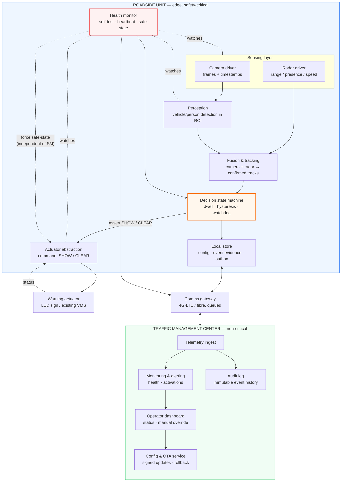
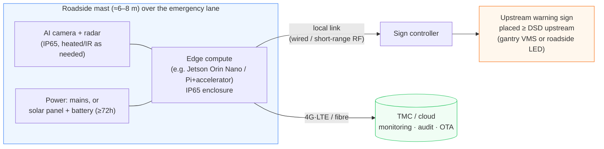
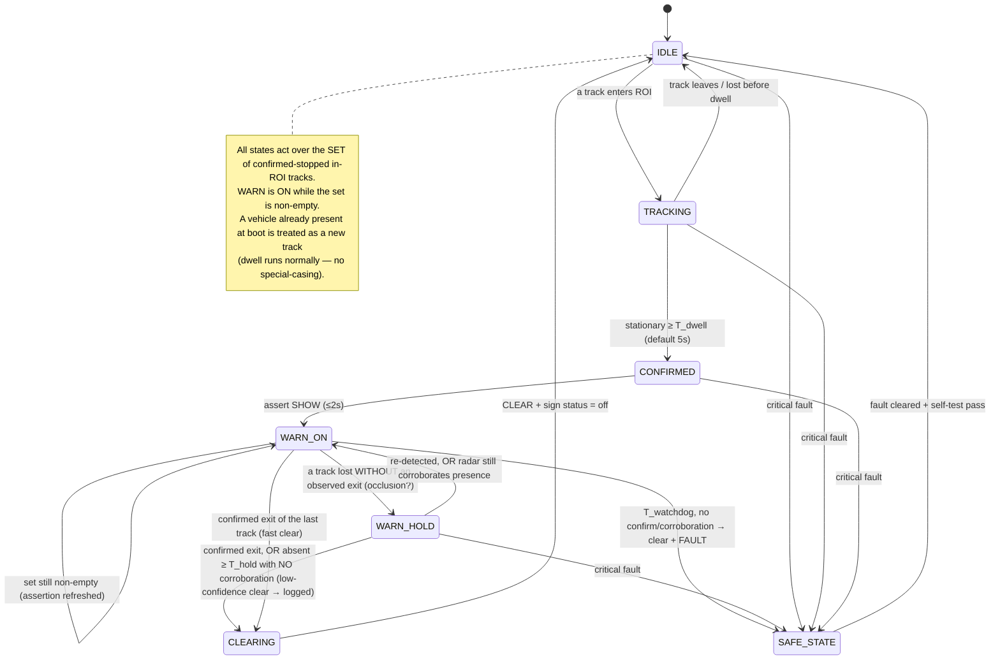
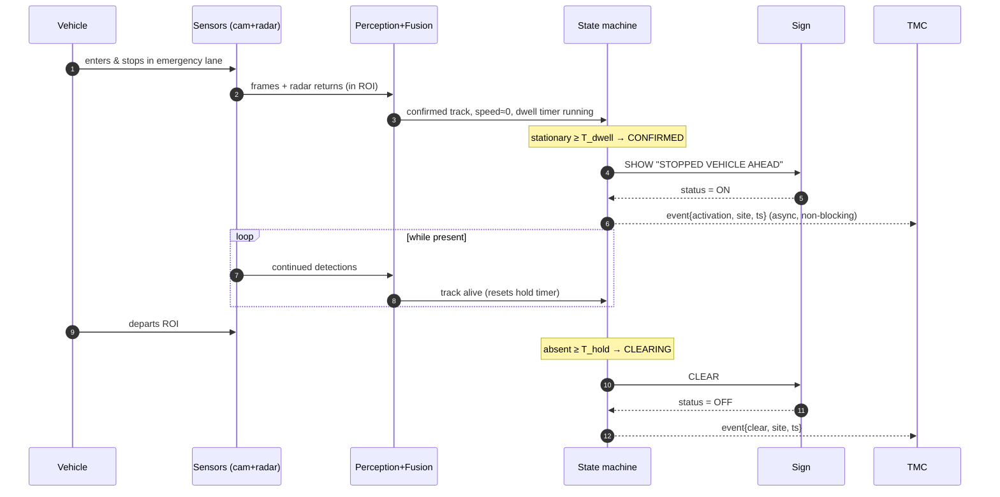

# 02 — System Architecture

**Project:** Emergency Stop-Lane Automatic Warning System (ESW)
**Status:** Proposed
**Last updated:** 2026-06-26
**Related:** [requirements](01-requirements.md) · [ADRs](adr/README.md) · [risk & safety](04-risk-and-safety.md)

This is the central design document. It describes *how* the system is built and *why* it is shaped
this way. It is faithful to Figure 1 of the proposal (the concept infographic, preserved at
[assets/figure-1-concept-infographic.jpeg](assets/figure-1-concept-infographic.jpeg)) and makes it
buildable.


*Tiếng Việt: [sơ đồ kiến trúc](assets/architecture-diagram-vi.svg).*

*Overview — the safety-critical loop (blue) runs at the edge; the center (teal) is oversight only;
amber is everything the driver sees. The detailed views follow below.*

---

## 1. Architectural drivers

The shape of this architecture follows directly from the requirements:

| Driver | Architectural response |
|--------|------------------------|
| Safety loop must not depend on the network (NFR-06) | **Edge-local closed loop**; cloud is monitoring-only ([ADR-0002](adr/ADR-0002-edge-vs-cloud-processing.md)). |
| Must work at night / rain / fog (FR-09, NFR-05) | **Multi-sensor**: camera + radar fusion ([ADR-0001](adr/ADR-0001-sensing-modality.md)). |
| No false triggers, no flapping, no stale-ON (FR-03/04/07, NFR-04) | **State machine** with dwell, hysteresis, and a **watchdog** (§4). |
| Fail-safe + fail-loud (FR-10/11) | **Health monitor + defined safe state + heartbeat** (§3, [ADR-0005](adr/ADR-0005-fail-safe-and-system-safety.md)). |
| Reuse infrastructure (FR-17) | **Pluggable actuator** abstraction: own LED sign *or* existing VMS ([ADR-0004](adr/ADR-0004-warning-actuator-integration.md)). |
| Right-size to budget (NFR-12) | Same logical design runs on a **simulation harness** and a **bench rig** (doc 03). |

## 2. Logical architecture (components & responsibilities)



**Component responsibilities**

| Component | Responsibility | Key notes |
|-----------|----------------|-----------|
| **Camera / radar drivers** | Acquire timestamped frames and radar returns. | Time sync between sensors matters for fusion. |
| **Perception** | Detect vehicles/persons; keep only detections whose footprint falls inside the ROI polygon. | Lightweight detector + ROI gating ([ADR-0003](adr/ADR-0003-detection-algorithm.md)). |
| **Fusion & tracking** | Associate camera detections with radar returns; produce stable tracks with position + speed + dwell. | Radar resolves "present & stationary" in the dark / rain. |
| **Decision state machine** | The brain. Applies dwell, hysteresis, occlusion/multi-track policy, watchdog; decides SHOW/CLEAR. | The only component that may **assert** a warning; **absence** of a live assertion is fail-safe by construction (see actuator). §4, [ADR-0008](adr/ADR-0008-detection-persistence-and-multitrack.md). |
| **Actuator abstraction** | Translate SHOW/CLEAR into the concrete sign protocol; read back sign status. | Swappable: own LED sign or existing VMS. **Defaults to the safe (blank) state on loss of a fresh assertion heartbeat from the state machine — a dead-man's switch, so a crashed/wedged SM cannot leave a warning stuck on.** See [ADR-0005](adr/ADR-0005-fail-safe-and-system-safety.md). |
| **Health monitor** | Self-test every subsystem; emit heartbeat; drive safe state on fault. | Independent of the perception/decision path; can **force the actuator to safe state directly**, without routing through the (possibly wedged) state machine. See [ADR-0005](adr/ADR-0005-fail-safe-and-system-safety.md). |
| **Local store** | Hold config, the event-evidence buffer, and a durable outbox for telemetry. | Survives reboots; bounded retention (privacy). |
| **Comms gateway** | Store-and-forward telemetry; receive config/OTA. | Loss-tolerant; never in the safety path. |
| **TMC services** | Monitor, alert, audit, configure, update, override. | Off the critical path — can be offline without unsafe behaviour. |

## 3. Physical / deployment architecture


*Tiếng Việt: [sơ đồ triển khai](assets/deployment-diagram-vi.svg).*

*The roadside unit is one physical site: sensors + edge compute + power on the mast/cabinet, the
sign placed upstream (cable or radio link), and a non-critical uplink to the center. The editable
Mermaid source follows.*



**Placement geometry (critical — see [doc 01 §4](01-requirements.md#4-warning-placement--the-math-the-proposal-omits)):**

```
     traffic ──────────────────────────────────────────────►
   ┌──────────────────────────────────────────────────────┐
   │  through lanes (làn xe 1, làn xe 2)                    │
   ├──────────────────────────────────────────────────────┤
   │  emergency lane (làn dừng khẩn cấp)                    │
   │                          [████ stopped vehicle ████]   │
   └──────────────────────────────────────────────────────┘
        ▲                                  ▲           ▲
     WARNING SIGN                      sensor mast   detection
   (≥ DSD upstream:                   (overlooks      zone / ROI
    ~315 m @100 km/h)                  the ROI)     (vùng phát hiện)
```

The sign is **upstream** of the detection zone by at least the Decision Sight Distance so that
following drivers receive the warning before they reach the hazard. Figure 1 shows two signs (a
gantry VMS and a roadside board); both are valid instances of the same "warning actuator" — choose
per site (ADR-0004).

## 4. The detection→warning state machine

This is where the proposal's "chu trình khép kín" (closed loop) becomes precise. It is the single
authority over the sign and the place where false-trigger, flapping, stale-ON, **occlusion**, and
**multi-vehicle** risks are controlled. The persistence policy it implements is decided in
[ADR-0008](adr/ADR-0008-detection-persistence-and-multitrack.md).

**The machine operates over the _set_ of confirmed-stopped in-ROI tracks, not a single object.** The
warning is ON while that set is non-empty; it clears only when the set empties under the rules below.
This is what lets several vehicles stop, depart, and arrive independently without the warning
flapping or clearing early.


*Tiếng Việt: [sơ đồ máy trạng thái](assets/state-machine-diagram-vi.svg).*

*Blue = normal monitoring, amber = warning shown, red = fault safe state. Dwell (default 5 s) gates
false triggers; **a lost track is held while radar still corroborates presence (occlusion), but a
confirmed exit clears fast**; the watchdog clears **and raises a fault** if no channel can confirm, so
no warning can stick on silently; the safe state is reachable from any state and can be forced by the
independent health monitor. The editable Mermaid source follows.*



**Timers & guards.** Defaults are **starting points to be tuned empirically in Phase 3**
([doc 03 §5](03-roadmap-and-phasing.md#5-per-phase-risk-gates)), not derived constants; the
safety-relevant ones are the dwell, the two holds, and the watchdog.

| Symbol | Default | Purpose | Trade-off |
|--------|---------|---------|-----------|
| `T_dwell` | 5 s (3–10) | Stationary time before a track is declared "stopped". | Too low → false alarms from slow/transient vehicles; too high → late warning. Size it against the **unwarned-exposure budget** ([doc 01 §4](01-requirements.md#4-warning-placement--the-math-the-proposal-omits)). |
| `T_hold` | 10 s (5–15) | **Brief hysteresis**: hold through a short detection dropout **when no other channel corroborates**. | Absorbs flicker; too high → stale warning after a real departure not seen as an exit. |
| `T_occlusion` | up to 60 s | Hold a lost track as **presumed-present** *while radar (or another channel) still corroborates a return* — sustained truck occlusion. | Keeps an occluded-but-present vehicle warning **without** stale-ON risk, because the hold extends only while some channel corroborates presence. |
| `T_activate` | ≤ 2 s | Confirmed → sign actually asserted ON. | Bounded by NFR-01. |
| `T_watchdog` | ≤ 30 s | Max time a warning may stay ON with **no** fresh confirmation or corroboration from any channel. | On expiry: **clear + raise a fault** (logic may be wedged). Prevents indefinite stale-ON (NFR-04). |
| speed gate | < 3 km/h | Threshold below which a track counts as "stationary". | Separates "stopped" from "creeping along the shoulder". |

**ROI semantics.** A detection counts as in-ROI by **fractional footprint overlap** with the ROI
polygon (default ≥ 50 % of the track's ground footprint inside), not a single point — so a vehicle
**straddling** the shoulder/through-lane boundary (a common breakdown pose) is handled
deterministically instead of flickering at the edge. The ROI carries a defined **downstream exit
boundary** used to recognise a *confirmed exit*
([ADR-0008](adr/ADR-0008-detection-persistence-and-multitrack.md)).

**Why each guard exists (mapped to a real failure):**

- *Dwell* → a vehicle that drifts through or briefly touches the shoulder does **not** trigger.
- *Brief hysteresis (`T_hold`)* → momentary detector flicker does not blink the warning off/on.
- *Occlusion hold (`T_occlusion`) + radar corroboration* → a through-lane truck that hides the stopped
  car for many seconds does **not** drop a live warning, because radar still sees the return; the hold
  extends only while *some* channel corroborates presence. This closes the occlusion-induced
  silent-miss gap that a single absence-timeout would open (ADR-0008).
- *Confirmed exit vs. lost track* → a vehicle **seen leaving** (speed up + crossing the exit boundary)
  clears fast; a track **lost in place** is held, not cleared. Departure carries evidence; occlusion
  does not.
- *Set semantics* → the warning reflects whether **any** confirmed-stopped vehicle remains, so several
  vehicles arriving/leaving independently are handled without an early clear.
- *Watchdog* → if the logic wedges, or every channel genuinely loses the target with no exit seen, the
  watchdog **clears and raises a fault** — a *loud*, logged, low-confidence clear, never a silent
  stuck-ON. **No warning can be stuck on forever.**
- *Safe state* → on any critical fault the machine leaves normal operation and escalates; the sign can
  be forced safe by the **independent health monitor** even if the state machine is wedged (dead-man's
  switch, [ADR-0005](adr/ADR-0005-fail-safe-and-system-safety.md)).

## 5. Runtime data flow (happy path)


*Tiếng Việt: [sơ đồ trình tự](assets/runtime-sequence-diagram-vi.svg).*

*The sign displays "stopped vehicle ahead" (PHÍA TRƯỚC CÓ XE DỪNG KHẨN CẤP). Dashed arrows are
asynchronous/return messages — the TMC notifications are fire-and-forget, so a down link never
stalls the safety loop. The editable Mermaid source follows.*



The TMC interactions (steps to `T`) are **fire-and-forget**: if the link is down, events queue in the
local outbox and the safety loop is unaffected.

## 6. Coverage model

A single roadside unit covers a **bounded segment** (the length its sensors reliably see —
realistically tens to low-hundreds of metres). An emergency lane is continuous, so full coverage is
neither affordable nor in scope. The model is therefore **discrete monitored zones at high-value
locations**:

- approaches to **tunnels, bridges, elevated sections** (Figure-1 use cases);
- **curves / crests** with limited sight distance;
- known **incident hotspots** and lay-by/stop points;
- expressway segments where the operator reports recurring shoulder stops.

For this project, **one pilot zone** (or its simulation) is the scope. Scaling to many zones is a
deployment/CapEx question for the field follow-on, not an architecture change — units are independent
and report to the same TMC.

## 7. Interfaces & contracts (initial)

| Interface | Between | Shape (indicative) |
|-----------|---------|--------------------|
| Detection event | Perception → State machine | `{track_id, class, bbox/range, speed, in_roi, ts}` |
| Sign command | State machine → Actuator | `SHOW(message_id) | CLEAR | STATUS?` returns `{state, lamp_ok, ts}` |
| Heartbeat | Health monitor → TMC | `{site_id, fw_ver, subsystem_health[], state, ts}` at fixed cadence |
| Activation/clear event | State machine → TMC/audit | `{site_id, type, evidence_ref?, ts}` (store-and-forward) |
| Config | TMC → Roadside | `{roi_polygon, T_dwell, T_hold, speed_gate, message_set}` (signed) |
| OTA | TMC → Roadside | signed image + version + rollback token |

Concrete encodings (protobuf/JSON, MQTT/HTTPS for telemetry; the sign vendor's protocol or an
NTCIP-style profile for VMS) are deferred to detailed design; the **abstraction boundaries above are
the architectural commitment.**

## 8. Recommended technology stack (indicative, not binding)

| Layer | Recommendation | Rationale |
|-------|----------------|-----------|
| Edge compute | NVIDIA Jetson Orin Nano *or* Raspberry Pi 5 + Hailo/Coral accelerator | Enough TOPS for a small detector at the edge; low power for solar. |
| Camera | Global-shutter or good-WDR IP camera; IR illumination for night | Handles glare and night per NFR-05. |
| Radar | Automotive-grade 24/77 GHz presence+range radar | Night/fog/rain presence; complements camera (ADR-0001). |
| Perception | Compact detector (YOLO-nano / SSD-Mobilenet class) + ROI gating + simple tracker (SORT/ByteTrack) | Robust, cheap, edge-friendly (ADR-0003). |
| Runtime | Containerised services, systemd-supervised; watchdog process | Restartability + isolation; health monitor independent of perception. |
| Local store | SQLite + ring-buffer for event evidence | Small, durable, bounded retention (privacy). |
| Telemetry | MQTT over TLS, store-and-forward outbox | Loss-tolerant, lightweight. |
| Sign | LED matrix VMS (QCVN-41-compliant) *or* existing operator VMS via its protocol | ADR-0004. |
| Simulation | CARLA / SUMO or a custom 2-D scenario player feeding synthetic detections | Validate the state machine without traffic (doc 03). |
| TMC | Small web service + time-series store + dashboard | Monitoring/audit only; not safety-critical. |

> These are starting points sized to the budget and skills; each is revisited in detailed design and
> the load-bearing ones are argued in the ADRs.

## 9. How this maps to Figure 1

| Figure 1 element (VI) | Architecture component |
|-----------------------|------------------------|
| Camera AI giám sát làn dừng | Camera driver + Perception (+ radar added here) |
| AI nhận diện ô tô đậu trong vùng | Perception + Fusion, ROI-gated |
| Vùng phát hiện (red dashed area) | The ROI polygon / detection zone |
| Bộ xử lý AI / điều khiển | Edge compute: Fusion + **State machine** |
| Hệ thống tự động gửi tín hiệu cảnh báo | Actuator abstraction → sign command |
| Bảng tín hiệu ở đầu làn / gantry VMS | Warning actuator (placed ≥ DSD upstream) |
| Tự động tắt khi xe rời đi | `WARN_HOLD → CLEARING → IDLE` transitions |
| Lợi ích: phát hiện tự động, cảnh báo kịp thời | Met by latency + availability NFRs |

The architecture adds, beyond the infographic: **radar fusion, the dwell/hysteresis/watchdog logic,
the health-monitor + safe-state, DSD-based placement, and the TMC oversight plane** — i.e. the parts
that make it dependable rather than just demonstrable.
