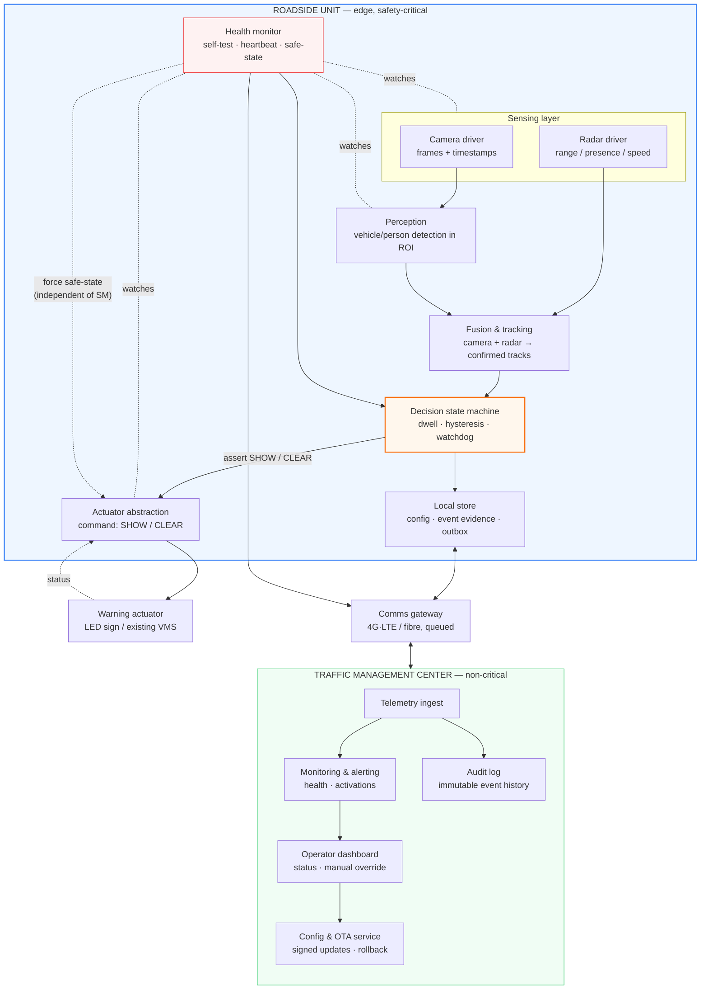
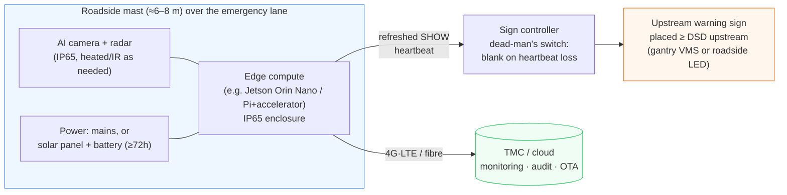
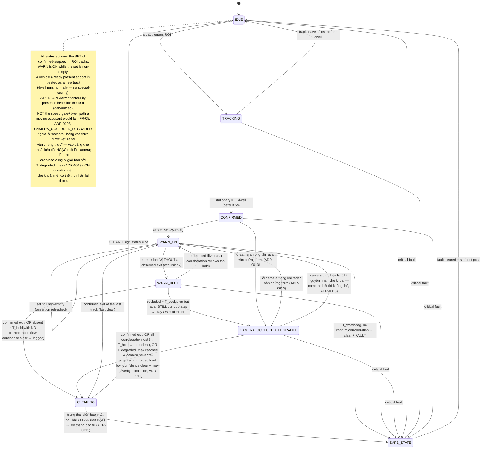
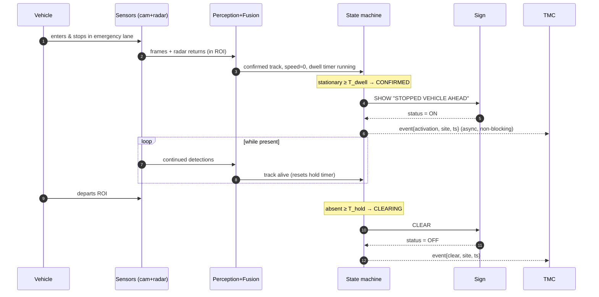

# 02 — Kiến trúc hệ thống

> 🇬🇧 Bản gốc tiếng Anh: [02-system-architecture.md](02-system-architecture.md)

**Dự án:** Hệ thống cảnh báo tự động làn dừng xe khẩn cấp (ESW)
**Trạng thái:** Đề xuất
**Cập nhật:** 2026-06-26
**Liên quan:** [yêu cầu](01-requirements.vi.md) · [các ADR](adr/README.vi.md) · [rủi ro & an toàn](04-risk-and-safety.vi.md)

Đây là tài liệu thiết kế trung tâm. Nó mô tả *cách* hệ thống được xây dựng và *vì sao* nó có hình
dạng như vậy. Tài liệu trung thành với Hình 1 của đề xuất (đồ họa thông tin minh họa ý tưởng, được
lưu tại [assets/figure-1-concept-infographic.jpeg](assets/figure-1-concept-infographic.jpeg)) và làm
cho nó có thể xây dựng được.


*Tổng quan — vòng kín trọng yếu an toàn (màu xanh dương) chạy tại biên; trung tâm (màu xanh ngọc) chỉ
giám sát; màu hổ phách là tất cả những gì người lái nhìn thấy. Các góc nhìn chi tiết được trình bày
bên dưới.*

---

## 1. Các yếu tố định hình kiến trúc

Hình dạng của kiến trúc này được rút ra trực tiếp từ các yêu cầu:

| Yếu tố định hình | Phản hồi của kiến trúc |
|--------|------------------------|
| Vòng an toàn không được phụ thuộc vào mạng (NFR-06) | **Vòng kín cục bộ tại biên**; đám mây chỉ giám sát ([ADR-0002](adr/ADR-0002-edge-vs-cloud-processing.vi.md)). |
| Phải hoạt động ban đêm / mưa / sương mù (FR-09, NFR-05) | **Đa cảm biến**: hợp nhất camera + radar ([ADR-0001](adr/ADR-0001-sensing-modality.vi.md)). |
| Không kích hoạt sai, không dao động, không kẹt-BẬT (FR-03/04/07, NFR-04) | **Máy trạng thái** với dwell, hysteresis và một **watchdog** (§4). |
| An toàn khi sự cố (fail-safe) + báo lỗi rõ ràng (fail-loud) (FR-10/11) | **Bộ giám sát tình trạng + trạng thái an toàn được xác định + nhịp tín hiệu (heartbeat)** (§3, [ADR-0005](adr/ADR-0005-fail-safe-and-system-safety.vi.md)). |
| Tái sử dụng hạ tầng (FR-17) | Trừu tượng hóa **cơ cấu cảnh báo cắm-rút được**: bảng LED riêng *hoặc* VMS hiện có ([ADR-0004](adr/ADR-0004-warning-actuator-integration.vi.md)). |
| Cân chỉnh quy mô theo ngân sách (NFR-12) | Cùng một thiết kế logic chạy trên **khung mô phỏng** và **mô hình thử nghiệm trên bàn (bench)** (tài liệu 03). |

## 2. Kiến trúc logic (các thành phần & trách nhiệm)



**Trách nhiệm của các thành phần**

| Thành phần | Trách nhiệm | Ghi chú chính |
|-----------|----------------|-----------|
| **Driver camera / radar** | Thu nhận khung hình có gắn nhãn thời gian và tín hiệu phản hồi radar. | Đồng bộ thời gian giữa các cảm biến rất quan trọng cho việc hợp nhất. |
| **Nhận diện** | Phát hiện xe/người; chỉ giữ lại các phát hiện có vùng tiếp xúc nằm bên trong đa giác ROI. | Bộ phát hiện nhẹ + cổng chặn ROI ([ADR-0003](adr/ADR-0003-detection-algorithm.vi.md)). |
| **Hợp nhất & theo dõi** | Liên kết các phát hiện của camera với tín hiệu phản hồi radar; tạo ra các vết bám ổn định kèm vị trí + tốc độ + dwell. | Radar xác định "có mặt & đứng yên" trong điều kiện tối / mưa. |
| **Máy trạng thái quyết định** | Bộ não. Áp dụng dwell, hysteresis, chính sách che khuất/đa vết, watchdog; quyết định SHOW/CLEAR. | Là thành phần duy nhất được phép **khẳng định** một cảnh báo; **sự vắng mặt** của một khẳng định đang hoạt động tự thân đã là an toàn khi sự cố (xem cơ cấu chấp hành). §4, [ADR-0008](adr/ADR-0008-detection-persistence-and-multitrack.vi.md). |
| **Trừu tượng hóa cơ cấu cảnh báo** | Chuyển SHOW/CLEAR thành giao thức bảng cụ thể; **làm mới tín hiệu khẳng định SHOW** gửi tới bộ điều khiển biển báo; đọc ngược lại trạng thái bảng. | Hoán đổi được: bảng LED riêng hoặc VMS hiện có. **Cơ chế tự ngắt an toàn (dead-man's switch) nằm trong _bộ điều khiển biển báo_, ở phía hạ lưu của liên kết cục bộ** (không phải trong thành phần thiết bị biên này): nó làm trống biển báo khi mất nhịp khẳng định SHOW làm mới liên tục, nên một máy trạng thái bị treo, một **thiết bị biên chết**, hay một **liên kết bị cắt/nghẽn** đều khiến biển báo về trống. Trừu tượng hóa này vẫn giữ một cơ chế tự ngắt an toàn *bên trong* dựa trên nhịp khẳng định (heartbeat) của máy trạng thái. Một VMS bên thứ ba chốt trạng thái (latching) không thể tuân theo hợp đồng làm mới và lùi về watchdog + CLEAR chủ động + đọc ngược lại trạng thái. Xem [ADR-0009](adr/ADR-0009-failsafe-placement-and-degraded-modes.vi.md), [ADR-0005](adr/ADR-0005-fail-safe-and-system-safety.vi.md). |
| **Bộ giám sát tình trạng** | Tự kiểm tra mọi hệ thống con; phát nhịp tín hiệu (heartbeat); đưa về trạng thái an toàn khi có lỗi. | Độc lập với đường nhận diện/quyết định; có thể **buộc trực tiếp cơ cấu chấp hành về trạng thái an toàn**, không phải đi qua máy trạng thái (có thể đang bị kẹt cứng). Xem [ADR-0005](adr/ADR-0005-fail-safe-and-system-safety.vi.md). |
| **Kho lưu cục bộ** | Giữ cấu hình, vùng đệm bằng chứng-sự kiện, và một outbox bền bỉ cho dữ liệu đo lường từ xa. | Sống sót qua khởi động lại; thời gian lưu giữ có giới hạn (quyền riêng tư). |
| **Cổng truyền thông** | Lưu và chuyển dữ liệu đo lường từ xa; nhận cấu hình/OTA. | Chịu được mất mát; không bao giờ nằm trong đường an toàn. |
| **Các dịch vụ TMC** | Giám sát, cảnh báo, kiểm toán, cấu hình, cập nhật, can thiệp. | Nằm ngoài đường trọng yếu — có thể ngoại tuyến mà không gây hành vi mất an toàn. |

## 3. Kiến trúc vật lý / triển khai


*Thiết bị tại hiện trường là một địa điểm vật lý duy nhất: cảm biến + bộ tính toán biên + nguồn trên
cột/tủ, bảng cảnh báo đặt phía trước (liên kết cáp hoặc vô tuyến), và một đường lên không trọng yếu
tới trung tâm. Mã nguồn Mermaid có thể chỉnh sửa được trình bày tiếp theo.*

> **An toàn khi sự cố là một thuộc tính của bộ điều khiển biển báo, không phải của thiết bị biên.** Biển
> báo được khẳng định bằng một nhịp khẳng định SHOW *làm mới liên tục*; **bộ điều khiển biển báo làm trống
> biển báo bất cứ khi nào nhịp khẳng định đó dừng** — nên một thiết bị biên chết, một hệ điều hành bị treo,
> hay một liên kết bị cắt/nghẽn đều đưa biển báo về an toàn, chứ không chỉ riêng một máy trạng thái bị sập.
> Đặt cơ chế tự ngắt an toàn (dead-man's switch) ở phía thượng lưu của liên kết (trong thiết bị biên) sẽ để
> một biển báo đã chốt kẹt BẬT đúng vào lúc thiết bị hoặc liên kết hỏng. Xem
> [ADR-0009 §A](adr/ADR-0009-failsafe-placement-and-degraded-modes.vi.md).



**Hình học vị trí đặt (trọng yếu — xem [tài liệu 01 §4](01-requirements.vi.md#4-bố-trí-cảnh-báo--phép-tính-mà-đề-xuất-bỏ-sót)):**

```
     traffic ──────────────────────────────────────────────►
   ┌──────────────────────────────────────────────────────┐
   │  through lanes (làn xe 1, làn xe 2)                    │
   ├──────────────────────────────────────────────────────┤
   │  emergency lane (làn dừng khẩn cấp)                    │
   │                          [████ stopped vehicle ████]   │
   └──────────────────────────────────────────────────────┘
        ▲                                  ▲           ▲
     WARNING SIGN                      sensor mast   detection
   (≥ DSD upstream:                   (overlooks      zone / ROI
    ~315 m @100 km/h)                  the ROI)     (vùng phát hiện)
```

Bảng được đặt **phía trước** vùng phát hiện một khoảng ít nhất bằng Cự ly tầm nhìn quyết định — tính từ
**biên phía trước (gần) của ROI**, để một xe dừng ở bất cứ đâu trong vùng (ROI trải dài từ vài chục tới
vài trăm mét, §6) vẫn nhận được ít nhất trọn vẹn DSD — để các xe phía sau nhận được cảnh báo trước khi
họ tới chỗ nguy hiểm. Hình 1 cho thấy hai bảng (một VMS trên
giá long môn và một bảng bên đường); cả hai đều là các thể hiện hợp lệ của cùng một "cơ cấu cảnh báo"
— chọn theo từng địa điểm (ADR-0004).

## 4. Máy trạng thái phát hiện→cảnh báo

Đây là nơi "chu trình khép kín" (closed loop) của đề xuất trở nên chính xác. Đây là cơ quan duy nhất
có quyền với bảng và là nơi kiểm soát các rủi ro kích hoạt sai, dao động, kẹt-BẬT, **che khuất**, và
**đa phương tiện**. Chính sách duy trì mà nó hiện thực được quyết định trong
[ADR-0008](adr/ADR-0008-detection-persistence-and-multitrack.vi.md).

**Máy trạng thái vận hành trên _tập hợp_ các vết (track) đã xác nhận đang dừng trong ROI, không phải một
đối tượng đơn lẻ.** Cảnh báo ở trạng thái BẬT khi tập hợp đó không rỗng; nó chỉ xóa khi tập hợp trở nên
rỗng theo các quy tắc bên dưới. Đây chính là điều cho phép nhiều xe dừng, rời đi, và tới một cách độc
lập mà cảnh báo không dao động hay xóa sớm.


*Xanh dương = giám sát bình thường, hổ phách = đang hiển thị cảnh báo, đỏ = trạng thái an toàn khi lỗi.
Dwell (mặc định 5 s) chặn các kích hoạt sai; **một vết bị mất được giữ lại trong khi radar vẫn còn đối
chứng sự hiện diện (che khuất), nhưng một thoát ra đã xác nhận thì xóa nhanh**; watchdog xóa **và phát
ra một lỗi** nếu không kênh nào có thể xác nhận, nên không cảnh báo nào có thể kẹt BẬT một cách âm thầm;
trạng thái an toàn có thể đạt được từ bất kỳ trạng thái nào và có thể bị buộc kích hoạt bởi bộ giám sát
tình trạng độc lập. Mã nguồn Mermaid có thể chỉnh sửa được trình bày tiếp theo.*



**Bộ định thời & điều kiện bảo vệ.** Các giá trị mặc định là **các điểm khởi đầu cần được tinh chỉnh bằng
thực nghiệm ở Giai đoạn 3** ([tài liệu 03 §5](03-roadmap-and-phasing.vi.md#5-cổng-kiểm-soát-rủi-ro-theo-từng-giai-đoạn)), không
phải các hằng số được suy ra; những giá trị liên quan đến an toàn là dwell, hai loại giữ (hold), và
watchdog.

| Ký hiệu | Mặc định | Mục đích | Đánh đổi |
|--------|---------|---------|-----------|
| `T_dwell` | 5 s (3–10) | Thời gian đứng yên trước khi một vết được tuyên bố là "đang dừng". | Quá thấp → báo động giả từ xe chạy chậm/thoáng qua; quá cao → cảnh báo muộn. Cân chỉnh nó theo **ngân sách phơi nhiễm không-được-cảnh-báo** ([tài liệu 01 §4](01-requirements.vi.md#4-bố-trí-cảnh-báo--phép-tính-mà-đề-xuất-bỏ-sót)). |
| `T_hold` | 10 s (5–15) | **Hysteresis ngắn**: giữ qua một lần rớt phát hiện ngắn **khi không có kênh nào khác đối chứng**. | Hấp thụ nhấp nháy; quá cao → cảnh báo cũ sau một lần rời đi thực sự nhưng không được nhận là một thoát ra. |
| `T_occlusion` | tối đa 60 s (**làm mới được**) | Giữ một vết bị mất ở trạng thái **giả định-còn-hiện-diện** *trong khi radar (hoặc một kênh khác) vẫn còn đối chứng một tín hiệu phản hồi* — che khuất kéo dài bởi xe tải. Chỉ giới hạn phần đối chứng **không được làm mới**; một tín hiệu phản hồi đang hoạt động sẽ làm mới nó. | Quá `T_occlusion` mà radar **vẫn** đối chứng → **CAMERA_OCCLUDED_DEGRADED** (vẫn BẬT + cảnh báo cho vận hành), không bao giờ xóa âm thầm ([ADR-0009 §C](adr/ADR-0009-failsafe-placement-and-degraded-modes.vi.md)). |
| `T_degraded_max` | ví dụ 5 phút (tinh chỉnh được; tùy chọn một trần ngắn hơn cho nguyên nhân **lỗi** camera) | **Giới hạn cứng cho `CAMERA_OCCLUDED_DEGRADED`** — thời gian tối đa cảnh báo có thể duy trì BẬT khi **camera không xác thực được vết (che khuất HOẶC lỗi) và chỉ radar đối chứng** trước khi máy buộc một định đoạt rõ ràng, lớn tiếng ([ADR-0013](adr/ADR-0013-degraded-hold-unification.vi.md) tổng quát hóa giới hạn này sang nguyên nhân lỗi camera). | Watchdog **không thể** giới hạn trạng thái này — đối chứng bằng radar cố ý vô hiệu hóa nó — nên không có `T_degraded_max` thì một tín hiệu radar bị nhầm là xe ở lề (xe tải che khuất ở làn thông xe, khi tiêu chí (b) của [ADR-0001](adr/ADR-0001-sensing-modality.vi.md) yếu) sẽ giữ bảng BẬT **vô hạn**. Khi hết hạn mà camera chưa xác thực lại được: **buộc xóa lớn-tiếng độ-tin-cậy-thấp + leo thang mức cao nhất** tới người trực, người sau đó nắm quyền định đoạt ([ADR-0009 §C](adr/ADR-0009-failsafe-placement-and-degraded-modes.vi.md), [ADR-0011](adr/ADR-0011-operator-concept-and-alarm-management.vi.md)). |
| `T_activate` | ≤ 2 s | Từ confirmed → bảng thực sự được khẳng định BẬT. | Bị giới hạn bởi NFR-01 (đã định mức cho phần phụ trợ VMS). |
| `T_watchdog` | ≤ 30 s | Thời gian tối đa một cảnh báo có thể duy trì BẬT mà **không** có xác nhận hoặc đối chứng mới từ bất kỳ kênh nào. | Khi hết hạn: **xóa + phát ra một lỗi** (logic có thể đang bị kẹt cứng). Ngăn tình trạng kẹt-BẬT vô thời hạn (NFR-04). |
| `T_assert_refresh` | 0.5 s | Chu kỳ mà thiết bị biên làm mới tín hiệu khẳng định SHOW gửi tới **bộ điều khiển biển báo**. | Phải nằm dưới `T_signhold` đủ nhiều để nhiễu động bình thường không bao giờ làm trống một cảnh báo đang hoạt động. |
| `T_signhold` | 2 s | **Cơ chế tự ngắt an toàn của bộ điều khiển biển báo (dead-man's switch)**: làm trống biển báo nếu không có SHOW mới đến trong khoảng thời gian này (bao quát máy trạng thái bị sập, thiết bị biên chết, liên kết bị cắt). | Đồng thời là **thời gian kẹt-BẬT tối đa sau một sự cố cứng** *và* **khoảng hở nhịp tối thiểu khiến một cảnh báo đúng và đang hoạt động bị làm trống** ([ADR-0009 §A](adr/ADR-0009-failsafe-placement-and-degraded-modes.vi.md)). |
| cổng tốc độ | < 3 km/h | Ngưỡng mà dưới đó một vết được tính là "đứng yên". | Phân biệt "đang dừng" với "bò chậm dọc lề đường". |
| `T_person_debounce` | ~1–2 s trong/cạnh ROI | **Kích hoạt cảnh báo cho người đi bộ** (FR-08): một đối tượng lớp *person* được phát hiện trong hoặc ngay cạnh ROI, có khử dội — **không** theo đường speed-gate+dwell, vốn một người gặp nạn đang *đi bộ* (3–6 km/h) sẽ không thỏa `< 3 km/h`. | Quá thấp → một người băng/qua thoáng qua gây kích hoạt giả; quá cao → cảnh báo muộn cho người đang gặp nguy. Tính bền vững vẫn hẹp hơn của xe (không có giữ-khi-che-khuất bằng radar — [ADR-0008](adr/ADR-0008-detection-persistence-and-multitrack.vi.md)). |

**Ngữ nghĩa ROI.** Một phát hiện được tính là trong-ROI bằng **mức chồng lấn vùng tiếp xúc theo tỷ lệ**
với đa giác ROI (mặc định ≥ 50 % vùng tiếp xúc mặt đất của vết nằm bên trong), chứ không phải một điểm
đơn lẻ — nhờ vậy một xe **nằm vắt ngang** ranh giới lề đường/làn thông xe (một tư thế hỏng hóc thường gặp)
được xử lý một cách tất định thay vì nhấp nháy ở biên. ROI mang theo một **biên thoát ra phía hạ lưu** đã
được xác định, dùng để nhận biết một *thoát ra đã xác nhận*
([ADR-0008](adr/ADR-0008-detection-persistence-and-multitrack.vi.md)).

**Hiệu chuẩn mang tính chịu lực — và có thể bị trôi.** Việc tính một *vùng tiếp xúc mặt đất* (chứ không chỉ
một khung ảnh) đòi hỏi một **phép đồng dạng mặt phẳng mặt đường** riêng cho từng địa điểm, và việc quy một
tín hiệu phản hồi radar về một vết bám của camera đòi hỏi **hiệu chuẩn ngoại lai camera↔radar** — cả hai đều
là nền tảng cho cả cổng chặn ROI *lẫn* việc hợp nhất. **Trôi hiệu chuẩn** (cột lắc trong gió, rung động, chu
trình nhiệt — chính là những điều kiện mà NFR-13 định mức) âm thầm làm xê dịch ROI và làm suy giảm việc hợp
nhất, tạo ra hoặc là bỏ sót hoặc là báo động giả mà không có triệu chứng rõ ràng nào. Do đó cần có một quy
trình hiệu chuẩn cho từng địa điểm, một lần kiểm tra lại định kỳ, và một **bộ giám sát trôi (hiệu chuẩn)**
trong bộ giám sát tình trạng (một chức năng tự-giám-sát **FR-10** có tên gọi,
[tài liệu 01 §2](01-requirements.vi.md#2-yêu-cầu-chức-năng)), và lỗi này được theo dõi như một rủi ro
([tài liệu 04 R15](04-risk-and-safety.vi.md#1-bảng-đăng-ký-rủi-ro)).

> **Đặc tả bộ giám sát trôi (đủ cụ thể để xây dựng và giới hạn).** Bộ giám sát theo dõi một tập nhỏ các
> **điểm tham chiếu cố định** trong khung cảnh (vạch kẻ làn, một cột biển báo, các điểm mốc gắn đặt — được
> khảo sát lúc hiệu chuẩn) và liên tục so sánh **vị trí ảnh quan sát được** của chúng với các vị trí mà phép
> đồng dạng đã lưu dự đoán; một sai số dư vượt quá **dung sai** riêng cho từng địa điểm (ví dụ vài pixel /
> một phần nhỏ chiều rộng làn, đặt lúc nghiệm thu) lâu hơn một khoảng khử dội sẽ phát một cảnh báo
> **trôi-hiệu-chuẩn** và đánh dấu thiết bị **suy giảm** cho tới khi được hiệu chuẩn lại. **Bậc:** *logic phát
> hiện* có thể trình diễn trên bàn thử bằng cách tiêm một dịch chuyển đồng dạng tổng hợp (B); trôi **thực** do
> cột lắc / chu trình nhiệt thì **bị hoãn sang hiện trường** (nó cần vỏ hộp hiện trường và cột), nên ở phạm vi
> bàn thử biện pháp kiểm soát của R15 là *được-kiểm-chứng-bằng-logic, không phải được-chứng-minh-tại-hiện-trường*
> — nêu giống như các hạng mục được-thiết-kế-nhưng-chưa-chứng-minh khác
> ([tài liệu 01 §3a](01-requirements.vi.md#3a-phạm-vi-kiểm-chứng--giai-đoạn-được-tài-trợ-bàn-thửmô-phỏng-thực-sự-có-thể-chứng-minh-điều-gì)).

**Vì sao mỗi điều kiện bảo vệ tồn tại (ánh xạ tới một lỗi thực tế):**

- *Dwell* → một xe trôi qua hoặc chạm vào lề đường trong chốc lát **không** kích hoạt.
- *Kích hoạt theo hiện diện cho người đi bộ* → một cảnh báo cho **người** (FR-08) được nêu ra khi *hiện
  diện* trong/cạnh ROI (có khử dội, `T_person_debounce`), **không** theo cổng tĩnh tại — vì một người gặp
  nạn thường *di chuyển* (đi bộ quanh xe) và sẽ không bao giờ thỏa cổng tốc độ `< 3 km/h`. Dùng đường của
  xe cho người sẽ bỏ sót một cách hệ thống đúng cái hiểm họa người đi bộ mà H-C nêu tên
  ([tài liệu 04 §1](04-risk-and-safety.vi.md#1-bảng-đăng-ký-rủi-ro), [ADR-0003](adr/ADR-0003-detection-algorithm.vi.md)).
- *Hysteresis ngắn (`T_hold`)* → nhấp nháy phát hiện trong chốc lát không làm cảnh báo chớp tắt/bật.
- *Giữ khi che khuất (`T_occlusion`) + đối chứng bằng radar* → một xe tải ở làn thông xe che khuất chiếc
  xe đang dừng trong nhiều giây **không** làm rớt một cảnh báo đang hoạt động, vì radar vẫn còn thấy tín
  hiệu phản hồi; thời gian giữ **làm mới** chừng nào *một* kênh nào đó còn đối chứng sự hiện diện. Nếu che
  khuất kéo dài quá `T_occlusion` mà radar vẫn còn đối chứng, máy trạng thái chuyển vào
  **CAMERA_OCCLUDED_DEGRADED** — cảnh báo vẫn BẬT **và** vận hành được cảnh báo (nhiều khả năng là một sự cố
  phức hợp hoặc một lỗi camera), không bao giờ xóa âm thầm. Điều này khép lại khoảng trống bỏ-sót-âm-thầm do
  che khuất gây ra mà một bộ định-thời-vắng-mặt đơn thuần sẽ để hở
  ([ADR-0008](adr/ADR-0008-detection-persistence-and-multitrack.vi.md), [ADR-0009](adr/ADR-0009-failsafe-placement-and-degraded-modes.vi.md)).
- *Thoát ra đã xác nhận vs. mất vết* → một xe **được thấy rời đi** (tăng tốc + vượt qua biên thoát ra)
  thì xóa nhanh; một vết **bị mất tại chỗ** thì được giữ lại, không xóa. Sự rời đi mang theo bằng chứng;
  che khuất thì không.
- *Ngữ nghĩa tập hợp* → cảnh báo phản ánh việc liệu **còn bất kỳ** xe đã xác nhận đang dừng nào hay không,
  nên nhiều xe tới/rời một cách độc lập được xử lý mà không bị xóa sớm.
- *Watchdog* → nếu logic bị kẹt cứng, hoặc mọi kênh thực sự mất mục tiêu mà không thấy thoát ra, watchdog
  **xóa và phát ra một lỗi** — một lần xóa độ-tin-cậy-thấp *rõ ràng*, có ghi nhật ký, không bao giờ là một
  lần kẹt-BẬT âm thầm. **Không cảnh báo nào có thể kẹt BẬT mãi mãi.**
- *Giữ-suy-giảm có giới hạn (`T_degraded_max`)* → watchdog ở trên **cố ý bị vô hiệu hóa** trong khi radar
  còn đối chứng ([ADR-0008](adr/ADR-0008-detection-persistence-and-multitrack.vi.md)), nên
  `CAMERA_OCCLUDED_DEGRADED` — camera bị che, chỉ radar giữ cảnh báo BẬT — là trạng thái duy nhất watchdog
  không giới hạn được. Nếu tiêu chí (b) yếu, tín hiệu "đối chứng" có thể là **xe tải che khuất ở làn thông
  xe**, không phải xe ở lề, và cảnh báo sẽ ở BẬT **vô hạn** dựa trên một tín hiệu không kiểm chứng được.
  `T_degraded_max` buộc một định đoạt **lớn tiếng** (xóa độ-tin-cậy-thấp + leo thang mức cao nhất tới người
  trực, [ADR-0011](adr/ADR-0011-operator-concept-and-alarm-management.vi.md)) để **không trạng thái nào —
  phần mềm *hay* phân biệt-cảm-biến — giữ bảng BẬT mãi mà không có xác nhận quy-được-về-làn** (NFR-04).
  Đây là đường giữ-vô-hạn cuối cùng được khép lại.
- *Trạng thái an toàn* → khi có bất kỳ lỗi trọng yếu nào, máy rời khỏi vận hành bình thường và leo thang
  xử lý; bảng có thể bị buộc về trạng thái an toàn bởi **bộ giám sát tình trạng độc lập** ngay cả khi máy
  trạng thái bị kẹt cứng (cơ chế an toàn tự kích hoạt khi mất tín hiệu (dead-man's switch),
  [ADR-0005](adr/ADR-0005-fail-safe-and-system-safety.vi.md)).

**Các chế độ suy giảm cảm biến — *khởi tạo* và *duy trì* không đối xứng.** Mất một cảm biến không phải là một
trạng thái "suy giảm" phẳng lì duy nhất; những gì thiết bị còn có thể làm tùy thuộc vào *cảm biến nào* bị mất:

| Chế độ | Xác nhận một stop **mới**? | **Duy trì** một cảnh báo hiện có? | Tư thế |
|------|-------------------------|-------------------------------|---------|
| Camera + radar (ĐẦY ĐỦ) | có | có (kể cả giữ khi che khuất) | bình thường |
| Radar chết (CHỈ-CAMERA) | có | có, nhưng không giữ khi che khuất | suy giảm + cảnh báo |
| Camera chết (CHỈ-RADAR) | **không** — không có lớp / không có hình học ROI trên ảnh | có, nhưng chỉ ở dạng **trạng thái giữ khi camera không xác thực được (vết) có giới hạn** (= ngữ nghĩa `CAMERA_OCCLUDED_DEGRADED`): trong khi radar đối chứng, **bị giới hạn bởi `T_degraded_max`** → buộc xóa lớn tiếng; **không** thu nhận lại camera ([ADR-0013](adr/ADR-0013-degraded-hold-unification.vi.md)) | **MÙ VỚI SỰ CỐ MỚI: cảnh báo trọng yếu** |
| Cả hai chết | không | không | TRẠNG THÁI AN TOÀN + cảnh báo |

Một thiết bị mất camera là **mù với những nguy hiểm mới** và phải nói ra điều đó một cách rõ ràng — *không phải*
một chế độ "radar vẫn chạy" vô hại, vì riêng radar không thể định vị một đối tượng mới trong ROI lề đường hay
phân lớp nó. Lý do và bộ tiêm-lỗi: [ADR-0009 §B](adr/ADR-0009-failsafe-placement-and-degraded-modes.vi.md); các
hàng FMEA trong [tài liệu 04 §2](04-risk-and-safety.vi.md#2-fmea-lite-kiểu-lỗi--tác-động--phát-hiện--phản-ứng)
tuân theo bảng này.

**Ma trận tương tác cảnh báo × chế độ cảm biến (hai miền là trực giao).** Vòng đời cảnh báo ở trên và chế
độ tình trạng cảm biến là các **miền đồng thời** — một thiết bị có thể đang ở `WARN_ON` *và* mất camera —
nên hành vi nằm ở *tích* của chúng, được liệt kê đầy đủ ở đây thay vì để suy luận
([ADR-0013](adr/ADR-0013-degraded-hold-unification.vi.md) §B). Điểm hiệu chỉnh then chốt so với góc nhìn
một-miền trước đây: **lỗi-camera-trong-khi-cảnh-báo là cùng một trạng thái giữ khi camera không xác thực
được (vết) có giới hạn như che khuất** (`T_degraded_max`), không phải một trạng thái giữ "trong chốc lát"
vô hạn.

| Trạng thái cảnh báo ↓ / Cảm biến → | **FULL** | **CAMERA-ONLY** (radar chết) | **RADAR-ONLY** (camera chết) | **NEITHER** |
|---|---|---|---|---|
| **IDLE / TRACKING** | bình thường | khởi tạo OK; không kiểm tra chéo radar; suy giảm+cảnh báo | **MÙ VỚI SỰ CỐ MỚI** — không thể khởi tạo; cảnh báo trọng yếu | **TRẠNG THÁI AN TOÀN** + cảnh báo trọng yếu |
| **CONFIRMED / WARN_ON** | bình thường | khởi tạo OK; không giữ khi che khuất | camera nay đã chết → **trạng thái giữ khi camera không xác thực được (vết) có giới hạn** (`T_degraded_max`); cảnh báo trọng yếu | **TRẠNG THÁI AN TOÀN** + cảnh báo trọng yếu |
| **WARN_HOLD** | giữ trong khi được đối chứng → `CAMERA_OCCLUDED_DEGRADED` quá `T_occlusion` | chỉ `T_hold` ngắn → xóa lớn tiếng độ-tin-cậy-thấp | **trạng thái giữ khi camera không xác thực được (vết) có giới hạn** (`T_degraded_max`); cảnh báo trọng yếu | **TRẠNG THÁI AN TOÀN** + cảnh báo trọng yếu |
| **CAMERA_OCCLUDED_DEGRADED** | bị giới hạn bởi `T_degraded_max`; thu nhận lại→`WARN_ON` (nguyên nhân che khuất) | tương tự; không kiểm tra chéo radar | bị giới hạn bởi `T_degraded_max`; **không** thu nhận lại (nguyên nhân lỗi) | **TRẠNG THÁI AN TOÀN** + cảnh báo trọng yếu |
| **CLEARING** | xóa; xác nhận biển báo tắt (nếu không→TRẠNG THÁI AN TOÀN, kẹt-BẬT) | xóa; xác nhận biển báo tắt | xóa; xác nhận biển báo tắt | **TRẠNG THÁI AN TOÀN** + cảnh báo trọng yếu |

Không ô nào là vô hạn hoặc âm thầm: **RADAR-ONLY** là MÙ VỚI SỰ CỐ MỚI khi nhàn rỗi và là một trạng thái
giữ bị giới hạn bởi `T_degraded_max` khi đã có một cảnh báo đang bật; **NEITHER** luôn luôn là TRẠNG THÁI
AN TOÀN.

**Ùn tắc là một chế độ kích hoạt sai riêng biệt (không phải một lần đi-ngang-qua thoáng chốc).** Trong tình
huống dừng-chạy (stop-and-go) hoặc kẹt xe — một điều kiện rủi ro cao *có tên gọi* — chính làn thông xe sát lề
cũng đứng yên áp vào ranh giới ROI, nên dwell (mọi thứ đều đứng yên) và radar (mọi thứ đều hiện diện) không thể
phân biệt được; chỉ có hình học ROI mới tách được một xe hỏng ở lề khỏi dòng xe thông xe đang xếp hàng, và đó
lại là thứ mong manh nhất đúng vào lúc này. Do đó logic quyết định phải phát hiện **ùn tắc tổng thể** (nhiều
vết đứng yên trải khắp các làn thông xe) và **chặn hoặc đổi nội dung** cảnh báo lề đường thay vì khẳng định
"phía trước có xe dừng, hãy chuyển làn" vào giữa một đám kẹt xe, nơi mà cảnh báo vừa sai vừa phản tác dụng. Đây
là một kịch bản chấp nhận tường minh ([tài liệu 01 §5](01-requirements.vi.md#5-chỉ-số-đánh-giá--tiêu-chí-nghiệm-thu))
và một rủi ro được theo dõi ([tài liệu 04 R14](04-risk-and-safety.vi.md#1-bảng-đăng-ký-rủi-ro)). Hai hệ quả phải được nêu rõ, không che giấu: (1) chặn cảnh báo trong một đám kẹt xe là một **khoảng trống phạm vi bao phủ có chủ đích trong một điều kiện nguy-hiểm-hàng-đầu _có tên gọi_** ("mật độ giao thông cao", [tài liệu 00 §1](00-context-and-glossary.vi.md)), nên nó được ghi nhận như một **giới hạn của sự bảo vệ** ([tài liệu 04 §0](04-risk-and-safety.vi.md)), chứ không chỉ là một biện pháp kiểm soát kích hoạt sai; (2) việc *đổi-thông-điệp* tiền giả định tồn tại một **thông báo tuân thủ QCVN 41 thứ hai** — nếu không có, chỉ có ức chế là khả dụng ([ADR-0004](adr/ADR-0004-warning-actuator-integration.vi.md)).

**Khởi động lại nóng trong khi một cảnh báo đang BẬT — một sự tái-phơi-nhiễm mà quy tắc xe-có-mặt-khi-khởi-động nguội không bao trùm.** Quy tắc xe-có-mặt-khi-khởi-động (coi một xe có mặt lúc khởi động là một vết mới, chạy đủ dwell) được viết cho khởi động *nguội*. Một **lần khởi động lại ngoài kế hoạch** (chớp nguồn, sập-rồi-khởi-động-lại) *trong khi một cảnh báo đang BẬT* thì khác: cơ chế tự ngắt an toàn làm trống biển báo đúng cách trong thời gian ngừng, nhưng khi khởi động lại chiếc xe vẫn-đang-dừng phải phục vụ lại trọn vẹn `T_dwell` trước khi cảnh báo quay lại — một **cửa sổ phơi-nhiễm-không-được-cảnh-báo mới cho một chiếc xe vốn đã được bảo vệ** ([tài liệu 01 §4](01-requirements.vi.md#4-bố-trí-cảnh-báo--phép-tính-mà-đề-xuất-bỏ-sót)). Các lần OTA/khởi động lại theo kế hoạch được hoãn khi một cảnh báo đang hoạt động (FR-21); các lần ngoài kế hoạch thì không, nên sự tái-phơi-nhiễm này là một phần dư đã được nêu. Một cờ *cảnh-báo-đang-hoạt-động-lúc-tắt* được lưu lại có thể rút ngắn việc xác nhận lại cho một chiếc xe vẫn ở cùng vị trí ROI khi khởi động lại — **một câu hỏi an toàn còn mở** cần giải quyết tường minh trong thiết kế chi tiết ([tài liệu 04 §5 Q7](04-risk-and-safety.vi.md#5-các-câu-hỏi-an-toàn-còn-mở-cho-nhóm)): rút ngắn việc xác nhận lại đánh đổi cửa sổ tái-phơi-nhiễm với khả năng **kẹt-BẬT trên một chiếc xe thực ra đã rời đi trong lúc ngừng**, nên không được làm một cách mù quáng.

## 5. Luồng dữ liệu lúc chạy (đường thuận lợi)


*Bảng hiển thị "phía trước có xe dừng" (PHÍA TRƯỚC CÓ XE DỪNG KHẨN CẤP). Mũi tên nét đứt là các thông
điệp bất đồng bộ/trả về — các thông báo tới TMC là kiểu gửi-rồi-quên, nên một đường liên kết bị mất
không bao giờ làm đình trệ vòng an toàn. Mã nguồn Mermaid có thể chỉnh sửa được trình bày tiếp theo.*



Các tương tác với TMC (các bước tới `T`) theo kiểu **gửi-rồi-quên**: nếu đường liên kết bị mất, các sự
kiện xếp hàng trong outbox cục bộ và vòng an toàn không bị ảnh hưởng.

## 6. Mô hình phạm vi giám sát

Một thiết bị tại hiện trường đơn lẻ giám sát một **đoạn có giới hạn** (chiều dài mà các cảm biến của
nó nhìn thấy đáng tin cậy — thực tế là từ vài chục tới vài trăm mét). Làn dừng khẩn cấp là liên tục,
nên việc giám sát toàn bộ vừa không đủ kinh phí vừa nằm ngoài phạm vi. Do đó mô hình là **các vùng
giám sát rời rạc tại những vị trí có giá trị cao**:

- các đoạn dẫn vào **hầm, cầu, đoạn trên cao** (các tình huống sử dụng của Hình 1);
- **đường cong / đỉnh dốc** có tầm nhìn hạn chế;
- các **điểm nóng sự cố** đã biết và các điểm dừng/đỗ tạm;
- các đoạn đường cao tốc nơi đơn vị vận hành báo cáo tình trạng dừng lề tái diễn.

Đối với dự án này, **một vùng thử nghiệm** (hoặc bản mô phỏng của nó) là phạm vi. Mở rộng quy mô tới
nhiều vùng là một câu hỏi về triển khai/CapEx cho giai đoạn tiếp nối tại hiện trường, không phải thay
đổi kiến trúc — các thiết bị là độc lập và báo cáo về cùng một TMC.

## 7. Giao diện & hợp đồng (ban đầu)

| Giao diện | Giữa | Hình dạng (mang tính chỉ dẫn) |
|-----------|---------|--------------------|
| Sự kiện phát hiện | Nhận diện → Máy trạng thái | `{track_id, class, bbox/range, speed, in_roi, ts}` |
| Lệnh bảng | Máy trạng thái → Cơ cấu cảnh báo | `SHOW(message_id) | CLEAR | STATUS?` trả về `{state, lamp_ok, ts}` |
| Khẳng định bảng (liên kết) | Thiết bị biên → Bộ điều khiển biển báo | `SHOW(message_id)` làm mới mỗi `T_assert_refresh` (đã xác thực); bộ điều khiển làm trống khi mất trong `T_signhold`; **ngân sách độ tin cậy/độ trễ/năng lượng/xác thực riêng** trên liên kết ≥ DSD ([ADR-0009 §A](adr/ADR-0009-failsafe-placement-and-degraded-modes.vi.md)) |
| Nhịp tín hiệu (heartbeat) | Bộ giám sát tình trạng → TMC | `{site_id, fw_ver, cfg_ver, model_ver, calib_ver, subsystem_health[], state, ts}` theo nhịp cố định |
| Sự kiện kích hoạt/xóa | Máy trạng thái → TMC/kiểm toán | `{site_id, type, evidence_ref?, cfg_ver, model_ver, calib_ver, ts}` (lưu và chuyển) |
| Cấu hình | TMC → Thiết bị tại hiện trường | `{roi_polygon, T_dwell, T_hold, T_occlusion, T_person_debounce, speed_gate, message_set, T_override_max}` (đã ký) — tập con tinh chỉnh được theo từng địa điểm; **toàn bộ mặt phẳng tham số an toàn và các giới hạn FR-20 của nó nằm ở §7a** |
| OTA | TMC → Thiết bị tại hiện trường | ảnh đã ký + phiên bản + mã thông báo rollback |

> **Mọi sự kiện liên quan đến an toàn đều mang dấu vân tay cấu hình đang hoạt động.** Một cuộc kiểm toán
> cấp-trách-nhiệm-pháp-lý ([tài liệu 04 R10](04-risk-and-safety.vi.md#1-bảng-đăng-ký-rủi-ro)) phải tái
> dựng được *thiết bị đang chạy cái gì* tại thời điểm sự kiện — nên mỗi nhịp tín hiệu và mỗi sự kiện kích
> hoạt/xóa/lỗi đều mang các mã băm phiên bản của **ROI/cấu hình (`cfg_ver`), mô hình (`model_ver`), và
> hiệu chuẩn (`calib_ver`)** đang có hiệu lực, được ràng buộc với nhau. Thiếu nó, "biển báo đã BẬT lúc
> 02:14" không thể được gắn với ROI, các bộ định thời, mô hình, và phép đồng dạng đã tạo ra nó. Rẻ để
> thêm bây giờ, đắt để cải tạo về sau.
>
> **Liên kết biên↔biển báo là một giao diện hạng nhất, không phải một sợi cáp nội bộ.** Vì biển báo nằm
> cách ≥ DSD về phía thượng nguồn ([§3](#3-kiến-trúc-vật-lý--triển-khai)), nhịp khẳng định SHOW làm mới
> băng qua một liên kết hiện trường dài 300 m+ mà ngân sách mất gói/độ trễ/năng lượng/xác thực của nó chi
> phối cả định thời an toàn lẫn rủi ro chập chờn
> ([ADR-0009 §A](adr/ADR-0009-failsafe-placement-and-degraded-modes.vi.md)); việc kiểm chứng nó qua
> khoảng cách là **bị hoãn sang hiện trường**, vì bàn thử chạy nó qua một mét cáp.

### 7a. Mặt phẳng cấu hình & tham số an toàn (danh sách giới hạn FR-20 có thẩm quyền)

Bảng bộ định thời ở §4 gọi các giá trị mặc định của nó là *"các điểm khởi đầu cần được tinh chỉnh bằng thực
nghiệm ở Giai đoạn 3"* — vậy nên các tham số liên quan đến an toàn **không** hẳn đều là hằng số biên dịch, và
tập hợp có thể được **đẩy xuống hoặc tinh chỉnh** **lớn hơn lược đồ Cấu hình ở trên và lớn hơn danh sách mà
[FR-20](01-requirements.vi.md#2-yêu-cầu-chức-năng) liệt kê lần đầu** (vốn chỉ nêu ROI / dwell / hold / cổng-tốc-độ
/ tập-thông-điệp). Khoảng trống đó là một lỗ hổng an toàn: toàn bộ luận đề của FR-20 là *"việc ký ngăn được giả
mạo, chứ không ngăn được lỗi của người vận hành"* — một `T_signhold` hay `T_degraded_max` sai sẽ âm thầm phá vỡ
chức năng an toàn mà không kích hoạt bất kỳ chỉ báo cảnh sớm (canary) nào. Bảng này là **mặt phẳng có thẩm quyền
duy nhất**: mọi tham số liên quan đến an toàn, dù là **cấu hình lúc chạy** hay một **hằng số có giới hạn**, kèm
**dải giá trị cứng mà thiết bị kẹp về theo FR-20**. Không có gì liên quan đến an toàn lại tinh chỉnh được *bên
ngoài* bảng này.

| Tham số | Phạm vi | Mặc định | Giới hạn cứng FR-20 (kẹp/từ chối) | Ghi chú |
|-----------|-------|---------|----------------------------------|-------|
| `roi_polygon` | cấu hình lúc chạy | theo từng địa điểm | trong FOV cảm biến; ≥ diện tích tối thiểu; trên mặt đường | ROI sai = bỏ sót/báo-động-giả có hệ thống |
| `T_dwell` | cấu hình lúc chạy | 5 s | **3–10 s** | cân chỉnh theo ngân sách phơi-nhiễm-không-được-cảnh-báo ([tài liệu 01 §4](01-requirements.vi.md#4-bố-trí-cảnh-báo--phép-tính-mà-đề-xuất-bỏ-sót)) |
| `T_hold` | cấu hình lúc chạy | 10 s | **5–15 s** | hysteresis ngắn |
| `T_occlusion` | cấu hình lúc chạy | 60 s | **≤ 120 s** | làm mới được trong khi được đối chứng |
| `T_person_debounce` | cấu hình lúc chạy | 1–2 s | **0.5–3 s** | kích-hoạt-theo-hiện-diện cho người đi bộ |
| `speed_gate` | cấu hình lúc chạy | 3 km/h | **1–5 km/h** | ngưỡng "đứng yên" |
| `T_override_max` | cấu hình lúc chạy (chính sách) | 30 phút / trần 8 h | **≤ 8 h** | trần thời hạn ghi đè ([ADR-0010](adr/ADR-0010-operator-override-and-manual-control.vi.md)) |
| `message_set` | cấu hình lúc chạy | theo QCVN-41 | thành viên ∈ chỉ tập đã duyệt | tuân thủ ([ADR-0004](adr/ADR-0004-warning-actuator-integration.vi.md)) |
| `T_degraded_max` | hằng số có giới hạn (cấu hình dưới trần chặt) | 5 phút (tùy chọn ngắn hơn cho nguyên nhân lỗi) | **≤ 10 phút** | chốt chặn cho trạng thái giữ khi camera không xác thực được (vết) ([ADR-0013](adr/ADR-0013-degraded-hold-unification.vi.md)); không bao giờ được tinh chỉnh thành "gần như không bao giờ" |
| `T_watchdog` | hằng số có giới hạn | ≤ 30 s | **≤ 30 s** | chốt chặn kẹt-BẬT (NFR-04); trần là cứng |
| `T_signhold` | hằng số có giới hạn | 2 s | **≤ 3 s** | khoảng cơ-chế-tự-ngắt-an-toàn ([ADR-0009 §A](adr/ADR-0009-failsafe-placement-and-degraded-modes.vi.md)); một giá trị lớn vô hiệu hóa an-toàn-khi-sự-cố |
| `T_assert_refresh` | hằng số có giới hạn | 0.5 s | **≤ ¼·`T_signhold`** | phải nằm dưới `T_signhold` đủ nhiều (kiểm soát chập chờn) |
| `T_activate` | hằng số có giới hạn | ≤ 2 s | **≤ 2 s** | NFR-01 (phần phụ trợ LED) |
| dung sai trôi | hằng số có giới hạn (theo từng địa điểm lúc nghiệm thu) | theo từng địa điểm | trong giới hạn bao đã khảo sát | ngưỡng bộ-giám-sát-trôi (§4, R15) |

**Quy tắc:** các chốt chặn trọng yếu an toàn (`T_watchdog`, `T_signhold`, `T_assert_refresh`, `T_degraded_max`,
`T_activate`) được giới hạn chặt đến mức không giá trị đẩy xuống nào có thể vô hiệu hóa bất biến mà chúng bảo vệ;
thiết bị **từ chối hoặc kẹp** bất kỳ giá trị nào nằm ngoài cột ở trên và giữ lại giá-trị-tốt-cuối-cùng, **lớn
tiếng tới người vận hành** (FR-20, [tài liệu 04 R16](04-risk-and-safety.vi.md#1-bảng-đăng-ký-rủi-ro)). Các dải giá
trị là các giới hạn khởi đầu cần xác nhận trong đợt đóng băng Giai-đoạn-2; *điểm mấu chốt* là danh sách đã đầy đủ
và mỗi mục đều có một giới hạn.

Các cách mã hóa cụ thể (protobuf/JSON, MQTT/HTTPS cho dữ liệu đo lường từ xa; giao thức của nhà cung
cấp bảng hoặc một hồ sơ kiểu NTCIP cho VMS) được hoãn sang giai đoạn thiết kế chi tiết; **các ranh
giới trừu tượng hóa ở trên là cam kết kiến trúc.**

> **Thời gian mang tính chịu lực — hãy giao cho nó một chủ sở hữu.** Việc hợp nhất camera↔radar cần đồng bộ
> *tương đối* ở mức dưới một khung hình, và nhật ký kiểm toán cần các nhãn thời gian *tuyệt đối* đáng tin cậy
> (bằng chứng trách nhiệm pháp lý, [tài liệu 04 R10](04-risk-and-safety.vi.md#1-bảng-đăng-ký-rủi-ro)). Một thiết bị
> tại hiện trường trong hầm không có NTP và đồng hồ tường chạy tự do thì bị trôi. Hãy chọn nguồn thời gian một
> cách tường minh trong thiết kế chi tiết — ví dụ **GNSS/PPS cho thời gian tuyệt đối + một đồng hồ dùng chung
> hoặc PTP cho đồng bộ giữa các cảm biến**, duy trì qua các lần mất kết nối — thay vì thừa hưởng bất cứ thứ gì
> mà đồng hồ của hệ điều hành làm. Đây nay là một **yêu cầu (NFR-16)**, không chỉ là một ghi chú thiết kế
> ([ADR-0001](adr/ADR-0001-sensing-modality.vi.md) AI#3).

## 8. Ngăn xếp công nghệ khuyến nghị (mang tính chỉ dẫn, không ràng buộc)

| Lớp | Khuyến nghị | Lý do |
|-------|----------------|-----------|
| Bộ tính toán biên | NVIDIA Jetson Orin Nano *hoặc* Raspberry Pi 5 + bộ tăng tốc Hailo/Coral | Đủ TOPS cho một bộ phát hiện nhỏ tại biên; công suất thấp phù hợp pin mặt trời. |
| Camera | IP camera global-shutter hoặc có WDR tốt; chiếu sáng IR cho ban đêm | Xử lý lóa và ban đêm theo NFR-05. |
| Radar | Radar phát hiện sự hiện diện + đo cự ly 24/77 GHz cấp ô tô | Phát hiện sự hiện diện trong đêm/sương mù/mưa; bổ trợ cho camera (ADR-0001). |
| Nhận diện | Bộ phát hiện gọn nhẹ (loại YOLO-nano / SSD-Mobilenet) + cổng chặn ROI + bộ theo dõi đơn giản (SORT/ByteTrack) | Vững vàng, rẻ, thân thiện với biên (ADR-0003). |
| Môi trường chạy | Các dịch vụ đóng gói container, được systemd giám sát; tiến trình watchdog | Khả năng khởi động lại + cô lập; bộ giám sát tình trạng độc lập với nhận diện. |
| Kho lưu cục bộ | SQLite + vùng đệm vòng cho bằng chứng sự kiện | Nhỏ, bền bỉ, thời gian lưu giữ có giới hạn (quyền riêng tư). |
| Dữ liệu đo lường từ xa | MQTT trên TLS, outbox lưu và chuyển | Chịu được mất mát, nhẹ. |
| Bảng | VMS ma trận LED (tuân thủ QCVN 41) *hoặc* VMS hiện có của đơn vị vận hành thông qua giao thức của nó | ADR-0004. |
| Mô phỏng | CARLA / SUMO hoặc một trình phát kịch bản 2-D tùy chỉnh cấp các phát hiện tổng hợp | Kiểm chứng máy trạng thái mà không cần giao thông thực (tài liệu 03). |
| TMC | Dịch vụ web nhỏ + kho lưu chuỗi thời gian + bảng điều khiển | Chỉ giám sát/kiểm toán; không trọng yếu an toàn. |

> Đây là các điểm khởi đầu được cân chỉnh quy mô theo ngân sách và kỹ năng; mỗi lựa chọn được xem xét
> lại trong thiết kế chi tiết và các lựa chọn mang tính chịu lực được lập luận trong các ADR.

## 9. Cách ánh xạ vào Hình 1

| Phần tử của Hình 1 (VI) | Thành phần kiến trúc |
|-----------------------|------------------------|
| Camera AI giám sát làn dừng | Driver camera + Nhận diện (+ radar được thêm ở đây) |
| AI nhận diện ô tô đậu trong vùng | Nhận diện + Hợp nhất, có cổng chặn ROI |
| Vùng phát hiện (vùng nét đứt màu đỏ) | Đa giác ROI / vùng phát hiện |
| Bộ xử lý AI / điều khiển | Bộ tính toán biên: Hợp nhất + **Máy trạng thái** |
| Hệ thống tự động gửi tín hiệu cảnh báo | Trừu tượng hóa cơ cấu cảnh báo → lệnh bảng |
| Bảng tín hiệu ở đầu làn / gantry VMS | Cơ cấu cảnh báo (đặt phía trước cách ≥ DSD) |
| Tự động tắt khi xe rời đi | Các chuyển trạng thái `WARN_HOLD → CLEARING → IDLE` |
| Lợi ích: phát hiện tự động, cảnh báo kịp thời | Được đáp ứng bởi các NFR về độ trễ + độ sẵn sàng |

Ngoài đồ họa thông tin, kiến trúc bổ sung thêm: **hợp nhất radar, logic dwell/hysteresis/watchdog, bộ
giám sát tình trạng + trạng thái an toàn, vị trí đặt dựa trên DSD, và mặt phẳng giám sát TMC** — tức
là các phần làm cho nó đáng tin cậy chứ không chỉ trình diễn được.
