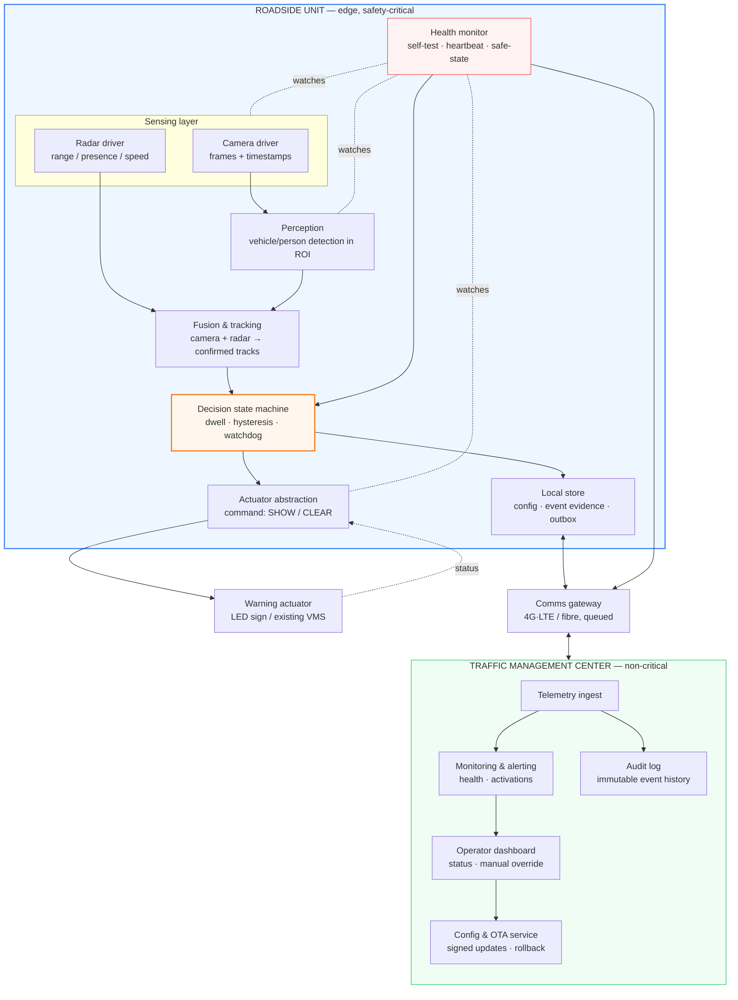
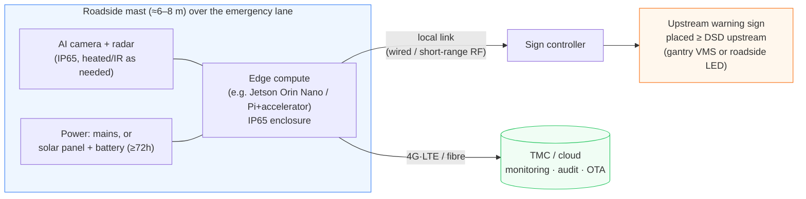
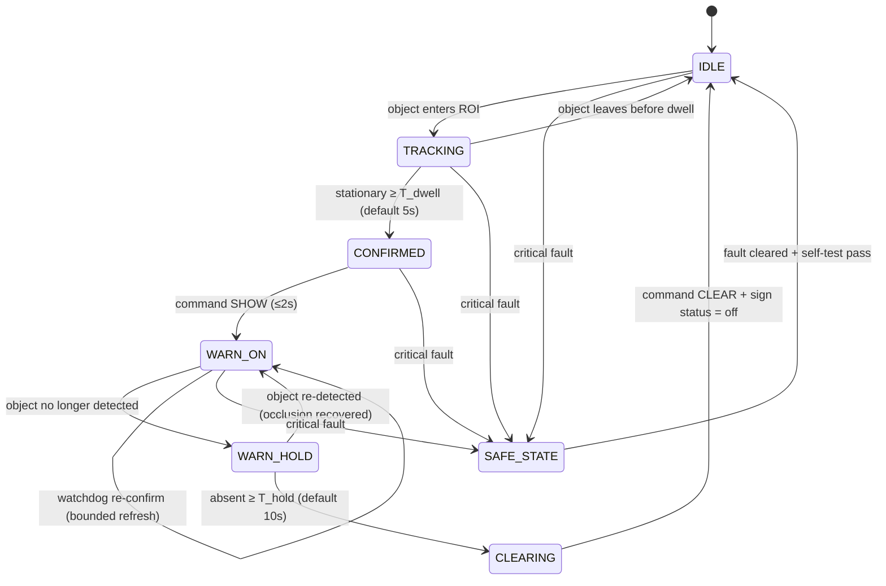
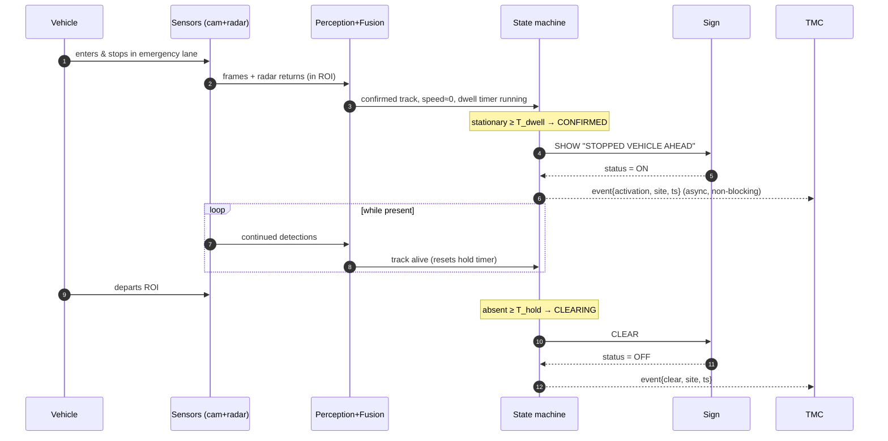

# 02 — Kiến trúc hệ thống

> 🇬🇧 Bản gốc tiếng Anh: [02-system-architecture.md](02-system-architecture.md)

**Dự án:** Hệ thống cảnh báo tự động làn dừng xe khẩn cấp (ESW)
**Trạng thái:** Đề xuất
**Cập nhật:** 2026-06-26
**Liên quan:** [yêu cầu](01-requirements.vi.md) · [các ADR](adr/README.vi.md) · [rủi ro & an toàn](04-risk-and-safety.vi.md)

Đây là tài liệu thiết kế trung tâm. Nó mô tả *cách* hệ thống được xây dựng và *vì sao* nó có hình
dạng như vậy. Tài liệu trung thành với Hình 1 của đề xuất (đồ họa thông tin minh họa ý tưởng, được
lưu tại [assets/figure-1-concept-infographic.jpeg](assets/figure-1-concept-infographic.jpeg)) và làm
cho nó có thể xây dựng được.


*Tổng quan — vòng kín trọng yếu an toàn (màu xanh dương) chạy tại biên; trung tâm (màu xanh ngọc) chỉ
giám sát; màu hổ phách là tất cả những gì người lái nhìn thấy. Các góc nhìn chi tiết được trình bày
bên dưới.*

---

## 1. Các yếu tố định hình kiến trúc

Hình dạng của kiến trúc này được rút ra trực tiếp từ các yêu cầu:

| Yếu tố định hình | Phản hồi của kiến trúc |
|--------|------------------------|
| Vòng an toàn không được phụ thuộc vào mạng (NFR-06) | **Vòng kín cục bộ tại biên**; đám mây chỉ giám sát ([ADR-0002](adr/ADR-0002-edge-vs-cloud-processing.vi.md)). |
| Phải hoạt động ban đêm / mưa / sương mù (FR-09, NFR-05) | **Đa cảm biến**: hợp nhất camera + radar ([ADR-0001](adr/ADR-0001-sensing-modality.vi.md)). |
| Không kích hoạt sai, không dao động, không kẹt-BẬT (FR-03/04/07, NFR-04) | **Máy trạng thái** với dwell, hysteresis và một **watchdog** (§4). |
| An toàn khi sự cố (fail-safe) + báo lỗi rõ ràng (fail-loud) (FR-10/11) | **Bộ giám sát tình trạng + trạng thái an toàn được xác định + nhịp tín hiệu (heartbeat)** (§3, [ADR-0005](adr/ADR-0005-fail-safe-and-system-safety.vi.md)). |
| Tái sử dụng hạ tầng (FR-17) | Trừu tượng hóa **cơ cấu cảnh báo cắm-rút được**: bảng LED riêng *hoặc* VMS hiện có ([ADR-0004](adr/ADR-0004-warning-actuator-integration.vi.md)). |
| Cân chỉnh quy mô theo ngân sách (NFR-12) | Cùng một thiết kế logic chạy trên **khung mô phỏng** và **mô hình thử nghiệm trên bàn (bench)** (tài liệu 03). |

## 2. Kiến trúc logic (các thành phần & trách nhiệm)



**Trách nhiệm của các thành phần**

| Thành phần | Trách nhiệm | Ghi chú chính |
|-----------|----------------|-----------|
| **Driver camera / radar** | Thu nhận khung hình có gắn nhãn thời gian và tín hiệu phản hồi radar. | Đồng bộ thời gian giữa các cảm biến rất quan trọng cho việc hợp nhất. |
| **Nhận diện** | Phát hiện xe/người; chỉ giữ lại các phát hiện có vùng tiếp xúc nằm bên trong đa giác ROI. | Bộ phát hiện nhẹ + cổng chặn ROI ([ADR-0003](adr/ADR-0003-detection-algorithm.vi.md)). |
| **Hợp nhất & theo dõi** | Liên kết các phát hiện của camera với tín hiệu phản hồi radar; tạo ra các vết bám ổn định kèm vị trí + tốc độ + dwell. | Radar xác định "có mặt & đứng yên" trong điều kiện tối / mưa. |
| **Máy trạng thái quyết định** | Bộ não. Áp dụng dwell, hysteresis, watchdog; quyết định SHOW/CLEAR. | Là thành phần duy nhất được phép ra lệnh cho bảng. §4. |
| **Trừu tượng hóa cơ cấu cảnh báo** | Chuyển SHOW/CLEAR thành giao thức bảng cụ thể; đọc ngược lại trạng thái bảng. | Hoán đổi được: bảng LED riêng hoặc VMS hiện có. |
| **Bộ giám sát tình trạng** | Tự kiểm tra mọi hệ thống con; phát nhịp tín hiệu (heartbeat); đưa về trạng thái an toàn khi có lỗi. | Đường watchdog độc lập; xem ADR-0005. |
| **Kho lưu cục bộ** | Giữ cấu hình, vùng đệm bằng chứng-sự kiện, và một outbox bền bỉ cho dữ liệu đo lường từ xa. | Sống sót qua khởi động lại; thời gian lưu giữ có giới hạn (quyền riêng tư). |
| **Cổng truyền thông** | Lưu và chuyển dữ liệu đo lường từ xa; nhận cấu hình/OTA. | Chịu được mất mát; không bao giờ nằm trong đường an toàn. |
| **Các dịch vụ TMC** | Giám sát, cảnh báo, kiểm toán, cấu hình, cập nhật, can thiệp. | Nằm ngoài đường trọng yếu — có thể ngoại tuyến mà không gây hành vi mất an toàn. |

## 3. Kiến trúc vật lý / triển khai


*Thiết bị tại hiện trường là một địa điểm vật lý duy nhất: cảm biến + bộ tính toán biên + nguồn trên
cột/tủ, bảng cảnh báo đặt phía trước (liên kết cáp hoặc vô tuyến), và một đường lên không trọng yếu
tới trung tâm. Mã nguồn Mermaid có thể chỉnh sửa được trình bày tiếp theo.*



**Hình học vị trí đặt (trọng yếu — xem [tài liệu 01 §4](01-requirements.vi.md#4--warning-placement--the-math-the-proposal-omits)):**

```
     traffic ──────────────────────────────────────────────►
   ┌──────────────────────────────────────────────────────┐
   │  through lanes (làn xe 1, làn xe 2)                    │
   ├──────────────────────────────────────────────────────┤
   │  emergency lane (làn dừng khẩn cấp)                    │
   │                          [████ stopped vehicle ████]   │
   └──────────────────────────────────────────────────────┘
        ▲                                  ▲           ▲
     WARNING SIGN                      sensor mast   detection
   (≥ DSD upstream:                   (overlooks      zone / ROI
    ~315 m @100 km/h)                  the ROI)     (vùng phát hiện)
```

Bảng được đặt **phía trước** vùng phát hiện một khoảng ít nhất bằng Cự ly tầm nhìn quyết định để các
xe phía sau nhận được cảnh báo trước khi họ tới chỗ nguy hiểm. Hình 1 cho thấy hai bảng (một VMS trên
giá long môn và một bảng bên đường); cả hai đều là các thể hiện hợp lệ của cùng một "cơ cấu cảnh báo"
— chọn theo từng địa điểm (ADR-0004).

## 4. Máy trạng thái phát hiện→cảnh báo

Đây là nơi "chu trình khép kín" (closed loop) của đề xuất trở nên chính xác. Đây là cơ quan duy nhất
có quyền với bảng và là nơi kiểm soát các rủi ro kích hoạt sai, dao động, và kẹt-BẬT.


*Xanh dương = giám sát bình thường, hổ phách = đang hiển thị cảnh báo, đỏ = trạng thái an toàn khi
lỗi. Dwell (mặc định 5 s) chặn các kích hoạt sai; cặp warn-on ⇄ warn-hold với thời gian giữ 10 s hấp
thụ tình trạng che khuất; watchdog xác nhận lại để không cảnh báo nào có thể kẹt BẬT; trạng thái an
toàn có thể đạt được từ bất kỳ trạng thái nào. Mã nguồn Mermaid có thể chỉnh sửa được trình bày tiếp
theo.*



**Bộ định thời & điều kiện bảo vệ**

| Ký hiệu | Mặc định | Mục đích | Đánh đổi |
|--------|---------|---------|-----------|
| `T_dwell` | 5 s (3–10) | Thời gian đứng yên trước khi tuyên bố "đang dừng". | Quá thấp → báo động giả từ xe chạy chậm/thoáng qua; quá cao → cảnh báo muộn. |
| `T_hold` | 10 s (5–15) | Giữ cảnh báo sau lần phát hiện cuối (hysteresis). | Hấp thụ che khuất ngắn; quá cao → cảnh báo cũ sau khi xe đã thực sự rời đi. |
| `T_activate` | ≤ 2 s | Từ confirmed → bảng thực sự BẬT. | Bị giới hạn bởi NFR-01. |
| `T_watchdog` | ≤ 30 s | Thời gian tối đa một cảnh báo có thể duy trì BẬT mà không có xác nhận mới hoặc làm mới của watchdog. | Ngăn tình trạng kẹt-BẬT vô thời hạn nếu logic bị kẹt cứng (NFR-04). |
| cổng tốc độ | ~ <3 km/h | Ngưỡng mà dưới đó một vết bám được tính là "đứng yên". | Phân biệt "đang dừng" với "bò chậm dọc lề đường". |

**Vì sao mỗi điều kiện bảo vệ tồn tại (ánh xạ tới một lỗi thực tế):**

- *Dwell* → một xe trôi qua hoặc chạm vào lề đường trong chốc lát **không** kích hoạt.
- *Hysteresis (giữ)* → một xe tải đi qua ở làn thông xe và che khuất tạm thời chiếc xe đang dừng
  không làm cảnh báo nhấp nháy tắt/bật.
- *Watchdog xác nhận lại* → nếu logic quyết định có lúc bị kẹt cứng trong khi bảng đang BẬT, watchdog
  buộc phải đánh giá lại; chưa xác nhận → CLEAR. **Không cảnh báo nào có thể "kẹt BẬT" mãi mãi.**
- *Trạng thái an toàn* → khi có bất kỳ lỗi trọng yếu nào, máy rời khỏi vận hành bình thường và leo
  thang xử lý (ADR-0005).

## 5. Luồng dữ liệu lúc chạy (đường thuận lợi)


*Bảng hiển thị "phía trước có xe dừng" (PHÍA TRƯỚC CÓ XE DỪNG KHẨN CẤP). Mũi tên nét đứt là các thông
điệp bất đồng bộ/trả về — các thông báo tới TMC là kiểu gửi-rồi-quên, nên một đường liên kết bị mất
không bao giờ làm đình trệ vòng an toàn. Mã nguồn Mermaid có thể chỉnh sửa được trình bày tiếp theo.*



Các tương tác với TMC (các bước tới `T`) theo kiểu **gửi-rồi-quên**: nếu đường liên kết bị mất, các sự
kiện xếp hàng trong outbox cục bộ và vòng an toàn không bị ảnh hưởng.

## 6. Mô hình phạm vi giám sát

Một thiết bị tại hiện trường đơn lẻ giám sát một **đoạn có giới hạn** (chiều dài mà các cảm biến của
nó nhìn thấy đáng tin cậy — thực tế là từ vài chục tới vài trăm mét). Làn dừng khẩn cấp là liên tục,
nên việc giám sát toàn bộ vừa không đủ kinh phí vừa nằm ngoài phạm vi. Do đó mô hình là **các vùng
giám sát rời rạc tại những vị trí có giá trị cao**:

- các đoạn dẫn vào **hầm, cầu, đoạn trên cao** (các tình huống sử dụng của Hình 1);
- **đường cong / đỉnh dốc** có tầm nhìn hạn chế;
- các **điểm nóng sự cố** đã biết và các điểm dừng/đỗ tạm;
- các đoạn đường cao tốc nơi đơn vị vận hành báo cáo tình trạng dừng lề tái diễn.

Đối với dự án này, **một vùng thử nghiệm** (hoặc bản mô phỏng của nó) là phạm vi. Mở rộng quy mô tới
nhiều vùng là một câu hỏi về triển khai/CapEx cho giai đoạn tiếp nối tại hiện trường, không phải thay
đổi kiến trúc — các thiết bị là độc lập và báo cáo về cùng một TMC.

## 7. Giao diện & hợp đồng (ban đầu)

| Giao diện | Giữa | Hình dạng (mang tính chỉ dẫn) |
|-----------|---------|--------------------|
| Sự kiện phát hiện | Nhận diện → Máy trạng thái | `{track_id, class, bbox/range, speed, in_roi, ts}` |
| Lệnh bảng | Máy trạng thái → Cơ cấu cảnh báo | `SHOW(message_id) | CLEAR | STATUS?` trả về `{state, lamp_ok, ts}` |
| Nhịp tín hiệu (heartbeat) | Bộ giám sát tình trạng → TMC | `{site_id, fw_ver, subsystem_health[], state, ts}` theo nhịp cố định |
| Sự kiện kích hoạt/xóa | Máy trạng thái → TMC/kiểm toán | `{site_id, type, evidence_ref?, ts}` (lưu và chuyển) |
| Cấu hình | TMC → Thiết bị tại hiện trường | `{roi_polygon, T_dwell, T_hold, speed_gate, message_set}` (đã ký) |
| OTA | TMC → Thiết bị tại hiện trường | ảnh đã ký + phiên bản + mã thông báo rollback |

Các cách mã hóa cụ thể (protobuf/JSON, MQTT/HTTPS cho dữ liệu đo lường từ xa; giao thức của nhà cung
cấp bảng hoặc một hồ sơ kiểu NTCIP cho VMS) được hoãn sang giai đoạn thiết kế chi tiết; **các ranh
giới trừu tượng hóa ở trên là cam kết kiến trúc.**

## 8. Ngăn xếp công nghệ khuyến nghị (mang tính chỉ dẫn, không ràng buộc)

| Lớp | Khuyến nghị | Lý do |
|-------|----------------|-----------|
| Bộ tính toán biên | NVIDIA Jetson Orin Nano *hoặc* Raspberry Pi 5 + bộ tăng tốc Hailo/Coral | Đủ TOPS cho một bộ phát hiện nhỏ tại biên; công suất thấp phù hợp pin mặt trời. |
| Camera | IP camera global-shutter hoặc có WDR tốt; chiếu sáng IR cho ban đêm | Xử lý lóa và ban đêm theo NFR-05. |
| Radar | Radar phát hiện sự hiện diện + đo cự ly 24/77 GHz cấp ô tô | Phát hiện sự hiện diện trong đêm/sương mù/mưa; bổ trợ cho camera (ADR-0001). |
| Nhận diện | Bộ phát hiện gọn nhẹ (loại YOLO-nano / SSD-Mobilenet) + cổng chặn ROI + bộ theo dõi đơn giản (SORT/ByteTrack) | Vững vàng, rẻ, thân thiện với biên (ADR-0003). |
| Môi trường chạy | Các dịch vụ đóng gói container, được systemd giám sát; tiến trình watchdog | Khả năng khởi động lại + cô lập; bộ giám sát tình trạng độc lập với nhận diện. |
| Kho lưu cục bộ | SQLite + vùng đệm vòng cho bằng chứng sự kiện | Nhỏ, bền bỉ, thời gian lưu giữ có giới hạn (quyền riêng tư). |
| Dữ liệu đo lường từ xa | MQTT trên TLS, outbox lưu và chuyển | Chịu được mất mát, nhẹ. |
| Bảng | VMS ma trận LED (tuân thủ QCVN 41) *hoặc* VMS hiện có của đơn vị vận hành thông qua giao thức của nó | ADR-0004. |
| Mô phỏng | CARLA / SUMO hoặc một trình phát kịch bản 2-D tùy chỉnh cấp các phát hiện tổng hợp | Kiểm chứng máy trạng thái mà không cần giao thông thực (tài liệu 03). |
| TMC | Dịch vụ web nhỏ + kho lưu chuỗi thời gian + bảng điều khiển | Chỉ giám sát/kiểm toán; không trọng yếu an toàn. |

> Đây là các điểm khởi đầu được cân chỉnh quy mô theo ngân sách và kỹ năng; mỗi lựa chọn được xem xét
> lại trong thiết kế chi tiết và các lựa chọn mang tính chịu lực được lập luận trong các ADR.

## 9. Cách ánh xạ vào Hình 1

| Phần tử của Hình 1 (VI) | Thành phần kiến trúc |
|-----------------------|------------------------|
| Camera AI giám sát làn dừng | Driver camera + Nhận diện (+ radar được thêm ở đây) |
| AI nhận diện ô tô đậu trong vùng | Nhận diện + Hợp nhất, có cổng chặn ROI |
| Vùng phát hiện (vùng nét đứt màu đỏ) | Đa giác ROI / vùng phát hiện |
| Bộ xử lý AI / điều khiển | Bộ tính toán biên: Hợp nhất + **Máy trạng thái** |
| Hệ thống tự động gửi tín hiệu cảnh báo | Trừu tượng hóa cơ cấu cảnh báo → lệnh bảng |
| Bảng tín hiệu ở đầu làn / gantry VMS | Cơ cấu cảnh báo (đặt phía trước cách ≥ DSD) |
| Tự động tắt khi xe rời đi | Các chuyển trạng thái `WARN_HOLD → CLEARING → IDLE` |
| Lợi ích: phát hiện tự động, cảnh báo kịp thời | Được đáp ứng bởi các NFR về độ trễ + độ sẵn sàng |

Ngoài đồ họa thông tin, kiến trúc bổ sung thêm: **hợp nhất radar, logic dwell/hysteresis/watchdog, bộ
giám sát tình trạng + trạng thái an toàn, vị trí đặt dựa trên DSD, và mặt phẳng giám sát TMC** — tức
là các phần làm cho nó đáng tin cậy chứ không chỉ trình diễn được.
