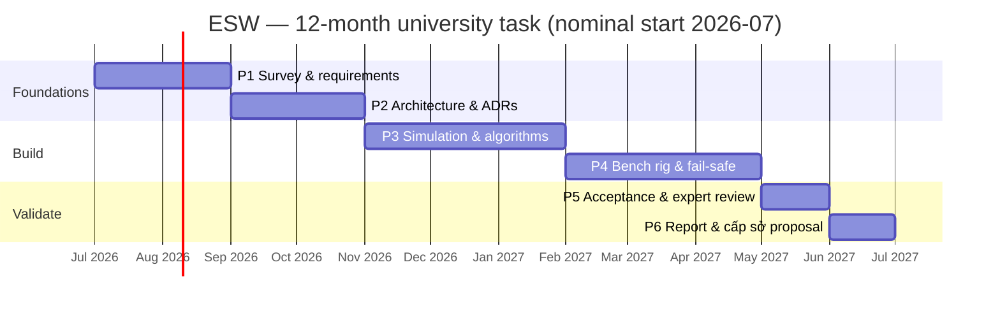

# 03 — Engineering Roadmap & Phasing

**Project:** Emergency Stop-Lane Automatic Warning System (ESW)
**Status:** Proposed
**Last updated:** 2026-06-26

This roadmap maps the architecture onto the proposal's **6-phase, 12-month** plan and **20,000,000
VND** budget, defines the **MVP**, and gives an honest **scope/budget reality check**. It keeps the
proposal's structure; it just attaches concrete engineering deliverables and a defensible scope.

---

## 1. Scope & budget reality check (read first)

The proposal's ambitions span field deployment, AI, IoT, and commercialization. The funding —
**20,000,000 VND (≈ US$800)** over 12 months at university level — supports a **principle prototype**,
not a roadside installation. A single field-grade unit (edge box + camera + radar + solar + a
QCVN-41 LED VMS + IP65 enclosure + civil works + permits) costs **many multiples** of the whole grant.

**Therefore the funded deliverable is scoped as:**

- a **simulation harness** that exercises the full detect→confirm→warn→clear loop and the fail-safe
  behaviour, plus
- a **bench/desktop rig** (real camera, low-cost edge compute, a small LED panel standing in for the
  sign, optionally a low-cost radar module) demonstrating the closed loop on staged scenarios, plus
- the **architecture, feasibility report, and a field-pilot proposal** for the follow-on
  **provincial (cấp sở)** project.

This is not a reduction of ambition — it is the correct **first rung**. The proposal itself
positions the field pilot and commercialization as the *next* stage; this roadmap makes that explicit
and fundable. **The same logical architecture (doc 02) runs unchanged from bench rig to field unit** —
only the sensor/sign/power *backends* change — so nothing built now is throwaway.

> **Verify the grant's project _type_ against this scope — a governance check, not an engineering one.**
> The proposal's declared type is **SXTN — *sản xuất thử nghiệm* (experimental / pilot production)**
> ([doc 00 glossary](00-context-and-glossary.md#7-bilingual-glossary-en--vi)), which can carry an
> expectation of a *trial-production unit*, not only a principle prototype — in tension with the
> bench/simulation scope above (which is what the 20M VND envelope actually supports; a single
> field-grade unit already exceeds the whole grant). Resolve it explicitly with the funder: confirm the
> cấp-trường deliverable is a **principle prototype** (this roadmap), or — if an SXTN trial-production
> unit is contractually expected — raise the scope/budget mismatch **now**, not at the final review.

### Indicative budget allocation (university scope)

| Item | Indicative | Note |
|------|-----------:|------|
| Edge compute (e.g. Raspberry Pi 5 + accelerator, or used Jetson Nano) | ~3–4M | Runs perception + state machine. |
| Camera (IP, WDR, IR) | ~1.5–2.5M | Primary sensor. |
| **Stopped-vehicle-capable** mmWave radar eval module (imaging / HRR FMCW) | ~6–8M | **Budget priority & the hard trade-off.** A module that can actually pass the [ADR-0001](adr/ADR-0001-sensing-modality.md) gate (stationary-in-clutter **+** shoulder-vs-through-lane discrimination) is an mmWave eval kit — **not** the ~1.5–2.5M *generic presence* unit the first cut assumed, and several times dearer. It is the *only* on-bench mitigation of R5 (top risk), so it is funded first and the lines below absorb the difference. Its **power draw** is also higher than a generic presence unit — a forward input to the solar sizing ([ADR-0006](adr/ADR-0006-connectivity-and-power.md)/NFR-07), reconciled like its cost was; moot at bench (mains), real at the field unit. |
| LED panel (sign stand-in) + sign controller | ~1–2M | Demonstrates actuator interface. |
| Mounts, cabling, power supply, misc | ~1–2M | Bench rig assembly. |
| Dissemination (report, poster, infographic) | ~1M | Per proposal's products. |
| Contingency | remainder | — |

> Numbers are planning estimates to show the envelope is *feasible for a bench prototype*, not a
> procurement quote. **Funding the gate-grade radar reshapes the budget**: at ~6–8M it consumes most of
> the contingency and pushes the edge/camera lines to their lower, *used/lower-cost* end (e.g. a
> second-hand Jetson Nano) — the deliberate trade to keep R5's only on-bench mitigation real. The
> alternative is to defer radar to a **synthetic channel** in simulation (architecture unchanged) —
> **but that makes the night/adverse recall claim field-deferred**, since it cannot be evidenced from
> synthetic radar ([ADR-0001](adr/ADR-0001-sensing-modality.md),
> [doc 01 §5](01-requirements.md#5-evaluation-metrics--acceptance-criteria)). Decide this explicitly at
> the **Phase-1 radar spike** (§3/§5), not by silent default. **Procurement lead time is itself a
> schedule risk:** an mmWave imaging eval kit can take **8–12 weeks** to arrive, so it must be ordered at
> project start for the month 1–2 spike to land on time — treat a slipped delivery as a gate-slip risk
> ([doc 04 R11](04-risk-and-safety.md#1-risk-register)).

## 2. MVP definition

**The MVP is the smallest build that proves the thesis end-to-end:**

> On the bench rig and/or simulation, a vehicle entering and stopping in the ROI causes the warning to
> turn **ON within the latency target**, stay on while present (surviving a brief occlusion), and turn
> **OFF after departure** — *and* an injected sensor/compute/sign fault drives the system to its
> **safe state with an operator alert**, never to a deceptive or stuck output.

If that demonstrates against the doc-01 §5 prototype targets, the central claim is validated and the
cấp sở proposal is evidence-backed.

## 3. Phase plan (aligned to the proposal's 6 phases)

| Phase | Proposal content (months) | Engineering deliverables (added) | Exit criteria |
|------:|---------------------------|----------------------------------|---------------|
| **1** | Survey & requirements (2) | Finalised [requirements](01-requirements.md); **per-site DSD placement** study (reconciled with TCVN 5729); **data-acquisition plan** ([ADR-0007](adr/ADR-0007-validation-and-data-strategy.md)); **order the mmWave eval kit (8–12 wk lead)** + **early radar feasibility spike** to de-risk R5 *before* the design commits its weight to radar ([ADR-0001](adr/ADR-0001-sensing-modality.md)); scenario catalogue (day/night/rain/**brief+sustained occlusion**/**`T_degraded_max` forced-clear**/transient/**congestion**/pedestrian incl. **moving occupant**/**multi-vehicle**/**boot-present**/**override-expiry+config-bounds+OTA-defer**/faults). | Requirements + acceptance criteria signed off; data plan agreed; **radar spike go/no-go recorded**. |
| **2** | Principle model & system design (2) | [Architecture](02-system-architecture.md) ratified; **all 12 ADRs accepted**; **requirement→verification traceability matrix** ([doc 06](06-traceability-matrix.md)); interface contracts; ROI + **exit-boundary** + state-machine spec (incl. occlusion/multi-track [ADR-0008](adr/ADR-0008-detection-persistence-and-multitrack.md); sign-controller fail-safe + degraded modes + **`T_degraded_max`** [ADR-0009](adr/ADR-0009-failsafe-placement-and-degraded-modes.md); **pedestrian presence-onset**; **operator-override policy** [ADR-0010](adr/ADR-0010-operator-override-and-manual-control.md); **operator concept-of-operations + alarm management** [ADR-0011](adr/ADR-0011-operator-concept-and-alarm-management.md); **security threat model** [ADR-0012](adr/ADR-0012-security-and-threat-model.md)); sensor/compute/sign selection. | ADRs Accepted; interfaces frozen; traceability matrix complete. |
| **3** | Simulation, algorithm, interface (3) | **Simulation harness** (documented synthetic sensor model, [ADR-0007](adr/ADR-0007-validation-and-data-strategy.md)); perception + ROI gating + tracker; **state machine with dwell/hysteresis/occlusion-hold/multi-track/watchdog** ([ADR-0008](adr/ADR-0008-detection-persistence-and-multitrack.md)); **radar stationary-detection gate** ([ADR-0001](adr/ADR-0001-sensing-modality.md)); warning UI content (QCVN-41-conformant). | Closed loop passes in simulation across the scenario catalogue; radar gate decided. |
| **4** | Build/simulate test model (3) | **Bench rig**: camera (+radar) → edge → LED sign; actuator adapter with the **sign-controller dead-man's switch** (blank-on-heartbeat-loss); **health monitor + safe state + the three degraded modes** ([ADR-0009](adr/ADR-0009-failsafe-placement-and-degraded-modes.md)); telemetry to a minimal TMC; **fault-injection harness** (kill the SM process, **kill the edge box, cut the sign link**, drop each sensor). | Closed loop + fail-safe demonstrated; **SM-kill, box-kill, and link-cut each blank the sign**; degraded modes escalate correctly. |
| **5** | Evaluate & expert review (1) | Run the **acceptance suite** (doc 01 §5); collect metrics; **expert review** (traffic, electronics, AI, road safety) per the proposal's method. | Metrics meet prototype targets; review feedback captured. |
| **6** | Final report & next steps (1) | **Feasibility report**; updated infographic; **cấp sở field-pilot proposal** (siting, BoM, power/connectivity, safety case, budget). | Deliverables submitted; follow-on proposal ready. |

## 4. Timeline (nominal)

## 5. Per-phase risk gates

Each phase exit is also a **go/no-go gate**:

- **After P1 (radar spike)** — an early, cheap feasibility check on a procurable mmWave module. If it
  cannot even *approach* stationary-in-clutter **+** shoulder/through-lane discrimination, decide **now**
  — before the architecture leans its weight on radar — whether to fund a gate-grade module (reshaping
  the budget) or to treat the night/adverse claim as field-deferred and the bench radar as
  fusion-plumbing only ([ADR-0001](adr/ADR-0001-sensing-modality.md)). Catching this in month 1–2 rather
  than month 9 is the entire point.
- **After P2** — if DSD placement cannot be satisfied at any realistic candidate site, revisit siting
  strategy or repeater signs (PL-04) before building.
- **After P3** — if the state machine cannot hit false-alarm/miss targets in simulation, retune dwell/
  hysteresis/fusion before committing hardware effort.
- **After P3 (radar gate)** — confirm the Phase-1 spike on the *final* hardware, now including
  **lane discrimination**: if a real radar cannot reliably pick a *stationary* vehicle out of roadside
  clutter **and** place it in the shoulder ROI, the night/adverse claim is **not** evidence-backed —
  fund a better radar or **down-scope the adverse-condition target to field-deferred**; do not rest it
  on synthetic data ([ADR-0001](adr/ADR-0001-sensing-modality.md)).
- **After P4** — if fault-injection coverage is below target, the fail-safe design
  ([ADR-0005](adr/ADR-0005-fail-safe-and-system-safety.md)/[ADR-0009](adr/ADR-0009-failsafe-placement-and-degraded-modes.md))
  is not yet acceptance-ready; in particular **SM-kill, edge-box-kill, and link-cut must each blank the
  sign**, and the degraded modes must escalate correctly, before evaluation.

## 6. What "done" hands to the follow-on (cấp sở)

A field pilot proposal backed by: a working closed-loop prototype, measured prototype metrics, the
accepted architecture and ADRs, a **safety case skeleton** (from [doc 04](04-risk-and-safety.md)),
a per-site **DSD-based siting method**, and a realistic field **bill of materials and budget**. That
package is exactly what a provincial grant and an expressway-operator partnership need to say yes.

→ That follow-on is drafted in **[doc 05 — field-pilot proposal](05-field-pilot-proposal.md)**.
