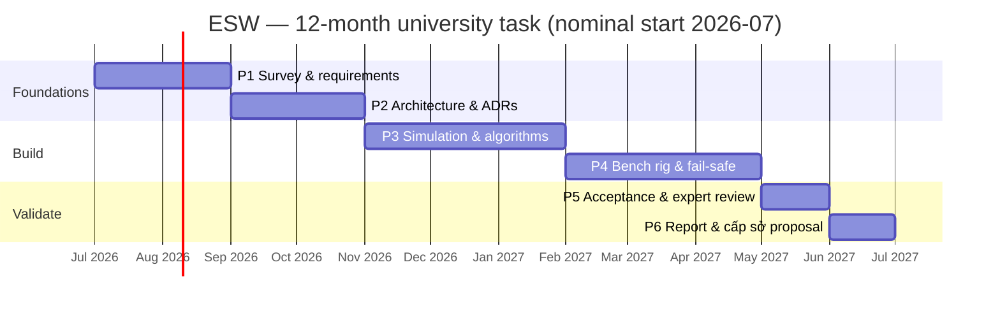

# 03 — Engineering Roadmap & Phasing

**Project:** Emergency Stop-Lane Automatic Warning System (ESW)
**Status:** Proposed
**Last updated:** 2026-06-26

This roadmap maps the architecture onto the proposal's **6-phase, 12-month** plan and **20,000,000
VND** budget, defines the **MVP**, and gives an honest **scope/budget reality check**. It keeps the
proposal's structure; it just attaches concrete engineering deliverables and a defensible scope.

---

> ## ⚠ PHASE NOTE — this build is CAMERA-ONLY
>
> [ADR-0001](adr/ADR-0001-sensing-modality.md) (camera + radar fusion) was **Rejected on 2026-07-10**. The cấp trường bench
> prototype ships **camera-only**. Every radar-dependent behaviour described below — radar
> corroboration, the occlusion hold (`WARN_HOLD` / `CAMERA_OCCLUDED_DEGRADED`), `T_degraded_max`, and
> the `FULL` / `RADAR-ONLY` sensing modes — is **dormant: the code retains it, but it never executes**,
> because `corr` is never true without a radar channel.
>
> Accepted consequences: **R5** (night/rain/fog blindness) is **unmitigated** and night/adverse recall
> is **not claimed**; **R20** — an occluded vehicle is cleared at `T_hold` (~10 s), blanking the sign
> with the hazard present; **R21** — the unit sits permanently in `CAMERA_ONLY`, hence permanently
> `DEGRADED`. See [doc 04](04-risk-and-safety.md).
>
> Radar content below is the **cấp sở** target design, not this phase's build.

## 1. Scope & budget reality check (read first)

The proposal's ambitions span field deployment, AI, IoT, and commercialization. The funding —
**20,000,000 VND (≈ US$800)** over 12 months at university level — supports a **principle prototype**,
not a roadside installation. A single field-grade unit (edge box + camera + radar + solar + a
QCVN-41 LED VMS + IP65 enclosure + civil works + permits) costs **many multiples** of the whole grant.

**Therefore the funded deliverable is scoped as:**

- a **simulation harness** that exercises the full detect→confirm→warn→clear loop and the fail-safe
  behaviour, plus
- a **bench/desktop rig** (real camera, low-cost edge compute, a small LED panel standing in for the
  sign; **camera-only — no radar**, [ADR-0001](adr/ADR-0001-sensing-modality.md) Rejected) demonstrating the closed loop on staged scenarios, plus
- the **architecture, feasibility report, and a field-pilot proposal** for the follow-on
  **provincial (cấp sở)** project.

This is not a reduction of ambition — it is the correct **first rung**. The proposal itself
positions the field pilot and commercialization as the *next* stage; this roadmap makes that explicit
and fundable. **The same logical architecture (doc 02) runs unchanged from bench rig to field unit** —
only the sensor/sign/power *backends* change — so nothing built now is throwaway.

> **Verify the grant's project _type_ against this scope — a governance check, not an engineering one.**
> The proposal's declared type is **SXTN — *sản xuất thử nghiệm* (experimental / pilot production)**
> ([doc 00 glossary](00-context-and-glossary.md#7-bilingual-glossary-en--vi)), which can carry an
> expectation of a *trial-production unit*, not only a principle prototype — in tension with the
> bench/simulation scope above (which is what the 20M VND envelope actually supports; a single
> field-grade unit already exceeds the whole grant). Resolve it explicitly with the funder: confirm the
> cấp-trường deliverable is a **principle prototype** (this roadmap), or — if an SXTN trial-production
> unit is contractually expected — raise the scope/budget mismatch **now**, not at the final review.

### Indicative budget allocation (university scope)

| Item | Indicative | Note |
|------|-----------:|------|
| Edge compute (e.g. Raspberry Pi 5 + accelerator, or used Jetson Nano) | ~3–4M | Runs perception + state machine. |
| Camera (IP, WDR, IR) | ~1.5–2.5M | Primary sensor. |
| ~~**Stopped-vehicle-capable** mmWave radar eval module (imaging / HRR FMCW)~~ | ~~~6–8M~~ → **0** | **NOT PROCURED — [ADR-0001](adr/ADR-0001-sensing-modality.md) Rejected 2026-07-10.** The ~6–8M is **released** back to contingency and to the **acceptance-evidence capture** (≥ 200 real events incl. night — the recall-with-Wilson-bound headline, which *is* bench-achievable and was previously unfunded). Rationale: gate criterion (b), shoulder-vs-through-lane at the monitored range, is **not bench-testable**, so a radar bought now would discharge **(a) only** — leaving every radar-dependent guarantee exactly where it already stands. **R5 is therefore unmitigated**, night/adverse recall is **not claimed**, and R20/R21 are accepted. Deferred to cấp sở; **specify the monitored range first**. |
| LED panel (sign stand-in) + sign controller | ~1–2M | Demonstrates actuator interface. |
| Mounts, cabling, power supply, misc | ~1–2M | Bench rig assembly. |
| Dissemination (report, poster, infographic) | ~1M | Per proposal's products. |
| Contingency | remainder | — |

> Numbers are planning estimates to show the envelope is *feasible for a bench prototype*, not a
> procurement quote.
>
> **The radar decision was taken on 2026-07-10: no radar this phase** ([ADR-0001](adr/ADR-0001-sensing-modality.md)
> Rejected). It was **decided explicitly, not by silent default** — which is what this section previously
> demanded. Radar is deferred to a **synthetic channel** in simulation (architecture unchanged), and the
> consequence is accepted in full: **the night/adverse recall claim is not made at all**, since it cannot
> be evidenced from synthetic radar ([doc 01 §5](01-requirements.md#5-evaluation-metrics--acceptance-criteria)),
> **R5 is unmitigated**, and R20/R21 are carried as residuals ([doc 04](04-risk-and-safety.md)).
>
> The ~6–8M and the **8–12 week mmWave procurement lead** (previously a Phase-1 schedule risk) both fall
> away. The released funds go to **contingency** and to the **acceptance-evidence capture** — ≥ 200 real
> staged events including night, which produces the recall figure with a Wilson bound and *is* achievable
> on a bench. That capture was the load-bearing deliverable this budget had never funded.

## 2. MVP definition

**The MVP is the smallest build that proves the thesis end-to-end:**

> On the bench rig and/or simulation, a vehicle entering and stopping in the ROI causes the warning to
> turn **ON within the latency target**, stay on while present (surviving a brief occlusion), and turn
> **OFF after departure** — *and* an injected sensor/compute/sign fault drives the system to its
> **safe state with an operator alert**, never to a deceptive or stuck output.

If that demonstrates against the doc-01 §5 prototype targets, the central claim is validated and the
cấp sở proposal is evidence-backed.

## 3. Phase plan (aligned to the proposal's 6 phases)

| Phase | Proposal content (months) | Engineering deliverables (added) | Exit criteria |
|------:|---------------------------|----------------------------------|---------------|
| **1** | Survey & requirements (2) | Finalised [requirements](01-requirements.md); **per-site DSD placement** study (reconciled with TCVN 5729); **data-acquisition plan** ([ADR-0007](adr/ADR-0007-validation-and-data-strategy.md)); **acceptance-evidence-generation plan** — a staged-event capture protocol sized to the [§5](01-requirements.md#5-evaluation-metrics--acceptance-criteria) Wilson-bound N (real positive events incl. night) plus the continuous bench-hours that give the per-hour false-activation denominator (real recall N can't come from synthetic runs); **QCVN-41 message-element confirmation** — verify a conformant "stopped vehicle on shoulder" element exists *and* a **second** legal message for congestion re-messaging, else start the regulated-exception process now ([ADR-0004](adr/ADR-0004-warning-actuator-integration.md) AI#4); ~~order the mmWave eval kit + early radar feasibility spike~~ **— cancelled; [ADR-0001](adr/ADR-0001-sensing-modality.md) Rejected 2026-07-10, no radar this phase (R5 unmitigated);** scenario catalogue (day/night/rain/**brief+sustained occlusion**/**`T_degraded_max` forced-clear**/**camera-fault-while-warning**/transient/**congestion**/pedestrian incl. **moving occupant**/**multi-vehicle**/**boot-present**/**override-expiry+config-bounds+OTA-defer**/faults). | Requirements + acceptance criteria signed off; data plan agreed; ~~radar spike go/no-go recorded~~ **— decided: no radar (ADR-0001 Rejected);** **QCVN-41 element confirmed or exception process started**; **acceptance-evidence plan sized (target N set)**. |
| **2** | Principle model & system design (2) | [Architecture](02-system-architecture.md) ratified; **all 13 ADRs accepted**; **requirement→verification traceability matrix** ([doc 06](06-traceability-matrix.md)); interface contracts (**[doc 08 — ICD v1](08-interface-control-document.md)**) incl. the **bounded safety-parameter surface** ([doc 02 §7a](02-system-architecture.md#7-interfaces--contracts-initial), FR-20); **simulation-methodology spec frozen** (**[doc 07](07-simulation-methodology.md)**: scenario schema, synthetic-sensor noise/dropout model + stated assumptions, ground-truth labeling rule — the basis the Phase-3 logic claims rest on, [ADR-0007](adr/ADR-0007-validation-and-data-strategy.md)); ROI + **exit-boundary** + state-machine spec (incl. occlusion/multi-track [ADR-0008](adr/ADR-0008-detection-persistence-and-multitrack.md); sign-controller fail-safe + degraded modes + **`T_degraded_max`** [ADR-0009](adr/ADR-0009-failsafe-placement-and-degraded-modes.md); **degraded-hold unification + warning×sensor-mode matrix** [ADR-0013](adr/ADR-0013-degraded-hold-unification.md); **pedestrian presence-onset**; **operator-override policy** [ADR-0010](adr/ADR-0010-operator-override-and-manual-control.md); **operator concept-of-operations + alarm management** [ADR-0011](adr/ADR-0011-operator-concept-and-alarm-management.md); **security threat model** [ADR-0012](adr/ADR-0012-security-and-threat-model.md)); sensor/compute/sign selection. | ADRs Accepted; interfaces frozen incl. safety-parameter bounds; **simulation methodology frozen**; traceability matrix complete. |
| **3** | Simulation, algorithm, interface (3) | **Simulation harness** (documented synthetic sensor model, [ADR-0007](adr/ADR-0007-validation-and-data-strategy.md)); perception + ROI gating + tracker; **state machine with dwell/hysteresis/occlusion-hold/multi-track/watchdog** ([ADR-0008](adr/ADR-0008-detection-persistence-and-multitrack.md)); ~~radar stationary-detection gate~~ **— removed; [ADR-0001](adr/ADR-0001-sensing-modality.md) Rejected, deferred to cấp sở;** warning UI content (QCVN-41-conformant). | Closed loop passes in simulation across the scenario catalogue; ~~radar gate decided~~ **— gate removed (no radar)**. |
| **4** | Build/simulate test model (3) | **Bench rig**: camera (+radar) → edge → LED sign; actuator adapter with the **sign-controller dead-man's switch** (blank-on-heartbeat-loss); **health monitor + safe state + the three degraded modes** ([ADR-0009](adr/ADR-0009-failsafe-placement-and-degraded-modes.md)); telemetry to a minimal TMC; **fault-injection harness** (kill the SM process, **kill the edge box, cut the sign link**, drop each sensor). | Closed loop + fail-safe demonstrated; **SM-kill, box-kill, and link-cut each blank the sign**; degraded modes escalate correctly. |
| **5** | Evaluate & expert review (1) | Run the **acceptance suite** (doc 01 §5); collect metrics; **expert review** (traffic, electronics, AI, road safety) per the proposal's method. | Metrics meet prototype targets; review feedback captured. |
| **6** | Final report & next steps (1) | **Feasibility report**; updated infographic; **cấp sở field-pilot proposal** (siting, BoM, power/connectivity, safety case, budget). | Deliverables submitted; follow-on proposal ready. |

## 4. Timeline (nominal)

## 5. Per-phase risk gates

Each phase exit is also a **go/no-go gate**:

- ~~**After P1 (radar spike)**~~ — **CLOSED 2026-07-10, not run.** The decision this gate existed to
  force was taken directly: **no radar** ([ADR-0001](adr/ADR-0001-sensing-modality.md) Rejected). The
  night/adverse claim is **not made at all**, R5 is unmitigated, and R20/R21 are accepted residuals.
  Reason the spike was not needed: criterion (b) — shoulder/through-lane discrimination at the monitored
  range — cannot be exercised on a bench at any budget, so the spike could only ever have half-answered
  it. Catching this in month 1 rather than month 9 was the entire point, and it was.
- **After P1 (QCVN-41 message gate)** — a regulatory long-lead item, treated like the radar spike.
  Confirm QCVN 41 actually provides a conformant element for "stopped vehicle on the shoulder ahead"
  **and** a *second* legal message for the congestion re-message. If the primary element does not exist,
  start the **regulated-exception / new-pictogram** process now (it gates the system's only output); if
  the second does not, the congestion design is **suppression-only** — a stated coverage gap recorded in
  [doc 04 §0](04-risk-and-safety.md#0-limits-of-protection-residual-hazards), decided here rather than
  discovered at Phase 5 ([ADR-0004](adr/ADR-0004-warning-actuator-integration.md) AI#4).
- **After P2** — if DSD placement cannot be satisfied at any realistic candidate site, revisit siting
  strategy or repeater signs (PL-04) before building.
- **After P3** — if the state machine cannot hit false-alarm/miss targets in simulation, retune dwell/
  hysteresis/fusion before committing hardware effort.
- ~~**After P3 (radar gate)**~~ — **REMOVED 2026-07-10; deferred to cấp sở.** There is no radar to gate.
  The instruction this gate carried has been executed in the only way left: the adverse-condition target
  is **down-scoped** and **not rested on synthetic data**
  ([ADR-0001](adr/ADR-0001-sensing-modality.md) Rejected; [doc 04](04-risk-and-safety.md) R5/R20/R21).
- **After P4** — if fault-injection coverage is below target, the fail-safe design
  ([ADR-0005](adr/ADR-0005-fail-safe-and-system-safety.md)/[ADR-0009](adr/ADR-0009-failsafe-placement-and-degraded-modes.md)/[ADR-0013](adr/ADR-0013-degraded-hold-unification.md))
  is not yet acceptance-ready; in particular **SM-kill, edge-box-kill, and link-cut must each blank the
  sign**, **killing the camera under an active warning must enter the bounded camera-unverified hold and
  hit a `T_degraded_max` forced loud clear**, **a CLEAR commanded against a wedged-ON sign must go to
  SAFE STATE + sign-stuck escalation**, and the degraded modes must escalate correctly, before evaluation.

## 6. What "done" hands to the follow-on (cấp sở)

A field pilot proposal backed by: a working closed-loop prototype, measured prototype metrics, the
accepted architecture and ADRs, a **safety case skeleton** (from [doc 04](04-risk-and-safety.md)),
a per-site **DSD-based siting method**, and a realistic field **bill of materials and budget**. That
package is exactly what a provincial grant and an expressway-operator partnership need to say yes.

→ That follow-on is drafted in **[doc 05 — field-pilot proposal](05-field-pilot-proposal.md)**.
