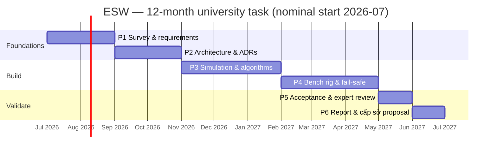

# 03 — Engineering Roadmap & Phasing

**Project:** Emergency Stop-Lane Automatic Warning System (ESW)
**Status:** Proposed
**Last updated:** 2026-06-26

This roadmap maps the architecture onto the proposal's **6-phase, 12-month** plan and **20,000,000
VND** budget, defines the **MVP**, and gives an honest **scope/budget reality check**. It keeps the
proposal's structure; it just attaches concrete engineering deliverables and a defensible scope.

---

## 1. Scope & budget reality check (read first)

The proposal's ambitions span field deployment, AI, IoT, and commercialization. The funding —
**20,000,000 VND (≈ US$800)** over 12 months at university level — supports a **principle prototype**,
not a roadside installation. A single field-grade unit (edge box + camera + radar + solar + a
QCVN-41 LED VMS + IP65 enclosure + civil works + permits) costs **many multiples** of the whole grant.

**Therefore the funded deliverable is scoped as:**

- a **simulation harness** that exercises the full detect→confirm→warn→clear loop and the fail-safe
  behaviour, plus
- a **bench/desktop rig** (real camera, low-cost edge compute, a small LED panel standing in for the
  sign, optionally a low-cost radar module) demonstrating the closed loop on staged scenarios, plus
- the **architecture, feasibility report, and a field-pilot proposal** for the follow-on
  **provincial (cấp sở)** project.

This is not a reduction of ambition — it is the correct **first rung**. The proposal itself
positions the field pilot and commercialization as the *next* stage; this roadmap makes that explicit
and fundable. **The same logical architecture (doc 02) runs unchanged from bench rig to field unit** —
only the sensor/sign/power *backends* change — so nothing built now is throwaway.

### Indicative budget allocation (university scope)

| Item | Indicative | Note |
|------|-----------:|------|
| Edge compute (e.g. Raspberry Pi 5 + accelerator, or used Jetson Nano) | ~3–4M | Runs perception + state machine. |
| Camera (IP, WDR, IR) | ~1.5–2.5M | Primary sensor. |
| Low-cost radar / presence module | ~1.5–2.5M | Validates fusion (ADR-0001); optional if budget tight. |
| LED panel (sign stand-in) + sign controller | ~1–2M | Demonstrates actuator interface. |
| Mounts, cabling, power supply, misc | ~1–2M | Bench rig assembly. |
| Dissemination (report, poster, infographic) | ~1M | Per proposal's products. |
| Contingency | remainder | — |

> Numbers are planning estimates to show the envelope is *feasible for a bench prototype*, not a
> procurement quote. Radar can be deferred to a synthetic channel in simulation if hardware budget is
> tight, without changing the architecture.

## 2. MVP definition

**The MVP is the smallest build that proves the thesis end-to-end:**

> On the bench rig and/or simulation, a vehicle entering and stopping in the ROI causes the warning to
> turn **ON within the latency target**, stay on while present (surviving a brief occlusion), and turn
> **OFF after departure** — *and* an injected sensor/compute/sign fault drives the system to its
> **safe state with an operator alert**, never to a deceptive or stuck output.

If that demonstrates against the doc-01 §5 prototype targets, the central claim is validated and the
cấp sở proposal is evidence-backed.

## 3. Phase plan (aligned to the proposal's 6 phases)

| Phase | Proposal content (months) | Engineering deliverables (added) | Exit criteria |
|------:|---------------------------|----------------------------------|---------------|
| **1** | Survey & requirements (2) | Finalised [requirements](01-requirements.md); **per-site DSD placement** study; scenario catalogue (day/night/rain/occlusion/transient/pedestrian/multi-vehicle/faults). | Requirements + acceptance criteria signed off. |
| **2** | Principle model & system design (2) | [Architecture](02-system-architecture.md) ratified; **ADRs accepted**; interface contracts; ROI/state-machine spec; sensor/compute/sign selection. | ADRs Accepted; interfaces frozen. |
| **3** | Simulation, algorithm, interface (3) | **Simulation harness**; perception + ROI gating + tracker; **state machine with dwell/hysteresis/watchdog**; warning UI content (QCVN-41-conformant). | Closed loop passes in simulation across the scenario catalogue. |
| **4** | Build/simulate test model (3) | **Bench rig**: camera (+radar) → edge → LED sign; actuator adapter; **health monitor + safe state**; telemetry to a minimal TMC; **fault-injection harness**. | Closed loop + fail-safe demonstrated on the rig. |
| **5** | Evaluate & expert review (1) | Run the **acceptance suite** (doc 01 §5); collect metrics; **expert review** (traffic, electronics, AI, road safety) per the proposal's method. | Metrics meet prototype targets; review feedback captured. |
| **6** | Final report & next steps (1) | **Feasibility report**; updated infographic; **cấp sở field-pilot proposal** (siting, BoM, power/connectivity, safety case, budget). | Deliverables submitted; follow-on proposal ready. |

## 4. Timeline (nominal)

## 5. Per-phase risk gates

Each phase exit is also a **go/no-go gate**:

- **After P2** — if DSD placement cannot be satisfied at any realistic candidate site, revisit siting
  strategy or repeater signs (PL-04) before building.
- **After P3** — if the state machine cannot hit false-alarm/miss targets in simulation, retune dwell/
  hysteresis/fusion before committing hardware effort.
- **After P4** — if fault-injection coverage is below target, the fail-safe design (ADR-0005) is not
  yet acceptance-ready; fix before evaluation.

## 6. What "done" hands to the follow-on (cấp sở)

A field pilot proposal backed by: a working closed-loop prototype, measured prototype metrics, the
accepted architecture and ADRs, a **safety case skeleton** (from [doc 04](04-risk-and-safety.md)),
a per-site **DSD-based siting method**, and a realistic field **bill of materials and budget**. That
package is exactly what a provincial grant and an expressway-operator partnership need to say yes.
