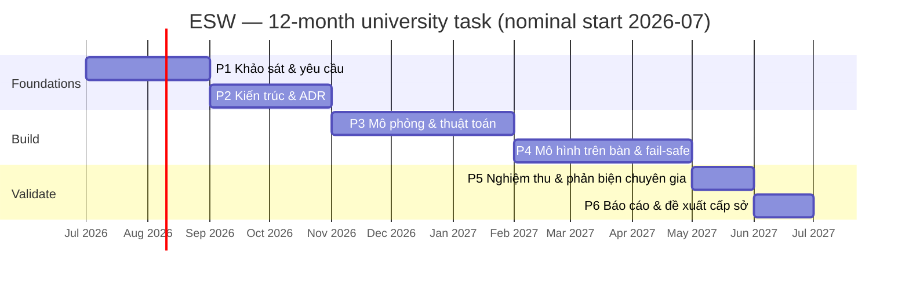

# 03 — Lộ trình kỹ thuật & phân kỳ

> 🇬🇧 Bản gốc tiếng Anh: [03-roadmap-and-phasing.md](03-roadmap-and-phasing.md)

**Dự án:** Hệ thống cảnh báo tự động làn dừng xe khẩn cấp (ESW)
**Trạng thái:** Đề xuất
**Cập nhật:** 2026-06-26

Lộ trình này ánh xạ kiến trúc lên kế hoạch **6 giai đoạn, 12 tháng** và ngân sách **20.000.000
VND** của đề xuất, định nghĩa **MVP**, và đưa ra một bản **rà soát thực tế phạm vi/ngân sách** trung thực. Nó giữ nguyên cấu trúc của đề xuất; chỉ gắn thêm các sản phẩm kỹ thuật cụ thể và một phạm vi có thể bảo vệ được.

---

## 1. Rà soát thực tế phạm vi & ngân sách (đọc trước)

Tham vọng của đề xuất trải rộng trên triển khai hiện trường, AI, IoT, và thương mại hóa. Nguồn kinh phí —
**20.000.000 VND (≈ US$800)** trong 12 tháng ở cấp trường — đủ cho một **nguyên mẫu nguyên lý** (principle prototype),
chứ không phải một lắp đặt bên đường. Một thiết bị đạt chuẩn hiện trường đơn lẻ (hộp xử lý tại biên + camera + radar + pin mặt trời + một VMS LED đạt QCVN-41 + vỏ bảo vệ IP65 + xây lắp + giấy phép) tốn **gấp nhiều lần** toàn bộ kinh phí tài trợ.

**Do đó sản phẩm được tài trợ được giới hạn phạm vi như sau:**

- một **khung mô phỏng** (simulation harness) thực thi đầy đủ vòng phát hiện→xác nhận→cảnh báo→giải tỏa (detect→confirm→warn→clear) và hành vi
  an toàn khi sự cố (fail-safe), cộng với
- một **mô hình thử nghiệm trên bàn/để bàn** (bench/desktop rig) (camera thật, thiết bị tính toán tại biên chi phí thấp, một bảng LED nhỏ thay thế cho
  bảng cảnh báo, tùy chọn một mô-đun radar chi phí thấp) trình diễn vòng kín trên các kịch bản dàn dựng, cộng với
- **kiến trúc, báo cáo khả thi, và một đề xuất thử nghiệm hiện trường** cho dự án
  **cấp sở** tiếp theo.

Đây không phải là việc thu hẹp tham vọng — đó là **bậc thang đầu tiên** đúng đắn. Bản thân đề xuất
định vị thử nghiệm hiện trường và thương mại hóa là giai đoạn *tiếp theo*; lộ trình này làm điều đó trở nên tường minh
và có thể tài trợ được. **Cùng một kiến trúc logic (doc 02) chạy không đổi từ mô hình trên bàn đến thiết bị hiện trường** —
chỉ có *backend* cảm biến/bảng cảnh báo/nguồn điện thay đổi — nên không có gì xây dựng bây giờ là bỏ đi.

### Phân bổ ngân sách dự kiến (phạm vi cấp trường)

| Hạng mục | Dự kiến | Ghi chú |
|------|-----------:|------|
| Tính toán tại biên (ví dụ Raspberry Pi 5 + bộ tăng tốc, hoặc Jetson Nano đã qua sử dụng) | ~3–4M | Chạy nhận diện + máy trạng thái. |
| Camera (IP, WDR, IR) | ~1.5–2.5M | Cảm biến chính. |
| Radar **có khả năng phát hiện xe đứng yên** / mô-đun phát hiện hiện diện | ~1.5–2.5M | **Ưu tiên ngân sách** — kiểm chứng trên bàn duy nhất cho tuyên bố về điều kiện ban đêm/bất lợi (cổng [ADR-0001](adr/ADR-0001-sensing-modality.vi.md)). Cắt giảm xuống kênh tổng hợp làm tuyên bố đó bị hoãn sang giai đoạn hiện trường. |
| Bảng LED (thay thế bảng cảnh báo) + bộ điều khiển bảng | ~1–2M | Trình diễn giao diện cơ cấu cảnh báo. |
| Giá đỡ, cáp, nguồn cấp, linh tinh | ~1–2M | Lắp ráp mô hình trên bàn. |
| Phổ biến kết quả (báo cáo, poster, infographic) | ~1M | Theo các sản phẩm của đề xuất. |
| Dự phòng | phần còn lại | — |

> Các con số là ước tính lập kế hoạch để cho thấy giới hạn ngân sách là *khả thi cho một nguyên mẫu trên bàn*, không phải
> một báo giá mua sắm. Radar có thể được hoãn lại thành một kênh tổng hợp trong mô phỏng nếu ngân sách phần cứng
> eo hẹp, mà không thay đổi kiến trúc — **nhưng làm như vậy khiến tuyên bố về độ nhạy phát hiện (recall) trong điều kiện
> ban đêm/bất lợi bị hoãn sang giai đoạn hiện trường** (không thể được chứng minh bằng dữ liệu radar tổng hợp;
> [ADR-0001](adr/ADR-0001-sensing-modality.vi.md), [doc 01 §5](01-requirements.vi.md#5-evaluation-metrics--acceptance-criteria)).
> Nên ưu tiên tài trợ một mô-đun chi phí thấp thực sự để cổng [ADR-0001](adr/ADR-0001-sensing-modality.vi.md) thực sự
> có thể được chạy — điều này giảm thiểu rủi ro cao nhất (R5).

## 2. Định nghĩa MVP

**MVP là bản dựng nhỏ nhất chứng minh được luận điểm một cách trọn vẹn (end-to-end):**

> Trên mô hình trên bàn và/hoặc mô phỏng, một phương tiện đi vào và dừng trong ROI khiến cảnh báo
> **BẬT trong phạm vi mục tiêu độ trễ**, duy trì bật khi xe còn hiện diện (vượt qua được một lần che khuất ngắn), và **TẮT
> sau khi xe rời đi** — *và* một lỗi cảm biến/tính toán/bảng cảnh báo được tiêm vào sẽ đưa hệ thống về
> **trạng thái an toàn kèm cảnh báo cho nhân viên vận hành**, không bao giờ về một đầu ra gây hiểu nhầm hay bị kẹt.

Nếu điều đó được chứng minh đối chiếu với các mục tiêu nguyên mẫu ở doc-01 §5, luận điểm trung tâm được kiểm chứng và
đề xuất cấp sở có bằng chứng hậu thuẫn.

## 3. Kế hoạch giai đoạn (khớp với 6 giai đoạn của đề xuất)

| Giai đoạn | Nội dung đề xuất (tháng) | Sản phẩm kỹ thuật (bổ sung) | Tiêu chí kết thúc |
|------:|---------------------------|----------------------------------|---------------|
| **1** | Khảo sát & yêu cầu (2) | Hoàn thiện [yêu cầu](01-requirements.vi.md); nghiên cứu **bố trí DSD theo từng vị trí** (đối chiếu với TCVN 5729); **kế hoạch thu thập dữ liệu** ([ADR-0007](adr/ADR-0007-validation-and-data-strategy.vi.md)); danh mục kịch bản (ngày/đêm/mưa/**che khuất ngắn+kéo dài**/thoáng qua/người đi bộ/**đa phương tiện**/**xe đã hiện diện lúc khởi động**/sự cố). | Yêu cầu + tiêu chí nghiệm thu được phê duyệt; kế hoạch dữ liệu được thống nhất. |
| **2** | Mô hình nguyên lý & thiết kế hệ thống (2) | [Kiến trúc](02-system-architecture.vi.md) được phê chuẩn; **cả 8 ADR được chấp nhận**; hợp đồng giao diện; đặc tả ROI + **biên thoát** + máy trạng thái (gồm che khuất/đa vết, [ADR-0008](adr/ADR-0008-detection-persistence-and-multitrack.vi.md)); lựa chọn cảm biến/tính toán/bảng cảnh báo. | Các ADR được Chấp nhận; giao diện được đóng băng. |
| **3** | Mô phỏng, thuật toán, giao diện (3) | **Khung mô phỏng** (mô hình cảm biến tổng hợp có tài liệu, [ADR-0007](adr/ADR-0007-validation-and-data-strategy.vi.md)); nhận diện + cổng lọc ROI + bộ theo dõi; **máy trạng thái với dwell/hysteresis/giữ-khi-che-khuất/đa vết/watchdog** ([ADR-0008](adr/ADR-0008-detection-persistence-and-multitrack.vi.md)); **cổng phát hiện xe đứng yên bằng radar** ([ADR-0001](adr/ADR-0001-sensing-modality.vi.md)); nội dung giao diện cảnh báo (tuân thủ QCVN-41). | Vòng kín vượt qua trong mô phỏng trên toàn bộ danh mục kịch bản; cổng radar được quyết định. |
| **4** | Xây dựng/mô phỏng mô hình thử nghiệm (3) | **Mô hình trên bàn**: camera (+radar) → biên → bảng LED; bộ chuyển đổi cơ cấu cảnh báo với **cơ chế an toàn tự kích hoạt khi mất tín hiệu (dead-man's switch)**; **bộ giám sát tình trạng + trạng thái an toàn**; telemetry tới một TMC tối thiểu; **khung tiêm lỗi** (gồm cả việc giết tiến trình máy trạng thái). | Vòng kín + an toàn khi sự cố được trình diễn trên mô hình; **giết tiến trình máy trạng thái làm bảng cảnh báo trống**. |
| **5** | Đánh giá & phản biện chuyên gia (1) | Chạy **bộ nghiệm thu** (doc 01 §5); thu thập số liệu; **phản biện chuyên gia** (giao thông, điện tử, AI, an toàn đường bộ) theo phương pháp của đề xuất. | Số liệu đạt mục tiêu nguyên mẫu; ghi nhận phản hồi phản biện. |
| **6** | Báo cáo cuối & các bước tiếp theo (1) | **Báo cáo khả thi**; infographic cập nhật; **đề xuất thử nghiệm hiện trường cấp sở** (chọn vị trí, BoM, nguồn/kết nối, hồ sơ an toàn, ngân sách). | Sản phẩm được nộp; đề xuất tiếp theo sẵn sàng. |

## 4. Tiến độ (danh nghĩa)

## 5. Cổng kiểm soát rủi ro theo từng giai đoạn

Mỗi điểm kết thúc giai đoạn cũng là một **cổng go/no-go**:

- **Sau P2** — nếu không thể thỏa mãn bố trí DSD tại bất kỳ vị trí ứng viên thực tế nào, hãy xem xét lại chiến lược
  chọn vị trí hoặc bảng lặp lại (PL-04) trước khi xây dựng.
- **Sau P3** — nếu máy trạng thái không đạt được mục tiêu báo động giả/bỏ sót trong mô phỏng, hãy tinh chỉnh lại dwell/
  hysteresis/hợp nhất trước khi đầu tư công sức vào phần cứng.
- **Sau P3 (cổng radar)** — nếu một radar thực không thể phát hiện một cách tin cậy một phương tiện *đứng yên* giữa nhiễu
  nền ven đường ở hình học lề đường, thì tuyên bố về điều kiện ban đêm/bất lợi **không** có bằng chứng hậu thuẫn: hoặc
  tài trợ một radar tốt hơn hoặc **giảm phạm vi mục tiêu điều kiện bất lợi xuống mức hoãn sang giai đoạn hiện trường** —
  đừng đặt nó dựa trên dữ liệu tổng hợp ([ADR-0001](adr/ADR-0001-sensing-modality.vi.md)).
- **Sau P4** — nếu độ phủ tiêm lỗi dưới mục tiêu, thiết kế an toàn khi sự cố (ADR-0005)
  chưa sẵn sàng để nghiệm thu; hãy khắc phục trước khi đánh giá.

## 6. "Hoàn thành" bàn giao gì cho giai đoạn tiếp theo (cấp sở)

Một đề xuất thử nghiệm hiện trường được hậu thuẫn bởi: một nguyên mẫu vòng kín hoạt động được, các số liệu nguyên mẫu đã đo,
kiến trúc và các ADR đã được chấp nhận, một **bộ khung hồ sơ an toàn** (từ [doc 04](04-risk-and-safety.vi.md)),
một **phương pháp chọn vị trí dựa trên DSD** theo từng vị trí, và một **danh mục vật tư và ngân sách** hiện trường thực tế. Gói đó
chính xác là những gì một nguồn tài trợ cấp tỉnh và một quan hệ đối tác với đơn vị vận hành đường cao tốc cần để nói đồng ý.

→ Giai đoạn tiếp theo đó được phác thảo trong **[tài liệu 05 — đề xuất thử nghiệm hiện trường](05-field-pilot-proposal.vi.md)**.
