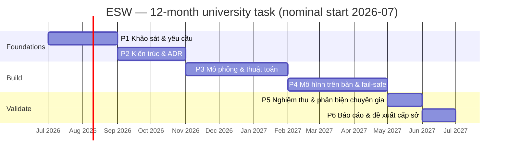

# 03 — Lộ trình kỹ thuật & phân kỳ

> 🇬🇧 Bản gốc tiếng Anh: [03-roadmap-and-phasing.md](03-roadmap-and-phasing.md)

**Dự án:** Hệ thống cảnh báo tự động làn dừng xe khẩn cấp (ESW)
**Trạng thái:** Đề xuất
**Cập nhật:** 2026-06-26

Lộ trình này ánh xạ kiến trúc lên kế hoạch **6 giai đoạn, 12 tháng** và ngân sách **20.000.000
VND** của đề xuất, định nghĩa **MVP**, và đưa ra một bản **rà soát thực tế phạm vi/ngân sách** trung thực. Nó giữ nguyên cấu trúc của đề xuất; chỉ gắn thêm các sản phẩm kỹ thuật cụ thể và một phạm vi có thể bảo vệ được.

---

> ## ⚠ LƯU Ý GIAI ĐOẠN — bản dựng này CHỈ DÙNG CAMERA
>
> [ADR-0001](adr/ADR-0001-sensing-modality.vi.md) (hợp nhất camera + radar) đã bị **Bác bỏ ngày 2026-07-10**. Nguyên mẫu trên bàn
> (cấp trường) **chỉ dùng camera**. Mọi hành vi phụ thuộc radar được mô tả bên dưới — radar chứng thực,
> khoảng giữ-khi-che-khuất (`WARN_HOLD` / `CAMERA_OCCLUDED_DEGRADED`), `T_degraded_max`, và các chế độ
> cảm biến `FULL` / `RADAR-ONLY` — đều **đang tạm ngưng: mã nguồn vẫn giữ, nhưng không bao giờ chạy**,
> vì `corr` không bao giờ đúng khi không có kênh radar.
>
> Hệ quả được chấp nhận: **R5** (mù ban đêm/mưa/sương mù) **không còn biện pháp giảm thiểu** và khả năng
> phát hiện ban đêm/bất lợi **không được tuyên bố**; **R20** — xe bị che khuất bị xóa sau `T_hold`
> (~10 giây), biển báo tắt trong khi mối nguy vẫn còn; **R21** — thiết bị nằm vĩnh viễn ở `CAMERA_ONLY`,
> do đó vĩnh viễn `DEGRADED`. Xem [tài liệu 04](04-risk-and-safety.vi.md).
>
> Nội dung radar bên dưới là **thiết kế mục tiêu cấp sở**, không phải bản dựng của giai đoạn này.

## 1. Rà soát thực tế phạm vi & ngân sách (đọc trước)

Tham vọng của đề xuất trải rộng trên triển khai hiện trường, AI, IoT, và thương mại hóa. Nguồn kinh phí —
**20.000.000 VND (≈ US$800)** trong 12 tháng ở cấp trường — đủ cho một **nguyên mẫu nguyên lý** (principle prototype),
chứ không phải một lắp đặt bên đường. Một thiết bị đạt chuẩn hiện trường đơn lẻ (hộp xử lý tại biên + camera + radar + pin mặt trời + một VMS LED đạt QCVN-41 + vỏ bảo vệ IP65 + xây lắp + giấy phép) tốn **gấp nhiều lần** toàn bộ kinh phí tài trợ.

**Do đó sản phẩm được tài trợ được giới hạn phạm vi như sau:**

- một **khung mô phỏng** (simulation harness) thực thi đầy đủ vòng phát hiện→xác nhận→cảnh báo→giải tỏa (detect→confirm→warn→clear) và hành vi
  an toàn khi sự cố (fail-safe), cộng với
- một **mô hình thử nghiệm trên bàn/để bàn** (bench/desktop rig) (camera thật, thiết bị tính toán tại biên chi phí thấp, một bảng LED nhỏ thay thế cho
  bảng cảnh báo; **chỉ dùng camera — không radar**, [ADR-0001](adr/ADR-0001-sensing-modality.vi.md) bị Bác bỏ) trình diễn vòng kín trên các kịch bản dàn dựng, cộng với
- **kiến trúc, báo cáo khả thi, và một đề xuất thử nghiệm hiện trường** cho dự án
  **cấp sở** tiếp theo.

Đây không phải là việc thu hẹp tham vọng — đó là **bậc thang đầu tiên** đúng đắn. Bản thân đề xuất
định vị thử nghiệm hiện trường và thương mại hóa là giai đoạn *tiếp theo*; lộ trình này làm điều đó trở nên tường minh
và có thể tài trợ được. **Cùng một kiến trúc logic (doc 02) chạy không đổi từ mô hình trên bàn đến thiết bị hiện trường** —
chỉ có *backend* cảm biến/bảng cảnh báo/nguồn điện thay đổi — nên không có gì xây dựng bây giờ là bỏ đi.

> **Kiểm tra _loại hình_ dự án của nguồn tài trợ so với phạm vi này — một việc kiểm soát về quản trị,
> không phải kỹ thuật.** Loại hình được nêu trong đề xuất là **SXTN — *sản xuất thử nghiệm***
> ([doc 00 bảng thuật ngữ](00-context-and-glossary.vi.md)), vốn có thể mang theo kỳ vọng về một *đơn vị
> sản xuất thử*, không chỉ một nguyên mẫu nguyên lý — mâu thuẫn với phạm vi bàn thử/mô phỏng ở trên (vốn
> là cái mà mức ngân sách 20M VND thực sự hỗ trợ; một thiết bị đạt chuẩn hiện trường đơn lẻ đã vượt toàn
> bộ kinh phí). Hãy giải quyết tường minh với đơn vị tài trợ: xác nhận sản phẩm cấp-trường là một
> **nguyên mẫu nguyên lý** (lộ trình này), hoặc — nếu một đơn vị sản xuất thử SXTN được kỳ vọng theo hợp
> đồng — nêu sự không khớp về phạm vi/ngân sách **ngay bây giờ**, chứ không phải lúc rà soát cuối cùng.

### Phân bổ ngân sách dự kiến (phạm vi cấp trường)

| Hạng mục | Dự kiến | Ghi chú |
|------|-----------:|------|
| Tính toán tại biên (ví dụ Raspberry Pi 5 + bộ tăng tốc, hoặc Jetson Nano đã qua sử dụng) | ~3–4M | Chạy nhận diện + máy trạng thái. |
| Camera (IP, WDR, IR) | ~1.5–2.5M | Cảm biến chính. |
| ~~Mô-đun đánh giá radar mmWave **có khả năng phát hiện xe đứng yên** (tạo ảnh / HRR FMCW)~~ | ~~~6–8M~~ → **0** | **KHÔNG MUA — [ADR-0001](adr/ADR-0001-sensing-modality.vi.md) bị Bác bỏ 2026-07-10.** Khoản ~6–8M được **giải phóng** về quỹ dự phòng và cho việc **thu thập bằng chứng nghiệm thu** (≥ 200 sự kiện thật, gồm cả ban đêm — con số recall kèm cận dưới Wilson, vốn *làm được* trên bàn thử và trước đây chưa được cấp kinh phí). Lý do: tiêu chí cổng (b), phân giải lề đường với làn thông hành ở **cự ly giám sát**, **không kiểm chứng được trên bàn thử**, nên radar mua bây giờ chỉ giải quyết được **(a)** — để lại mọi bảo đảm phụ thuộc radar đúng ở chỗ nó đang đứng. **Do đó R5 không còn biện pháp giảm thiểu**, khả năng phát hiện ban đêm/bất lợi **không được tuyên bố**, và R20/R21 được chấp nhận. Hoãn sang cấp sở; **xác định cự ly giám sát trước**. |
| Bảng LED (thay thế bảng cảnh báo) + bộ điều khiển bảng | ~1–2M | Trình diễn giao diện cơ cấu cảnh báo. |
| Giá đỡ, cáp, nguồn cấp, linh tinh | ~1–2M | Lắp ráp mô hình trên bàn. |
| Phổ biến kết quả (báo cáo, poster, infographic) | ~1M | Theo các sản phẩm của đề xuất. |
| Dự phòng | phần còn lại | — |

> Các con số là ước tính lập kế hoạch để cho thấy giới hạn ngân sách là *khả thi cho một nguyên mẫu trên bàn*, không phải
> một báo giá mua sắm.
>
> **Quyết định về radar đã được đưa ra ngày 2026-07-10: không dùng radar trong giai đoạn này**
> ([ADR-0001](adr/ADR-0001-sensing-modality.vi.md) bị Bác bỏ). Nó được **quyết định một cách tường minh,
> không phải bằng mặc định ngầm** — đúng như mục này trước đây yêu cầu. Radar được hoãn về một **kênh tổng
> hợp** trong mô phỏng (kiến trúc không đổi), và hệ quả được chấp nhận trọn vẹn: **tuyên bố recall ban
> đêm/bất lợi hoàn toàn không được đưa ra**, vì nó không thể được chứng minh bằng dữ liệu radar tổng hợp
> ([doc 01 §5](01-requirements.vi.md#5-chỉ-số-đánh-giá--tiêu-chí-nghiệm-thu)); **R5 không còn biện pháp
> giảm thiểu**; và R20/R21 được mang theo như các phần dư ([doc 04](04-risk-and-safety.vi.md)).
>
> Khoản ~6–8M và **thời gian đặt hàng mmWave 8–12 tuần** (trước đây là một rủi ro tiến độ Giai đoạn 1) đều
> không còn. Kinh phí được giải phóng chuyển sang **quỹ dự phòng** và **thu thập bằng chứng nghiệm thu** —
> ≥ 200 sự kiện dàn dựng thật gồm cả ban đêm, cho ra con số recall kèm cận dưới Wilson và *làm được* trên
> bàn thử. Đó chính là sản phẩm chịu lực mà ngân sách này chưa từng cấp kinh phí.

## 2. Định nghĩa MVP

**MVP là bản dựng nhỏ nhất chứng minh được luận điểm một cách trọn vẹn (end-to-end):**

> Trên mô hình trên bàn và/hoặc mô phỏng, một phương tiện đi vào và dừng trong ROI khiến cảnh báo
> **BẬT trong phạm vi mục tiêu độ trễ**, duy trì bật khi xe còn hiện diện (vượt qua được một lần che khuất ngắn), và **TẮT
> sau khi xe rời đi** — *và* một lỗi cảm biến/tính toán/bảng cảnh báo được tiêm vào sẽ đưa hệ thống về
> **trạng thái an toàn kèm cảnh báo cho nhân viên vận hành**, không bao giờ về một đầu ra gây hiểu nhầm hay bị kẹt.

Nếu điều đó được chứng minh đối chiếu với các mục tiêu nguyên mẫu ở doc-01 §5, luận điểm trung tâm được kiểm chứng và
đề xuất cấp sở có bằng chứng hậu thuẫn.

## 3. Kế hoạch giai đoạn (khớp với 6 giai đoạn của đề xuất)

| Giai đoạn | Nội dung đề xuất (tháng) | Sản phẩm kỹ thuật (bổ sung) | Tiêu chí kết thúc |
|------:|---------------------------|----------------------------------|---------------|
| **1** | Khảo sát & yêu cầu (2) | Hoàn thiện [yêu cầu](01-requirements.vi.md); nghiên cứu **bố trí DSD theo từng vị trí** (đối chiếu với TCVN 5729); **kế hoạch thu thập dữ liệu** ([ADR-0007](adr/ADR-0007-validation-and-data-strategy.vi.md)); **kế hoạch tạo bằng chứng nghiệm thu** — một giao thức bắt sự kiện dàn dựng được định cỡ theo N giới-hạn-Wilson ở [§5](01-requirements.vi.md#5-chỉ-số-đánh-giá--tiêu-chí-nghiệm-thu) (các sự kiện dương tính thực gồm cả ban đêm) cộng với số giờ chạy bàn-thử liên tục cung cấp mẫu số kích-hoạt-giả-trên-mỗi-giờ (N recall thực không thể đến từ các lần chạy tổng hợp); **xác nhận phần tử thông điệp QCVN-41** — kiểm chứng tồn tại một phần tử "xe dừng trên lề" tuân thủ *và* một thông điệp hợp pháp **thứ hai** để đổi thông điệp khi ùn tắc, nếu không thì khởi động quy trình ngoại lệ có quản lý ngay bây giờ ([ADR-0004](adr/ADR-0004-warning-actuator-integration.vi.md) AI#4); ~~đặt mua bộ kit đánh giá mmWave + thử nghiệm khả thi radar sớm~~ **— đã hủy; [ADR-0001](adr/ADR-0001-sensing-modality.vi.md) bị Bác bỏ 2026-07-10, không dùng radar giai đoạn này (R5 không còn giảm thiểu);** danh mục kịch bản (ngày/đêm/mưa/**che khuất ngắn+kéo dài**/**buộc-xóa `T_degraded_max`**/**lỗi-camera-khi-đang-cảnh-báo**/thoáng qua/**ùn tắc**/người đi bộ gồm **người mắc kẹt di chuyển**/**đa phương tiện**/**xe đã hiện diện lúc khởi động**/**hết-hạn-ghi-đè+ràng-buộc-cấu-hình+hoãn-OTA**/sự cố). | Yêu cầu + tiêu chí nghiệm thu được phê duyệt; kế hoạch dữ liệu được thống nhất; ~~ghi nhận quyết định go/no-go của thử nghiệm radar~~ **— đã quyết: không dùng radar (ADR-0001 Bác bỏ);** **phần tử QCVN-41 được xác nhận hoặc quy trình ngoại lệ đã khởi động**; **kế hoạch tạo bằng chứng nghiệm thu được định cỡ (đặt N mục tiêu)**. |
| **2** | Mô hình nguyên lý & thiết kế hệ thống (2) | [Kiến trúc](02-system-architecture.vi.md) được phê chuẩn; **cả 13 ADR được chấp nhận**; **ma trận truy vết yêu cầu→kiểm chứng** ([doc 06](06-traceability-matrix.vi.md)); hợp đồng giao diện gồm cả **bề mặt tham số an toàn có giới hạn** ([doc 02 §7a](02-system-architecture.vi.md#7-giao-diện--hợp-đồng-ban-đầu), FR-20); **đóng băng đặc tả phương pháp luận mô phỏng** (lược đồ kịch bản, mô hình nhiễu/rớt của cảm biến tổng hợp + các giả định được nêu rõ, quy tắc gán nhãn ground-truth — cơ sở mà các tuyên bố logic ở Giai đoạn 3 dựa vào, [ADR-0007](adr/ADR-0007-validation-and-data-strategy.vi.md)); đặc tả ROI + **biên thoát** + máy trạng thái (gồm che khuất/đa vết [ADR-0008](adr/ADR-0008-detection-persistence-and-multitrack.vi.md); bộ điều khiển biển báo an toàn khi sự cố + chế độ suy giảm + **`T_degraded_max`** [ADR-0009](adr/ADR-0009-failsafe-placement-and-degraded-modes.vi.md); **hợp nhất giữ-khi-suy-giảm + ma trận trạng thái cảnh báo × chế độ cảm biến** [ADR-0013](adr/ADR-0013-degraded-hold-unification.vi.md); **kích hoạt-theo-hiện-diện cho người đi bộ**; **chính sách ghi đè của người vận hành** [ADR-0010](adr/ADR-0010-operator-override-and-manual-control.vi.md); **quy trình vận hành + quản lý cảnh báo** [ADR-0011](adr/ADR-0011-operator-concept-and-alarm-management.vi.md); **mô hình mối đe dọa an ninh** [ADR-0012](adr/ADR-0012-security-and-threat-model.vi.md)); lựa chọn cảm biến/tính toán/bảng cảnh báo. | Các ADR được Chấp nhận; giao diện được đóng băng gồm cả ràng buộc biên tham số an toàn; **phương pháp luận mô phỏng được đóng băng**; ma trận truy vết hoàn tất. |
| **3** | Mô phỏng, thuật toán, giao diện (3) | **Khung mô phỏng** (mô hình cảm biến tổng hợp có tài liệu, [ADR-0007](adr/ADR-0007-validation-and-data-strategy.vi.md)); nhận diện + cổng lọc ROI + bộ theo dõi; **máy trạng thái với dwell/hysteresis/giữ-khi-che-khuất/đa vết/watchdog** ([ADR-0008](adr/ADR-0008-detection-persistence-and-multitrack.vi.md)); ~~cổng phát hiện xe đứng yên bằng radar~~ **— đã gỡ ([ADR-0001](adr/ADR-0001-sensing-modality.vi.md) bị Bác bỏ, hoãn sang cấp sở)**; nội dung giao diện cảnh báo (tuân thủ QCVN-41). | Vòng kín vượt qua trong mô phỏng trên toàn bộ danh mục kịch bản; ~~cổng radar được quyết định~~ **— cổng đã gỡ (không radar)**. |
| **4** | Xây dựng/mô phỏng mô hình thử nghiệm (3) | **Mô hình trên bàn**: camera (**không radar**) → biên → bảng LED; bộ chuyển đổi cơ cấu cảnh báo với **cơ chế tự ngắt an toàn của bộ điều khiển biển báo** (làm trống khi mất nhịp tim); **bộ giám sát tình trạng + trạng thái an toàn + ba chế độ suy giảm** ([ADR-0009](adr/ADR-0009-failsafe-placement-and-degraded-modes.vi.md)); telemetry tới một TMC tối thiểu; **khung tiêm lỗi** (giết tiến trình SM, **giết hộp biên, cắt liên kết biển báo**, ngắt từng cảm biến). | Vòng kín + an toàn khi sự cố được trình diễn trên mô hình; **giết-SM, giết-hộp, và cắt-liên-kết mỗi cái đều làm bảng cảnh báo trống**; các chế độ suy giảm leo thang đúng cách. |
| **5** | Đánh giá & phản biện chuyên gia (1) | Chạy **bộ nghiệm thu** (doc 01 §5); thu thập số liệu; **phản biện chuyên gia** (giao thông, điện tử, AI, an toàn đường bộ) theo phương pháp của đề xuất. | Số liệu đạt mục tiêu nguyên mẫu; ghi nhận phản hồi phản biện. |
| **6** | Báo cáo cuối & các bước tiếp theo (1) | **Báo cáo khả thi**; infographic cập nhật; **đề xuất thử nghiệm hiện trường cấp sở** (chọn vị trí, BoM, nguồn/kết nối, hồ sơ an toàn, ngân sách). | Sản phẩm được nộp; đề xuất tiếp theo sẵn sàng. |

## 4. Tiến độ (danh nghĩa)

## 5. Cổng kiểm soát rủi ro theo từng giai đoạn

Mỗi điểm kết thúc giai đoạn cũng là một **cổng go/no-go**:

- ~~**Sau P1 (thử nghiệm radar)**~~ — **ĐÃ KHÉP LẠI 2026-07-10, không chạy.** Quyết định mà cổng này sinh ra để
  thúc ép đã được đưa ra trực tiếp: **không dùng radar** ([ADR-0001](adr/ADR-0001-sensing-modality.vi.md) bị Bác bỏ).
  Tuyên bố về ban đêm/bất lợi **hoàn toàn không được đưa ra**, R5 không còn biện pháp giảm thiểu, và R20/R21 là các
  phần dư được chấp nhận. Lý do không cần thử nghiệm: tiêu chí (b) — phân biệt lề đường/làn thông hành ở **cự ly giám
  sát** — không thể kiểm chứng trên bàn thử ở bất kỳ mức ngân sách nào, nên thử nghiệm này chỉ có thể trả lời được một
  nửa. Bắt được điều này ở tháng 1 thay vì tháng 9 chính là toàn bộ mục đích, và điều đó đã xảy ra.
- **Sau P1 (cổng thông điệp QCVN-41)** — một hạng mục pháp lý có thời gian dẫn dài, được xử lý giống như
  thử nghiệm radar. Xác nhận QCVN 41 thực sự cung cấp một phần tử tuân thủ cho "xe dừng trên lề phía
  trước" **và** một thông điệp hợp pháp *thứ hai* cho việc đổi thông điệp khi ùn tắc. Nếu phần tử chính
  không tồn tại, hãy khởi động quy trình **ngoại lệ có quản lý / biểu tượng (pictogram) mới** ngay bây giờ
  (nó là cổng chặn đối với đầu ra duy nhất của hệ thống); nếu thông điệp thứ hai không tồn tại, thiết kế
  ùn tắc trở thành **chỉ-ức-chế** — một khoảng trống phạm vi phủ được phát biểu, ghi nhận tại
  [doc 04 §0](04-risk-and-safety.vi.md#0-giới-hạn-bảo-vệ-mối-nguy-còn-lại), được quyết định ở đây thay vì
  bị phát hiện ở Giai đoạn 5 ([ADR-0004](adr/ADR-0004-warning-actuator-integration.vi.md) AI#4).
- **Sau P2** — nếu không thể thỏa mãn bố trí DSD tại bất kỳ vị trí ứng viên thực tế nào, hãy xem xét lại chiến lược
  chọn vị trí hoặc bảng lặp lại (PL-04) trước khi xây dựng.
- **Sau P3** — nếu máy trạng thái không đạt được mục tiêu báo động giả/bỏ sót trong mô phỏng, hãy tinh chỉnh lại dwell/
  hysteresis/hợp nhất trước khi đầu tư công sức vào phần cứng.
- ~~**Sau P3 (cổng radar)**~~ — **ĐÃ GỠ 2026-07-10; hoãn sang cấp sở.** Không có radar nào để kiểm chứng. Chỉ thị mà
  cổng này mang theo đã được thực thi theo cách duy nhất còn lại: mục tiêu điều kiện bất lợi được **giảm phạm vi** và
  **không đặt dựa trên dữ liệu tổng hợp** ([ADR-0001](adr/ADR-0001-sensing-modality.vi.md) bị Bác bỏ;
  [doc 04](04-risk-and-safety.vi.md) R5/R20/R21).
- **Sau P4** — nếu độ phủ tiêm lỗi dưới mục tiêu, thiết kế an toàn khi sự cố
  ([ADR-0005](adr/ADR-0005-fail-safe-and-system-safety.vi.md)/[ADR-0009](adr/ADR-0009-failsafe-placement-and-degraded-modes.vi.md)/[ADR-0013](adr/ADR-0013-degraded-hold-unification.vi.md))
  chưa sẵn sàng để nghiệm thu; cụ thể là **giết-SM, giết-hộp-biên, và cắt-liên-kết mỗi cái đều phải làm bảng cảnh báo
  trống**, **việc giết camera khi một cảnh báo đang hoạt động phải bước vào trạng thái giữ khi camera không
  xác thực được (vết) có giới hạn và đạt tới một lần buộc xóa lớn tiếng `T_degraded_max`**, **một lệnh
  CLEAR đối với một bảng bị kẹt-BẬT phải đi tới TRẠNG THÁI AN TOÀN + leo thang biển-báo-bị-kẹt**, và các
  chế độ suy giảm phải leo thang đúng cách, trước khi đánh giá.

## 6. "Hoàn thành" bàn giao gì cho giai đoạn tiếp theo (cấp sở)

Một đề xuất thử nghiệm hiện trường được hậu thuẫn bởi: một nguyên mẫu vòng kín hoạt động được, các số liệu nguyên mẫu đã đo,
kiến trúc và các ADR đã được chấp nhận, một **bộ khung hồ sơ an toàn** (từ [doc 04](04-risk-and-safety.vi.md)),
một **phương pháp chọn vị trí dựa trên DSD** theo từng vị trí, và một **danh mục vật tư và ngân sách** hiện trường thực tế. Gói đó
chính xác là những gì một nguồn tài trợ cấp tỉnh và một quan hệ đối tác với đơn vị vận hành đường cao tốc cần để nói đồng ý.

→ Giai đoạn tiếp theo đó được phác thảo trong **[tài liệu 05 — đề xuất thử nghiệm hiện trường](05-field-pilot-proposal.vi.md)**.
