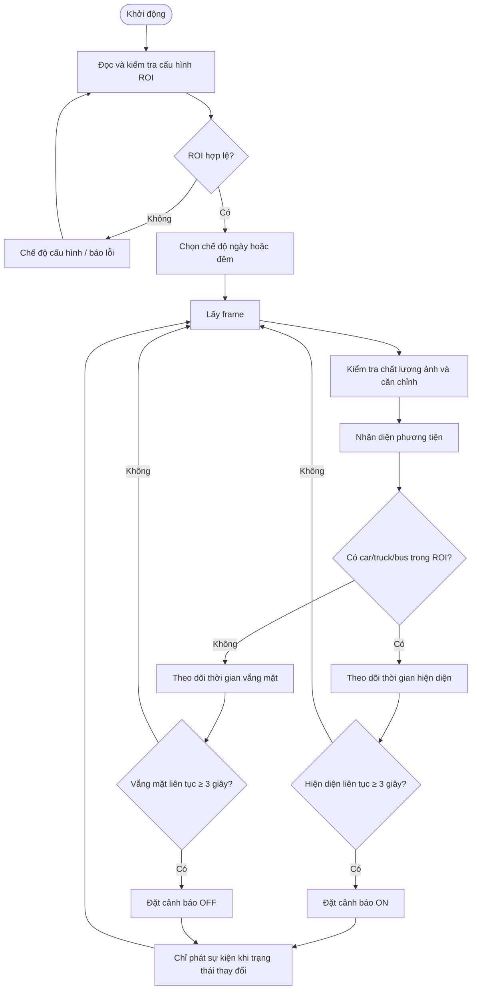
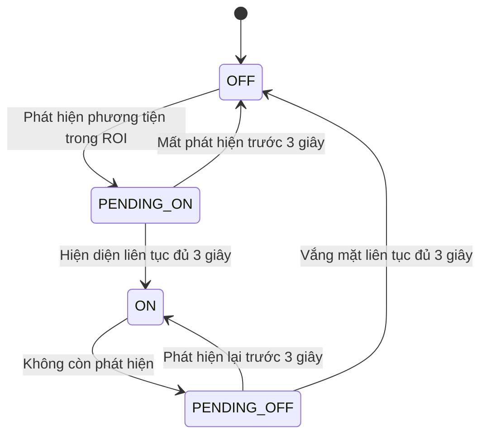

# Kiến trúc hệ thống cảnh báo phương tiện trong làn khẩn cấp

## 1. Mục tiêu hệ thống

Hệ thống giám sát liên tục làn khẩn cấp bằng camera cố định và K230. Một cảnh báo được kích hoạt khi phương tiện thuộc nhóm `car`, `truck` hoặc `bus` xuất hiện liên tục trong vùng làn khẩn cấp đủ **3 giây**. Khi không còn phát hiện phương tiện trong vùng liên tục đủ **3 giây**, cảnh báo được hủy và đèn được tắt.

Hệ thống phát hiện sự hiện diện của phương tiện trong làn khẩn cấp; việc phân loại xe đang dừng, đang chạy hoặc vi phạm giao thông nằm ngoài phạm vi hiện tại.

## 2. Thông số vận hành

| Thông số | Giá trị | Ý nghĩa |
|---|---:|---|
| `TARGET_FPS` | 30 FPS | Tốc độ xử lý đã kiểm thử trên K230 |
| `PRESENCE_THRESHOLD` | 3 giây | Thời gian phát hiện liên tục trước khi bật đèn |
| `ABSENCE_THRESHOLD` | 3 giây | Thời gian không phát hiện liên tục trước khi tắt đèn |
| Đối tượng | `car`, `truck`, `bus` | Các loại phương tiện tạo tín hiệu hiện diện |
| Chế độ chạy | 24/7 | Pipeline không chủ động ngủ |

`PRESENCE_THRESHOLD` và `ABSENCE_THRESHOLD` phải được đo bằng đồng hồ monotonic. Ở 30 FPS, mỗi khoảng 3 giây tương đương xấp xỉ 90 frame, nhưng **không được dùng 90 frame làm điều kiện nghiệp vụ cố định**, vì tốc độ xử lý có thể dao động.

## 3. Luồng xử lý tổng thể



## 4. Vùng giám sát

- K230 và camera được lắp cố định, quan sát làn khẩn cấp tại một vị trí xác định.
- ROI là polygon bao phủ **chỉ làn khẩn cấp**; vùng làn lưu thông bình thường phải nằm ngoài ROI hoặc nằm trong vùng loại trừ.
- Một phương tiện được tính là xuất hiện trong làn khẩn cấp khi bounding box thỏa quy tắc giao với ROI đã cấu hình. Quy tắc khuyến nghị là điểm đáy giữa của bounding box nằm trong ROI; cách này gần với vị trí bánh xe trên mặt đường hơn việc dùng toàn bộ bounding box.
- Có thể cấu hình nhiều ROI nếu một camera quan sát nhiều đoạn làn khẩn cấp tách biệt.
- Khi camera lệch khỏi góc nhìn tham chiếu quá dung sai, hệ thống chuyển sang trạng thái lỗi và không tự động giám sát toàn khung hình.

Chi tiết cấu hình được mô tả tại [INIT STATE](init_state.md).

## 5. Trạng thái phát hiện và cảnh báo



Quy tắc timer:

- Khi đang `OFF`, lần phát hiện hợp lệ đầu tiên bắt đầu timer hiện diện.
- Nếu mất phát hiện trước 3 giây, timer hiện diện được reset.
- Khi đủ 3 giây, hệ thống chuyển sang `ON` và phát `TURN_ON` đúng một lần.
- Khi đang `ON`, lần không phát hiện đầu tiên bắt đầu timer vắng mặt.
- Nếu phương tiện xuất hiện lại trước 3 giây, timer vắng mặt được reset và đèn tiếp tục bật.
- Khi vắng mặt đủ 3 giây, hệ thống chuyển sang `OFF` và phát `TURN_OFF` đúng một lần.
- Việc một phương tiện rời ROI trong khi phương tiện khác vẫn còn trong ROI không tạo trạng thái vắng mặt.

## 6. Chế độ ngày và đêm

Hệ thống có thể dùng model hoặc bộ tham số khác nhau cho ngày và đêm. Việc chuyển chế độ nên dựa trên độ sáng ảnh, lịch thời gian hoặc kết hợp cả hai, kèm hysteresis để tránh chuyển qua lại khi giao sáng.

Thay đổi chế độ không được tự động reset trạng thái cảnh báo. Nếu cần nạp lại model làm gián đoạn inference, khoảng gián đoạn phải được quản lý như trạng thái tạm thời, không được coi ngay là phương tiện đã rời đi.

## 7. Xử lý nhiễu

Pipeline cần xử lý các nguồn nhiễu chính:

- Ánh sáng đèn pha, đèn hậu và vùng cháy sáng.
- Rung nhẹ tại vị trí lắp đặt.
- Mưa, sương và suy giảm độ rõ của ảnh.
- Bounding box chập chờn quanh biên ROI.
- Nhiều phương tiện xuất hiện đồng thời.

Hai ngưỡng 3 giây cung cấp lọc theo thời gian ở cấp cảnh báo. Chúng không thay thế việc hiệu chỉnh confidence threshold, tracking, biên ROI và kiểm tra chất lượng ảnh.

## 8. Điều khiển đèn

K230 phát sự kiện khi trạng thái mong muốn thay đổi. Server định tuyến sự kiện đến ESP32 được ghép cặp; ESP32 điều khiển đèn và trả về trạng thái thực tế. Giao thức cần hỗ trợ tính idempotent, ACK, timeout/retry, heartbeat và đồng bộ lại sau mất kết nối.

Chi tiết được mô tả tại [LIGHT CONTROL](light_control.md).

## 9. Trạng thái an toàn và tự phục hồi

- Trong lúc khởi động hoặc khi ROI không hợp lệ, trạng thái mong muốn của đèn là `OFF`.
- Chính sách khi mất camera, K230, server hoặc Wi-Fi phải được chốt trước triển khai. Không được suy diễn trường hợp lỗi là “xe đã rời đi”.
- Watchdog chỉ được feed sau khi hoàn tất chu kỳ lấy ảnh, inference, cập nhật state machine và xử lý giao tiếp cần thiết.
- Hệ thống phải ghi log thay đổi trạng thái, thời điểm bắt đầu/kết thúc timer, confidence, lỗi camera, lỗi mạng và nguyên nhân khởi động lại.

### 9.1 Bootstrap LCD, cảm ứng và Wi-Fi trên K230

Module cấu hình Wi-Fi độc lập là `k230/connect_wifi.py`. Module chạy bằng **Run** trong CanMV IDE, dùng LCD cảm ứng để chọn mạng và lưu credential tương thích với trang Settings của firmware tại `/sdcard/configs/sys_config.json`, section `WLAN`.

Thứ tự khởi tạo là một phần của contract phần cứng, không được hoán đổi:

```text
Soft reboot của CanMV IDE
    │
    ├── Display.init(ST7701, 640×480)
    ├── MediaManager.init()
    ├── lv.init()
    ├── một BGRA8888 buffer + DIRECT render mode
    ├── LVGL input device + TOUCH(0)
    ├── render gate tối thiểu
    ├── network.WLAN(STA_IF)
    └── Wi-Fi UI → scan → reconnect/chọn mạng
```

`network.WLAN` phải được tạo **sau** `TOUCH(0)`. Trên Yahboom image `1.4.1`, tạo WLAN trước có thể làm native constructor `TOUCH(0)` block vô thời hạn; biểu hiện là màn hình đen, FPS bằng 0 và serial dừng tại `calling TOUCH(0)`. Thứ tự này cũng khớp GUI baseline: display/touch thuộc core engine, còn network helper chỉ được tạo khi trang Wi-Fi được mở.

Backend LVGL độc lập dùng một buffer `image.BGRA8888` và `lv.DISP_RENDER_MODE.DIRECT`, giống các example thực thi trong `k230-firmware/src/13.Lvgl/`. Không dùng double-buffer `FULL` nếu chưa có nhu cầu và kiểm thử thiết bị, vì hai frame 640×480 cần khoảng 2,46 MB cấp phát liên tục ngoài tài nguyên media.

Luồng Wi-Fi giữ các quy tắc sau:

- Khi startup, scan trước và chỉ reconnect credential đã lưu nếu SSID còn xuất hiện, bám theo `wifi_settings.py`.
- Nếu không có credential, không tìm thấy SSID hoặc connect timeout, trả về danh sách mạng và bàn phím cảm ứng.
- Mọi trạng thái quan trọng được ghi đồng thời lên LCD và serial; không in password.
- Không coi `wlan.config("ssid")` là getter đáng tin cậy trên image này: API có thể trả `True`. Chỉ nhận giá trị `str`/`bytes`, nếu không thì dùng SSID đang connect hoặc SSID đã lưu.
- Khi thoát, deinit theo thứ tự LVGL → Display → MediaManager và chỉ giải phóng resource đã init thành công.

Nhật ký điều tra và cách tái hiện nằm tại [Wi-Fi bootstrap incident](troubleshooting_wifi_bootstrap.md).

## 10. Tiêu chí kiểm thử kiến trúc

- Phương tiện hiện diện dưới 3 giây: đèn không bật.
- Phương tiện hiện diện từ 3 giây trở lên: đèn bật một lần.
- Khi đèn đang bật, mất phát hiện dưới 3 giây rồi phát hiện lại: đèn vẫn bật.
- Không còn phương tiện trong ROI từ 3 giây trở lên: đèn tắt một lần.
- Có nhiều phương tiện: chỉ bắt đầu timer vắng mặt khi không còn phương tiện hợp lệ nào trong ROI.
- FPS dao động quanh 30 FPS: thời điểm bật/tắt vẫn dựa trên 3 giây thực.
- Xe ở làn lưu thông bình thường ngoài ROI: không ảnh hưởng trạng thái đèn.
- Chạy `connect_wifi.py` sau power cycle: render gate và UI Wi-Fi phải xuất hiện, FPS lớn hơn 0.
- Startup có credential hợp lệ: scan, reconnect và hiển thị đúng SSID/IP.
- Credential sai hoặc SSID vắng mặt: UI vẫn responsive và cho phép chọn mạng khác.
- Tắt/bật Wi-Fi, rescan và nhập password bằng cảm ứng không làm treo LVGL handler.

## 11. Kết luận

Kiến trúc ưu tiên inference tại biên để duy trì tốc độ khoảng 30 FPS và giảm độ trễ. State machine hai chiều với ngưỡng 3 giây giúp tránh bật đèn do phát hiện thoáng qua và tránh tắt đèn do mất dấu ngắn. Trước khi triển khai thực địa, cần hiệu chỉnh ROI, confidence, quy tắc giao ROI và chính sách fail-safe bằng dữ liệu thu tại đúng vị trí lắp đặt.
