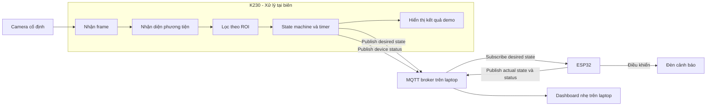
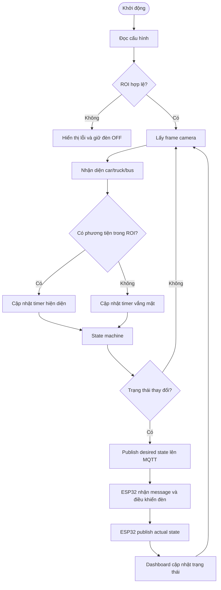
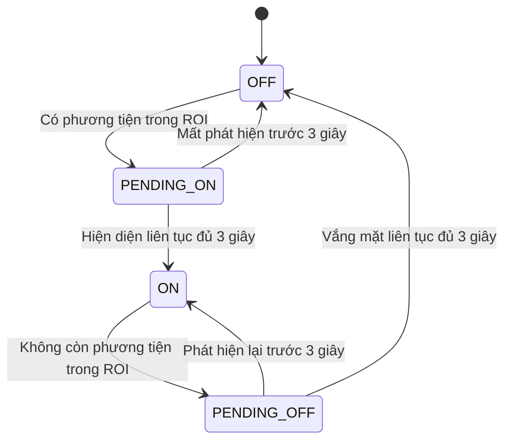

# Kiến trúc và kịch bản demo prototype

## 1. Mục tiêu buổi demo

Prototype chứng minh hệ thống có thể dùng camera và K230 để phát hiện phương tiện trong vùng làn khẩn cấp, sau đó điều khiển đèn cảnh báo qua ESP32.

Buổi demo cần giúp đối tác quan sát rõ ba năng lực cốt lõi:

1. Hệ thống phân biệt phương tiện nằm trong và ngoài vùng làn khẩn cấp đã cấu hình.
2. Hệ thống chỉ bật hoặc tắt đèn sau khi điều kiện được duy trì liên tục đủ thời gian quy định.
3. Quyết định của K230 được truyền đến ESP32 và thể hiện bằng đèn thật.

Prototype không nhằm chứng minh khả năng vận hành 24/7, mức độ an toàn thông tin hoặc khả năng triển khai trên nhiều vị trí.

## 2. Phạm vi chức năng

### 2.1. Chức năng bắt buộc

- Camera cố định cung cấp hình ảnh khu vực cần giám sát.
- K230 nhận diện các lớp phương tiện `car`, `truck` và `bus`.
- Một hoặc nhiều polygon ROI xác định phần làn khẩn cấp cần giám sát.
- Phương tiện chỉ được tính là nằm trong ROI khi điểm đáy giữa của bounding box nằm trong polygon.
- Phương tiện hiện diện liên tục đủ 3 giây làm trạng thái cảnh báo chuyển sang `ON`.
- Không còn phương tiện trong ROI liên tục đủ 3 giây làm trạng thái cảnh báo chuyển sang `OFF`.
- K230 gửi trạng thái mong muốn `ON` hoặc `OFF` lên MQTT broker chạy trên laptop.
- MQTT broker chuyển message đến ESP32 và dashboard theo topic đã quy định.
- ESP32 điều khiển đèn và phản hồi trạng thái thực tế.
- Dashboard trên laptop hiển thị trạng thái K230, ESP32, đèn và các sự kiện gần nhất.
- Màn hình K230 hiển thị hình ảnh camera, ROI, bounding box, trạng thái cảnh báo và thời gian chờ hiện tại.

### 2.2. Ngoài phạm vi prototype

- Phân biệt xe đang chạy, đang dừng hoặc xác định hành vi vi phạm giao thông.
- Quản lý đồng thời nhiều K230, ESP32 hoặc địa điểm triển khai.
- Server có tính sẵn sàng cao, database lịch sử hoặc dashboard vận hành production.
- Authentication, encryption, quản lý secret và phân quyền người dùng.
- Cam kết vận hành liên tục 24/7, watchdog và tự phục hồi hoàn chỉnh.
- Tự động phát hiện camera bị lệch hoặc tự hiệu chỉnh ROI.
- Tự động chuyển model ngày và đêm.
- Giao diện cấu hình ROI hoàn chỉnh trên thiết bị.

## 3. Kiến trúc prototype đề xuất



### 3.1. Trách nhiệm từng thành phần

| Thành phần | Trách nhiệm trong prototype |
|---|---|
| Camera | Cung cấp hình ảnh ổn định tại góc quan sát cố định |
| K230 | Nhận diện, lọc ROI, đo thời gian và quyết định trạng thái cảnh báo |
| MQTT broker | Nhận và phân phối message giữa K230, ESP32 và dashboard |
| ESP32 | Nhận trạng thái mong muốn, điều khiển đèn và phản hồi trạng thái thực tế |
| Đèn | Thể hiện trực quan trạng thái cảnh báo |
| Dashboard | Hiển thị trạng thái từng thiết bị, trạng thái đèn và sự kiện gần nhất |
| File cấu hình | Lưu ROI, confidence threshold, ngưỡng thời gian, broker và topic prefix |

Quyết định nghiệp vụ chỉ nằm trên K230. ESP32 không xử lý kết quả nhận diện và không tự quyết định có cảnh báo hay không.

### 3.2. Vai trò của laptop

Laptop đóng vai trò server nhẹ trong mạng demo và chạy hai thành phần:

- MQTT broker, ví dụ Mosquitto, để chuyển message giữa thiết bị;
- dashboard nhẹ để quan sát trạng thái mà không tham gia quyết định cảnh báo.

MQTT phù hợp với prototype vì nhẹ, dễ theo dõi message và cho phép bổ sung thiết bị mà không tạo kết nối trực tiếp giữa từng cặp. Laptop không xử lý hình ảnh và không quyết định bật/tắt đèn. Nếu dashboard dừng, luồng K230 → broker → ESP32 vẫn phải hoạt động.

## 4. Luồng xử lý



Ngưỡng 3 giây phải được đo bằng đồng hồ monotonic. FPS có thể được hiển thị để quan sát nhưng không được dùng làm đơn vị tính cho điều kiện bật hoặc tắt đèn.

## 5. State machine cảnh báo



| Trạng thái | Ý nghĩa | Trạng thái đèn |
|---|---|---|
| `OFF` | Không có cảnh báo | Tắt |
| `PENDING_ON` | Đang chờ xác nhận hiện diện đủ 3 giây | Tắt |
| `ON` | Cảnh báo đã được xác nhận | Bật |
| `PENDING_OFF` | Đang chờ xác nhận vắng mặt đủ 3 giây | Bật |

Nếu có nhiều phương tiện, timer vắng mặt chỉ bắt đầu khi không còn phương tiện hợp lệ nào trong ROI.

## 6. Giao tiếp qua MQTT

K230, ESP32 và dashboard kết nối đến MQTT broker chạy trên laptop trong cùng mạng Wi-Fi. Broker chỉ phân phối message theo topic; không chứa logic nghiệp vụ.

### 6.1. Cấu trúc topic

| Topic | Publisher | Subscriber | Retain | Mục đích |
|---|---|---|---|---|
| `demo/pair-01/light/desired` | K230 | ESP32, dashboard | Có | Trạng thái đèn K230 mong muốn |
| `demo/pair-01/light/actual` | ESP32 | Dashboard | Có | Trạng thái đèn thực tế |
| `demo/pair-01/device/k230/status` | K230 | Dashboard | Có | Trạng thái K230 |
| `demo/pair-01/device/esp32/status` | ESP32 | Dashboard | Có | Trạng thái ESP32 |
| `demo/pair-01/events` | K230, ESP32 | Dashboard | Không | Dòng sự kiện phục vụ demo |

`pair-01` là định danh của một bộ K230–ESP32–đèn. Cách đặt topic này cho phép bổ sung `pair-02` mà không thay đổi cấu trúc hệ thống.

### 6.2. Message điều khiển

K230 publish lên topic `demo/pair-01/light/desired`:

```json
{
  "version": 1,
  "pair_id": "pair-01",
  "event_id": "evt-000012",
  "source_id": "k230-01",
  "desired_state": "ON",
  "timestamp": 1750000000
}
```

ESP32 publish lên topic `demo/pair-01/light/actual`:

```json
{
  "version": 1,
  "pair_id": "pair-01",
  "event_id": "evt-000012",
  "device_id": "esp32-01",
  "status": "APPLIED",
  "actual_state": "ON",
  "timestamp": 1750000001
}
```

Quy tắc tối thiểu:

- `desired` và `actual` sử dụng retained message để thiết bị hoặc dashboard vừa kết nối có thể nhận trạng thái gần nhất.
- Message điều khiển sử dụng QoS 1.
- `ON` và `OFF` có tính idempotent; nhận lại cùng trạng thái không tạo tác động phụ.
- `event_id` giúp nhận biết một quyết định trạng thái cụ thể.
- K230 publish ngay khi trạng thái mong muốn thay đổi.
- ESP32 publish `actual_state` sau khi áp dụng lệnh và sau mỗi lần kết nối lại.
- K230 và ESP32 publish status định kỳ để dashboard xác định `ONLINE`, `STALE` hoặc `OFFLINE`.
- ESP32 khởi động với đèn ở trạng thái `OFF`, sau đó nhận retained `desired_state` để đồng bộ.
- Trong prototype, broker có thể chạy không authentication trong mạng demo cô lập.

## 7. Dashboard trạng thái thiết bị

Dashboard là một web page nhẹ chạy trên laptop. Dashboard chỉ subscribe MQTT và hiển thị dữ liệu; việc dashboard bị đóng không được làm gián đoạn điều khiển đèn.

Để giữ prototype đơn giản, dashboard nên gồm một tiến trình local subscribe MQTT bằng kết nối TCP thông thường, giữ trạng thái gần nhất trong bộ nhớ và phục vụ một web page trên laptop. Chưa cần database; tải lại trang có thể khôi phục trạng thái từ retained message.

### 7.1. Thông tin tổng quan

- Trạng thái MQTT broker.
- Số cặp thiết bị đang online.
- Thời điểm cập nhật gần nhất.
- Danh sách sự kiện gần nhất theo thứ tự thời gian.

### 7.2. Thẻ trạng thái cho từng cặp thiết bị

Mỗi `pair_id` có một thẻ riêng, tối thiểu gồm:

- `K230`: `ONLINE`, `STALE` hoặc `OFFLINE`, FPS và thời điểm status gần nhất;
- trạng thái nhận diện: `OFF`, `PENDING_ON`, `ON` hoặc `PENDING_OFF`;
- timer hiện diện hoặc vắng mặt;
- `ESP32`: `ONLINE`, `STALE` hoặc `OFFLINE` và thời điểm status gần nhất;
- `desired_state` và `actual_state` của đèn;
- cảnh báo lệch trạng thái khi `desired_state != actual_state`.

Video trực tiếp, ROI, bounding box, loại phương tiện và confidence có thể hiển thị trên màn hình gắn với K230. Prototype không bắt buộc truyền video qua MQTT hoặc đưa video vào dashboard laptop.

### 7.3. Trạng thái kết nối

- `ONLINE`: status gần nhất còn trong khoảng heartbeat cho phép.
- `STALE`: chưa có status mới sau một khoảng heartbeat nhưng chưa vượt ngưỡng offline.
- `OFFLINE`: mất status quá ngưỡng hoặc MQTT Last Will báo thiết bị mất kết nối.

K230 và ESP32 nên cấu hình MQTT Last Will cho topic status tương ứng. Dashboard dùng timestamp của heartbeat kết hợp Last Will để tránh hiển thị một retained `ONLINE` đã cũ như trạng thái hiện tại.

Màu hiển thị đề xuất:

| Tình trạng | Màu |
|---|---|
| Không cảnh báo | Xám hoặc xanh lá |
| Đang chờ đủ 3 giây | Vàng |
| Cảnh báo đang bật | Đỏ |
| Mất kết nối hoặc lỗi | Cam |
| Trạng thái cũ quá thời gian cho phép | Vàng |

## 8. Chuẩn bị trước buổi demo

### 8.1. Thiết bị

- K230 và camera đã được cố định.
- ESP32 kết nối được với relay hoặc đèn cảnh báo.
- Nguồn điện ổn định cho cả K230, ESP32 và đèn.
- Wi-Fi nội bộ hoạt động, K230 và ESP32 nhìn thấy nhau.
- Laptop kết nối cùng mạng và có địa chỉ IP ổn định trong suốt buổi demo.
- MQTT broker và dashboard được cấu hình tự khởi động hoặc có script khởi động chung.
- Có đèn hoặc ESP32 dự phòng nếu điều kiện cho phép.

### 8.2. Dữ liệu và cấu hình

- ROI đã được khoanh và kiểm tra trên đúng góc camera dùng để demo.
- Confidence threshold đã được thử với phương tiện hoặc video demo.
- Ngưỡng hiện diện và vắng mặt đều đặt là 3 giây.
- Địa chỉ broker, port, `pair_id` và topic prefix đã được cấu hình trên K230 và ESP32.
- Có video dự phòng chứa các tình huống trong kịch bản nếu không thể dùng xe thật.

### 8.3. Kiểm tra nhanh

- Khởi động toàn bộ hệ thống từ trạng thái mất điện.
- Xác nhận broker chấp nhận kết nối từ K230, ESP32 và dashboard.
- Xác nhận đèn ban đầu tắt.
- Xác nhận ROI hiển thị đúng vị trí.
- Xác nhận dashboard hiển thị đúng trạng thái của cả K230 và ESP32.
- Thực hiện thử một chu kỳ bật và tắt đèn.
- Khởi động lại ESP32 để kiểm tra retained state và đồng bộ lại.
- Đảm bảo có thể chuyển nhanh sang video hoặc chế độ mô phỏng dự phòng.

## 9. Kịch bản demo chính

### Bước 1 — Giới thiệu vùng giám sát

**Thao tác:** Hiển thị hình ảnh camera và ROI làn khẩn cấp.

**Kết quả mong đợi:** Đối tác nhìn thấy rõ phần đường được tính là làn khẩn cấp. Trạng thái hệ thống là `OFF` và đèn tắt.

**Thông điệp:** Hệ thống không cảnh báo trên toàn bộ khung hình; quyết định được giới hạn trong vùng nghiệp vụ đã cấu hình.

### Bước 2 — Phương tiện nằm ngoài ROI

**Thao tác:** Cho phương tiện xuất hiện ở vùng ngoài ROI.

**Kết quả mong đợi:** Bounding box vẫn được hiển thị nhưng timer hiện diện không bắt đầu, trạng thái vẫn `OFF` và đèn không bật.

**Thông điệp:** Nhận diện được phương tiện không đồng nghĩa với phát cảnh báo.

### Bước 3 — Phương tiện đi qua ROI dưới 3 giây

**Thao tác:** Cho phương tiện đi vào ROI rồi rời khỏi trước khi timer đạt 3 giây.

**Kết quả mong đợi:** Trạng thái chuyển `OFF → PENDING_ON → OFF`; đèn không bật.

**Thông điệp:** Bộ lọc thời gian loại bỏ các phát hiện quá ngắn hoặc thoáng qua.

### Bước 4 — Phương tiện hiện diện đủ 3 giây

**Thao tác:** Giữ phương tiện trong ROI ít nhất 3 giây.

**Kết quả mong đợi:** Timer tăng theo thời gian thực. Khi đủ 3 giây, trạng thái chuyển `PENDING_ON → ON`; K230 publish `desired_state=ON`, ESP32 bật đèn và publish `actual_state=ON`. Dashboard hiển thị hai trạng thái trùng nhau.

**Thông điệp:** K230 đưa ra quyết định tại biên và ESP32 thực thi trạng thái cảnh báo.

### Bước 5 — Mất phát hiện ngắn

**Thao tác:** Làm phương tiện mất khỏi ROI dưới 3 giây rồi xuất hiện lại.

**Kết quả mong đợi:** Trạng thái chuyển `ON → PENDING_OFF → ON`; đèn vẫn bật trong toàn bộ quá trình.

**Thông điệp:** Hệ thống không tắt đèn do mất dấu ngắn hoặc bounding box chập chờn.

### Bước 6 — Phương tiện rời ROI đủ 3 giây

**Thao tác:** Đưa toàn bộ phương tiện ra khỏi ROI và giữ vùng trống ít nhất 3 giây.

**Kết quả mong đợi:** Timer vắng mặt tăng. Khi đủ 3 giây, trạng thái chuyển `PENDING_OFF → OFF`; K230 publish `desired_state=OFF`, ESP32 tắt đèn và dashboard cập nhật `actual_state=OFF`.

**Thông điệp:** Cảnh báo chỉ kết thúc sau khi hệ thống xác nhận vùng giám sát đã trống ổn định.

## 10. Kịch bản bổ sung nếu còn thời gian

### Nhiều phương tiện

Cho hai phương tiện xuất hiện trong ROI, sau đó lần lượt rời đi. Đèn chỉ bắt đầu chờ tắt sau khi phương tiện cuối cùng rời ROI.

### Mất kết nối ESP32

Ngắt kết nối ESP32 trong thời gian ngắn. Dashboard phải chuyển ESP32 sang `STALE` hoặc `OFFLINE` và vẫn giữ `desired_state` gần nhất. Sau khi kết nối lại, ESP32 nhận retained state, đồng bộ đèn và publish `actual_state`.

### FPS dao động

Tạo tải hoặc sử dụng cảnh phức tạp để FPS thay đổi. Thời điểm bật/tắt vẫn dựa trên 3 giây thực, không dựa trên số frame.

Các kịch bản bổ sung không nên được thực hiện nếu chúng làm tăng rủi ro cho luồng demo chính.

## 11. Kịch bản dự phòng

Nếu không thể dùng phương tiện thật, chạy video đã chuẩn bị trước qua cùng pipeline nhận diện. Video cần chứa tối thiểu:

1. phương tiện ngoài ROI;
2. phương tiện trong ROI dưới 3 giây;
3. phương tiện trong ROI trên 3 giây;
4. mất dấu ngắn khi đèn đang bật;
5. vùng trống trên 3 giây để tắt đèn.

Nếu ESP32 hoặc đèn thật gặp lỗi, màn hình có thể hiển thị đèn mô phỏng. Người trình bày phải nói rõ đây là phương án dự phòng; logic K230 và trạng thái gửi đi vẫn phải chạy thật.

## 12. Tiêu chí demo đạt

| Mã | Tiêu chí | Kết quả cần đạt |
|---|---|---|
| D-01 | Phương tiện ngoài ROI | Không bật đèn |
| D-02 | Phương tiện trong ROI dưới 3 giây | Không bật đèn |
| D-03 | Phương tiện trong ROI đủ 3 giây | Bật đèn một lần |
| D-04 | Mất phát hiện dưới 3 giây khi đang cảnh báo | Đèn vẫn bật |
| D-05 | Không còn phương tiện đủ 3 giây | Tắt đèn một lần |
| D-06 | Nhiều phương tiện trong ROI | Chỉ chờ tắt khi không còn phương tiện nào |
| D-07 | FPS thay đổi | Timer vẫn theo thời gian thực |
| D-08 | Quan sát trạng thái | Màn hình K230 hiển thị ROI, detection và timer; dashboard hiển thị trạng thái từng thiết bị, desired state và actual state |

Prototype được xem là hoàn thành khi toàn bộ tiêu chí từ `D-01` đến `D-05` và `D-08` đạt ổn định trong nhiều lần chạy liên tiếp. `D-06` và `D-07` là tiêu chí nên đạt nếu điều kiện demo cho phép.

## 13. Hướng mở rộng sau prototype

Sau khi đối tác xác nhận giá trị của prototype, kiến trúc có thể được mở rộng theo các nhóm độc lập:

1. **Độ chính xác:** thu dữ liệu thực địa, hiệu chỉnh model, ROI, tracking và điều kiện ngày/đêm.
2. **Quản lý tập trung:** mở rộng MQTT broker và dashboard hiện tại với lịch sử sự kiện, cấu hình từ xa và quản lý nhiều địa điểm.
3. **Độ tin cậy:** heartbeat, retry bền vững, watchdog, health check và chính sách fail-safe.
4. **Bảo mật:** định danh thiết bị, mã hóa đường truyền, quản lý secret và phân quyền.
5. **Vận hành:** cập nhật từ xa, giám sát, cảnh báo lỗi và quy trình bảo trì.

Các nhóm trên không phải điều kiện để hoàn thành prototype hiện tại.
