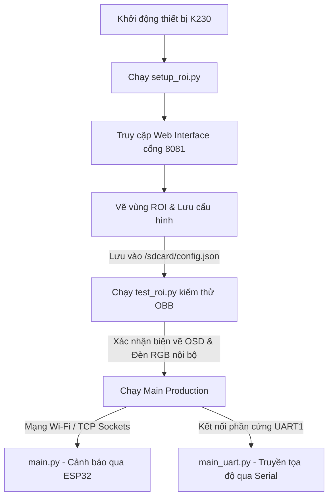

# HƯỚNG DẪN TRIỂN KHAI VÀ VẬN HÀNH HỆ THỐNG K230

Tài liệu này đóng gói và chuẩn hóa toàn bộ quy trình thiết lập, kiểm thử, và chạy chính thức hệ thống giám sát làn khẩn cấp chạy trên nền tảng **CanMV K230**.

---

## 🗺️ Sơ đồ Quy trình Vận hành

---

## 📋 Hướng dẫn từng bước trong quy trình

### Bước 1: Thiết lập vùng giám sát (ROI) bằng `setup_roi.py`
Mục đích là chụp hình thực tế từ góc camera lắp đặt cố định, mở web server cấu hình để người vận hành vẽ làn khẩn cấp cần giám sát.

1. **Khởi chạy trên K230**:
   Chạy file [setup_roi.py](file:///e:/k230-project/k230/setup_roi.py). Chương trình sẽ:
   - Tự động kết nối Wi-Fi (lấy cấu hình mạng trong thẻ SD hoặc dùng mặc định).
   - Chờ cảm biến ổn định, chụp một ảnh frame thực tế và lưu vào `/sdcard/capture.jpg`.
   - Khởi chạy HTTP Server trên cổng **`8081`**.
2. **Cấu hình trên trình duyệt**:
   - Sử dụng máy tính hoặc điện thoại kết nối cùng mạng Wi-Fi, truy cập vào địa chỉ hiển thị trên terminal: `http://<K230_IP>:8081`.
   - Tiến hành click các điểm góc trên ảnh để khoanh vùng làn khẩn cấp cần giám sát (cần tối thiểu 3 điểm). Có hỗ trợ kéo thả điểm nút, **Hoàn tác (Undo)** và **Xóa hết (Clear)**.
   - Nhấn **Lưu cấu hình (Save)**. File `/sdcard/config.json` sẽ được tạo mới hoặc cập nhật thông minh (bảo toàn các thiết lập Wi-Fi/Server cũ).

---

### Bước 2: Kiểm thử ngoại tuyến (Offline Test) bằng `test_roi.py`
Mục đích là tải cấu hình vừa vẽ và chạy thử mô hình nhận diện vật thể xoay (YOLOv8-OBB) để xác nhận chính xác các vùng biên vẽ trên màn hình hiển thị.

1. **Khởi chạy trên K230**:
   Chạy file [test_roi.py](file:///e:/k230-project/k230/test_roi.py).
2. **Xác minh hiển thị**:
   - Màn hình hiển thị (LCD/HDMI) sẽ vẽ các đa giác ROI đã cấu hình bằng **màu xanh ngọc Cyan neon** và các vùng loại trừ bằng **màu đỏ Red neon**.
   - Bất kỳ mục tiêu nào đi vào vùng ROI sẽ được khoanh khung OBB và hiển thị nhãn lớp.
3. **Xác minh đèn LED chỉ báo**:
   - Khi vùng giám sát an toàn (không có xe/người): Đèn LED tích hợp trên mạch K230 sáng **màu xanh dương** (chỉ báo chế độ test).
   - Khi phát hiện mục tiêu đi vào ROI: Đèn lập tức chuyển sang **màu đỏ** (Cảnh báo).

---

### Bước 3: Triển khai vận hành chính thức (Production)
Tùy thuộc vào hạ tầng kết nối phần cứng của bạn, lựa chọn một trong hai phương án triển khai sau:

#### Phương án A: Cảnh báo không dây qua ESP32 (Wi-Fi & TCP Sockets)
*Thích hợp khi thiết bị K230 truyền tín hiệu cảnh báo không dây tới mạch ESP32 để kích hoạt còi/đèn vật lý từ xa.*
1. Khởi chạy Server trên ESP32 để lắng nghe kết nối tại địa chỉ cấu hình.
2. Chạy file [main.py](file:///e:/k230-project/k230/main.py) trên K230.
3. Thiết bị sẽ tự động kết nối Wi-Fi, thiết lập TCP Socket kết nối tới ESP32, chạy mô hình YOLOv8 chuẩn. Nếu phát hiện xe (`car`, `truck`, `bus`) hoặc người (`person`) nằm trong ROI liên tục **3 giây**, K230 sẽ gửi lệnh `LED:ON` bật đèn cảnh báo. Khi vùng trống đủ **3 giây**, thiết bị gửi lệnh `LED:OFF` tắt cảnh báo.

#### Phương án B: Truyền thông dữ liệu trực tiếp (Serial UART)
*Thích hợp khi mạch K230 nối dây trực tiếp qua cổng Serial UART1 tới thiết bị điều khiển trung tâm.*
1. Chạy file [main_uart.py](file:///e:/k230-project/k230/main_uart.py) trên K230.
2. Khi phát hiện các mục tiêu hợp lệ nằm trong vùng ROI, thông tin tọa độ chi tiết của khung bao sẽ được đóng gói qua giao thức `YbProtocol` và gửi liên tục qua cổng serial UART1 (`115200 bps`) bằng đối tượng `YbUart`.

---

## 🛠️ Hướng dẫn chuyển code vào thiết bị (SD card)

### Cách 1: Sử dụng CanMV IDE (Trực tuyến)
1. Kết nối K230 với máy tính thông qua cáp USB Type-C.
2. Mở ứng dụng **CanMV IDE** và kết nối qua cổng COM tương ứng ở góc dưới bên trái.
3. Kéo thả các file mã nguồn cục bộ trên máy tính vào cây thư mục `/sdcard` của thiết bị được hiển thị trong IDE.
4. **Cài đặt autorun offline**: Mở file chạy chính (ví dụ [main.py](file:///e:/k230-project/k230/main.py) hoặc [main_uart.py](file:///e:/k230-project/k230/main_uart.py)) trong IDE, dừng chương trình đang chạy, sau đó chọn **Tools -> Save open script to CanMV board (as main.py)**. Chương trình sẽ tự khởi động mỗi khi bật nguồn mạch.

### Cách 2: Sao chép qua Đầu đọc thẻ nhớ (Ngoại tuyến)
1. Tắt nguồn mạch K230, rút thẻ nhớ TF (MicroSD) ra ngoài.
2. Cắm thẻ nhớ vào đầu đọc thẻ và kết nối với máy tính.
3. Máy tính nhận thẻ nhớ như một phân vùng ổ đĩa di động. Copy trực tiếp thư mục `libs/`, các tệp `.py` và thư mục `kmodel/` vào thư mục gốc của thẻ nhớ.
4. Rút thẻ nhớ an toàn, lắp lại vào mạch K230 và bật nguồn.

---

## ⚡ Các cơ chế tối ưu & Tự phục hồi đã tích hợp
Để đạt hiệu suất **30 FPS** ổn định và hệ thống vận hành liên tục không treo lỗi, các tệp mã nguồn trên đã được chuẩn hóa sâu:
- **Chống rò rỉ bộ nhớ (Memory Leak)**: Tách biệt hoàn toàn việc khởi tạo và giải phóng tài nguyên. Khối `finally` luôn gọi `pl.destroy()` giải phóng camera sensor sạch sẽ ngay cả khi xảy ra lỗi giữa chừng.
- **Tránh tràn RAM bộ đệm**: Tất cả logic xử lý hậu kỳ YOLOv8 đều được chuyển đổi sang hàm C phần cứng tăng tốc của SDK (`aidemo.yolov8_det_postprocess` và `aidemo.yolo_obb_postprocess`) thay vì dùng vòng lặp Python thuần.
- **Tự động Fallback hiển thị**: Khi màn hình LCD ST7701 không được cắm hoặc lỗi cấu hình, hệ thống tự phát hiện và fallback thông minh sang HDMI và ngược lại để chương trình không bị crash dừng đột ngột.
