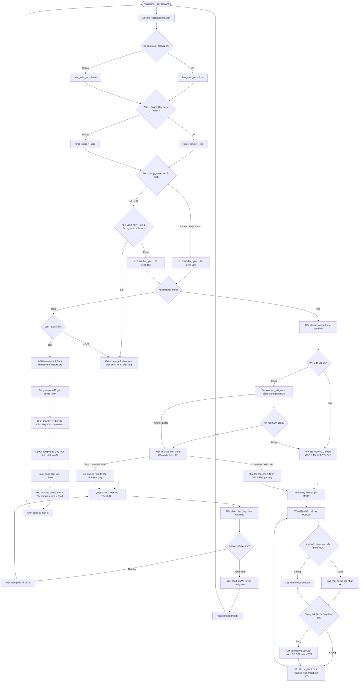

```mermaid
flowchart TD
    %% Khởi động hệ thống
    Start([Khởi động Thiết bị K230]) --> ReadConfig[Đọc file /sdcard/config.json]
    ReadConfig --> CheckROI{Có cấu hình ROI hợp lệ?}
    CheckROI -->|Có| SetValidROI[has_valid_roi = True]
    CheckROI -->|Không| SetInvalidROI[has_valid_roi = False]
    
    SetValidROI & SetInvalidROI --> CheckButton{Phím cứng YbKey được nhấn?}
    CheckButton -->|Có| SetForceSetup[force_setup = True]
    CheckButton -->|Không| SetForceSetupFalse[force_setup = False]

    %% Định tuyến Wi-Fi và Chế độ chạy
    SetForceSetup & SetForceSetupFalse --> CheckStartup{Đọc startup_action từ cấu hình}
    
    CheckStartup -->|Là 'load' hoặc 'setup'| WaitWifi30[Chờ Wi-Fi tự phục hồi trong 30s]
    CheckStartup -->|Là None| RouteByROI{has_valid_roi = True & force_setup = False?}
    
    RouteByROI -->|Đúng| WaitWifi10[Chờ Wi-Fi tự phục hồi trong 10s]
    RouteByROI -->|Sai| EnsureWifi[Gọi ensure_wifi - Mở giao diện chọn Wi-Fi cảm ứng]
    
    EnsureWifi --> SetupWifiUI[Quét Wi-Fi & Hiển thị Touch UI]
    SetupWifiUI --> InputPassUI[Bàn phím cảm ứng nhập mật khẩu]
    InputPassUI --> ConnectAttempts{Kết nối thành công?}
    ConnectAttempts -->|Thất bại| ConnectionFailedScreen[Hiện thông báo lỗi đỏ 2s]
    ConnectionFailedScreen --> SetupWifiUI
    ConnectAttempts -->|Thành công| SaveWifiConfig[Lưu cấu hình Wi-Fi vào config.json]
    SaveWifiConfig --> ResetDevice1[Khởi động lại thiết bị]
    ResetDevice1 --> Start

    %% Chế độ vẽ ROI (Setup Mode)
    WaitWifi30 & WaitWifi10 --> RouteMode{Xác định roi_mode}
    RouteMode -->|setup| CheckWifiSetup{Wi-Fi đã kết nối?}
    RouteMode -->|load| CleanStartup[Xóa startup_action trong cấu hình]

    CheckWifiSetup -->|Chưa| EnsureWifi
    CheckWifiSetup -->|Rồi| InitCamSnapshot[Khởi tạo camera & Chụp ảnh /sdcard/capture.jpg]
    InitCamSnapshot --> CloseCamSnapshot[Đóng camera để giải phóng RAM]
    CloseCamSnapshot --> StartWebServer[Khởi chạy HTTP Server trên cổng 8081 - Headless]
    StartWebServer --> WebBrowser[Người dùng vẽ đa giác ROI trên trình duyệt]
    WebBrowser --> ClickSaveROI[Người dùng bấm Lưu - Save]
    ClickSaveROI --> SaveConfigROI[Lưu ROI vào config.json & Ghi startup_action = 'load']
    SaveConfigROI --> ResetDevice2[Khởi động lại thiết bị]
    ResetDevice2 --> Start

    %% Chế độ nhận diện chính thức (Inference Mode)
    CleanStartup --> CheckWifiInference{Wi-Fi đã kết nối?}
    CheckWifiInference -->|Rồi| InitInference[Khởi tạo Pipeline Camera OSD & Mô hình YOLOv8]
    CheckWifiInference -->|Chưa| ReconnectWifi[Gọi connect_wifi_once bằng thông tin đã lưu]
    
    ReconnectWifi --> ReconnectSuccess{Kết nối thành công?}
    ReconnectSuccess -->|Đúng| InitInference
    ReconnectSuccess -->|Sai| BootMenu[Hiển thị Giao diện Menu Cảnh báo trên LCD]
    
    BootMenu -->|Chọn RETRY| ReconnectWifi
    BootMenu -->|Chọn CHANGE WI-FI| CallEnsureWifi[Gọi ensure_wifi để cấu hình lại mạng]
    CallEnsureWifi --> SetupWifiUI
    BootMenu -->|Chọn RUN OFFLINE| InitInferenceOffline[Khởi tạo Pipeline & Chạy Offline không mạng]

    %% Vòng lặp nhận diện chính
    InitInference & InitInferenceOffline --> StartMQTT[Khởi chạy Thread gửi MQTT]
    StartMQTT --> InferenceLoop[Vòng lặp nhận diện xe YOLOv8]
    InferenceLoop --> CheckTargetROI{Xe thuộc danh mục nằm trong ROI?}
    CheckTargetROI -->|Đúng| UpdatePresence[Cập nhật bộ lọc xác nhận xe]
    CheckTargetROI -->|Không| UpdateAbsence[Cập nhật bộ lọc an toàn]
    
    UpdatePresence & UpdateAbsence --> CheckStateChange{Trạng thái làn đường thay đổi?}
    CheckStateChange -->|Đúng| SendMQTT[Gửi telemetry LED:ON hoặc LED:OFF qua MQTT]
    CheckStateChange -->|Không| DrawOSD[Vẽ biên đa giác ROI & Khung xe lên màn hình LCD]
    SendMQTT --> DrawOSD
    DrawOSD --> InferenceLoop
```