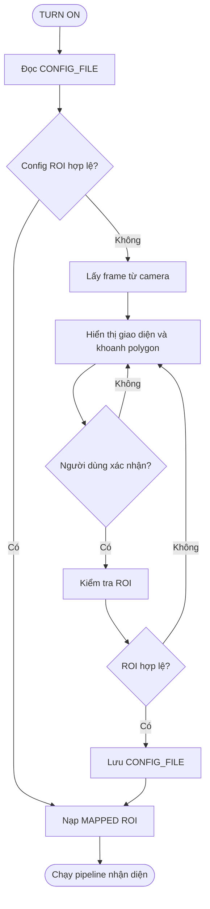

# INIT STATE — Cấu hình vùng làn khẩn cấp

## Mục tiêu

`INIT STATE` chuẩn bị vùng quan sát (ROI) trước khi pipeline nhận diện phương tiện bắt đầu. Do K230 và camera được lắp cố định, người dùng khoanh thủ công **phần làn khẩn cấp cần giám sát** trong lần cấu hình đầu tiên hoặc khi camera bị thay đổi vị trí. Làn lưu thông bình thường không thuộc vùng cảnh báo.

ROI là dữ liệu cấu hình đầu vào của model, không phải một model riêng. Trong tài liệu và mã nguồn nên dùng tên `MAPPED ROI` thay cho `MAPPED MODEL`.

## Luồng khởi tạo



## Cách cấu hình

- Hiển thị một frame lấy trực tiếp từ camera tại vị trí lắp đặt.
- Người dùng đặt các điểm tạo thành polygon bao quanh mặt đường thuộc làn khẩn cấp.
- Cho phép tạo nhiều ROI nếu khung hình có nhiều vùng đường tách biệt.
- Cho phép khai báo vùng loại trừ đối với làn lưu thông bình thường, khu vực thường gây nhiễu hoặc phần ROI bị che khuất.
- Hiển thị lớp phủ ROI trên ảnh để người dùng xem trước và xác nhận.
- Chỉ lưu cấu hình sau khi dữ liệu vượt qua bước kiểm tra hợp lệ.

## Dữ liệu cấu hình đề xuất

Tọa độ nên được chuẩn hóa trong khoảng `0.0–1.0` để không phụ thuộc vào độ phân giải xử lý.

```json
{
  "version": 1,
  "camera_id": "k230-01",
  "reference_resolution": [1920, 1080],
  "regions": [
    {
      "id": "emergency-lane-main",
      "polygon": [[0.12, 0.36], [0.88, 0.35], [0.98, 0.92], [0.03, 0.93]]
    }
  ],
  "exclusion_regions": []
}
```

## Quy tắc kiểm tra config

Config chỉ hợp lệ khi:

- Đúng phiên bản schema được hệ thống hỗ trợ.
- Có ít nhất một ROI.
- Mỗi polygon có tối thiểu ba điểm và không tự giao nhau.
- Mọi tọa độ nằm trong khoảng `0.0–1.0`.
- Diện tích ROI lớn hơn ngưỡng tối thiểu.
- ROI không bị vùng loại trừ che phủ hoàn toàn.
- ROI không bao phủ làn lưu thông bình thường ngoài dung sai cấu hình.

Nếu config thiếu, hỏng hoặc không hợp lệ, hệ thống phải quay lại giao diện cấu hình. Không được tự động chạy nhận diện trên toàn bộ khung hình vì xe ở làn lưu thông bình thường có thể tạo cảnh báo sai.

## Vận hành và cấu hình lại

- Cấu hình được tái sử dụng sau mỗi lần khởi động.
- Người vận hành phải có chức năng xem, sửa, đặt lại và sao lưu config.
- Cần cấu hình lại khi camera, giá đỡ, tiêu cự hoặc độ phân giải tham chiếu thay đổi đáng kể.
- Có thể lưu một ảnh tham chiếu hoặc các mốc cố định để phát hiện camera bị lệch khỏi góc nhìn ban đầu.
- Rung nhẹ được xử lý bằng biên dự phòng quanh ROI; không yêu cầu cấu hình lại nếu góc nhìn vẫn nằm trong dung sai.

## Trạng thái an toàn

Trong `INIT STATE`, đèn cảnh báo phải ở trạng thái tắt. Nếu chưa nạp được ROI hợp lệ, hệ thống không chuyển sang pipeline nhận diện và phải báo lỗi cấu hình cho người vận hành.
