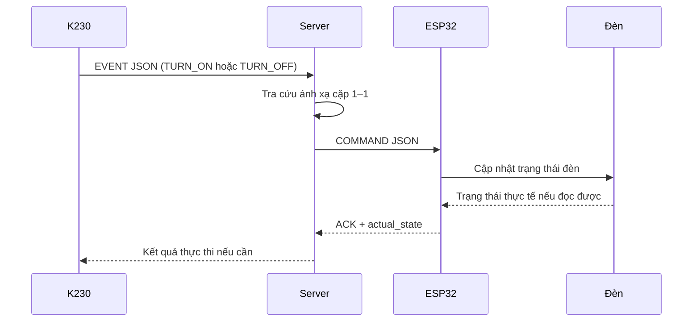
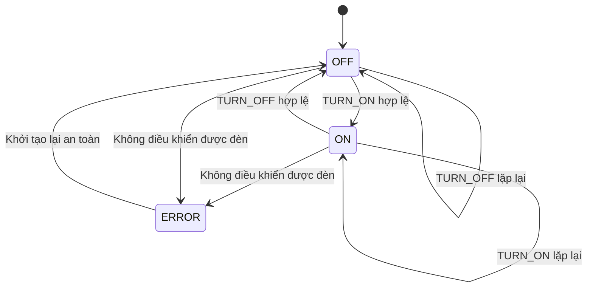

# LIGHT CONTROL — Kiến trúc điều khiển đèn

## Phạm vi

Mỗi K230 được ghép cặp cố định với một ESP32 đặt tại đèn theo quan hệ 1–1. Hai thiết bị truyền dữ liệu qua Wi‑Fi và giao tiếp thông qua server. Tài liệu này mô tả luồng logic; giao thức cụ thể giữa thiết bị và server có thể được lựa chọn độc lập.

```text
K230-01 ↔ ESP32-01 ↔ Đèn-01
K230-02 ↔ ESP32-02 ↔ Đèn-02
```

## Luồng truyền dẫn



K230 chỉ phát sự kiện khi trạng thái mong muốn thay đổi, không gửi lặp lại cùng một lệnh ở mọi frame. Server định tuyến lệnh đến ESP32 đã ghép cặp và lưu trạng thái gần nhất của cặp thiết bị.

## Ánh xạ thiết bị

Server duy trì ánh xạ cố định:

```json
{
  "pair_id": "pair-01",
  "k230_id": "k230-01",
  "esp32_id": "esp32-01",
  "light_id": "light-01"
}
```

Server phải từ chối sự kiện từ thiết bị không tồn tại hoặc không đúng với ánh xạ đã cấu hình.

## Sự kiện từ K230

```json
{
  "version": 1,
  "pair_id": "pair-01",
  "event_id": "evt-000123",
  "source_id": "k230-01",
  "event": "TURN_ON",
  "timestamp": 1750000000
}
```

Giá trị `event` được giới hạn ở:

- `TURN_ON`: bật đèn khi có ít nhất một phương tiện hiện diện liên tục trong ROI làn khẩn cấp đủ `PRESENCE_THRESHOLD = 3 giây`.
- `TURN_OFF`: tắt đèn khi không còn phương tiện nào trong ROI liên tục đủ `ABSENCE_THRESHOLD = 3 giây`.

Hai ngưỡng được đo bằng thời gian monotonic trên K230. Với tốc độ đã kiểm thử 30 FPS, 3 giây tương đương xấp xỉ 90 frame, nhưng giao thức chỉ truyền thay đổi trạng thái và không phụ thuộc vào số frame.

`event_id` phải duy nhất để server và ESP32 nhận biết lệnh gửi lại, tránh thực thi một sự kiện nhiều lần.

## Lệnh gửi đến ESP32

```json
{
  "version": 1,
  "pair_id": "pair-01",
  "event_id": "evt-000123",
  "target_id": "esp32-01",
  "desired_state": "ON",
  "timestamp": 1750000000
}
```

Lệnh phải có tính idempotent: nhận `ON` nhiều lần vẫn giữ đèn ở trạng thái bật, nhận `OFF` nhiều lần vẫn giữ đèn ở trạng thái tắt.

## Phản hồi từ ESP32

Sau khi xử lý lệnh, ESP32 gửi ACK cho server:

```json
{
  "version": 1,
  "pair_id": "pair-01",
  "event_id": "evt-000123",
  "device_id": "esp32-01",
  "status": "APPLIED",
  "actual_state": "ON",
  "timestamp": 1750000001
}
```

Các trạng thái phản hồi tối thiểu:

- `APPLIED`: lệnh đã được thực thi.
- `REJECTED`: lệnh không hợp lệ hoặc không thuộc đúng cặp.
- `FAILED`: ESP32 không thể điều khiển đèn.

Nếu không nhận được ACK trong thời gian quy định, server gửi lại lệnh với cùng `event_id` trong số lần giới hạn và ghi log khi hết retry.

## Trạng thái điều khiển



## Heartbeat và đồng bộ lại

- K230 và ESP32 gửi heartbeat định kỳ để server biết thiết bị còn trực tuyến.
- ESP32 gửi `actual_state` sau khi kết nối lại Wi‑Fi hoặc khởi động lại.
- Server lưu cả `desired_state` và `actual_state`; hai giá trị khác nhau cho biết lệnh chưa được áp dụng hoặc thiết bị đang lỗi.
- Sau khi ESP32 kết nối lại, server gửi lại `desired_state` gần nhất để đồng bộ.

## Trạng thái an toàn

- Khi ESP32 vừa khởi động và chưa nhận được trạng thái hợp lệ, đèn mặc định ở `OFF`.
- Khi K230 chưa hoàn tất `INIT STATE` hoặc ROI làn khẩn cấp không hợp lệ, không được phát `TURN_ON`.
- Khi mất Wi‑Fi/server, ESP32 giữ hoặc tắt đèn theo chính sách an toàn được chốt khi triển khai. Chính sách này phải thống nhất và không được phụ thuộc vào trạng thái ngẫu nhiên trước khi mất kết nối.
- Mọi lần bật, tắt, retry, mất kết nối và khởi động lại phải được ghi log tại server.

## Đánh giá

Kiến trúc K230 → Server → ESP32 → Đèn đáp ứng nhu cầu cơ bản của mô hình ghép cặp 1–1. Để vận hành ổn định, các thành phần bắt buộc là ánh xạ cặp cố định, `event_id`, ACK, timeout/retry, heartbeat và quy tắc trạng thái an toàn khi mất kết nối.
